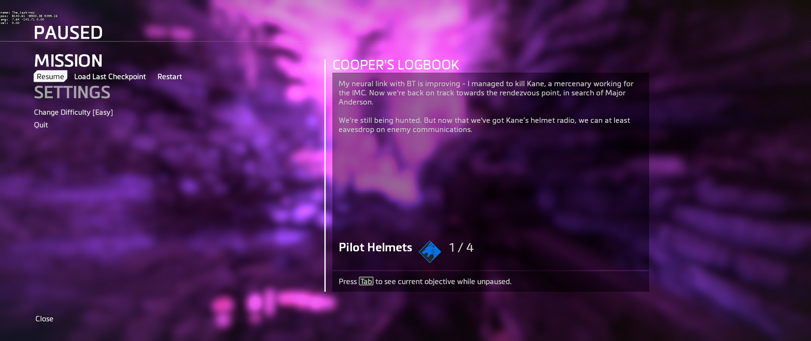

# Pause Menu Blur

The blur you can see in the background of the pause menu is controlled by a couple of ConVars

```text
// Default Values
mat_blur_r 0.7
mat_blur_g 0.7
mat_blur_b 0.7
```

These control the colour of the blur in Red, Green, and Blue values



```text
// Default Values
mat_blur_desaturate 0.4
```

This controls the saturation of the colour

```text
// Default Values
r_blurmenubg 1
```

This value turns the background blur on and off

