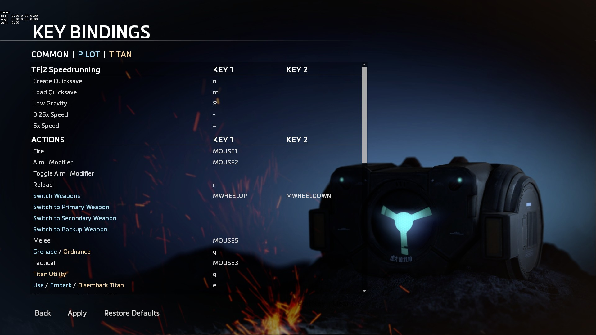

# Key Bindings



## File Location

The Key Bindings menu file is located  in `englishclient_frontend.bsp.pak000_dir.vpk`**,** under `scripts\kb_act.lst`

## How it works

Each line of the file corresponds to either a title/section which looks like:

```text
"blank"					"=========================="
"blank"					"Section Title"
"blank"					"=========================="
```

or  a bind to an action:

```text
"+attack"				    "#FIRE"
"+zoom"					    "#AIM_MODIFIER"
"+toggle_zoom"			"#TOGGLE_AIM_MODIFIER"
"+reload"				    "#RELOAD"
```

## Creating your own

To add your Key Bindings, first open the file and create a new section \(You don't have to but it makes it a lot neater\). Copy the code block above with the 3 lines that start with `"blank"` and create your own title for the section.

Underneath the new section you've created, add a new line and we'll add our own new key bind setting. 

Each setting is set out with the Titanfall/Source variable on the left and a Key Bind Title on the right.

```text
"+jump"        "Jump"
```

## Fun Commands

Give yourself low gravity

```text
"toggle sv_gravity 200 750"    "Low Gravity"
```

Create and load a save point

```text
"save quicksave"    "Create Quicksave"
"load quicksave"    "Load Quicksave"
```

Slow down or speed up the game

```text
"toggle host_timescale .25 1"      "0.25x Speed"
"toggle host_timescale 5 1"        "5x Speed"
```


