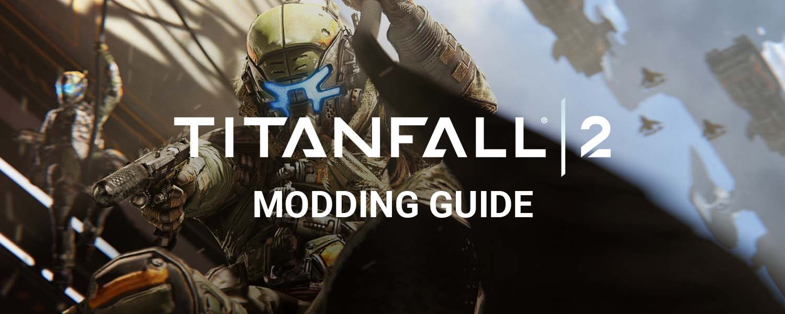

# Titanfall 2 Modding Guide

**Link to the wiki:** [**https://noskill.gitbook.io/titanfall2/**](https://noskill.gitbook.io/titanfall2/)****

Welcome to the Titanfall 2 Modding Guide by NoSkill. This is the ultimate guide to cosmetic modding of the game that will give you an in-depth walkthough of all aspects of modding and its possibilites.

While our goal is to give players a written guide that is simple and easy to understand, some things can be a bit more advanced, especially if you're just starting out with modding.

If this is your first time diving into modding and you have no prior experience, we highly recommend you check out the [**Modding introduction**](start-modding/modding-intro/) **** page before getting started.


[modding-intro](start-modding/modding-intro/)



#### IMPORTANT DISCLAIMER

Edits and modifications listed on this wiki may result in your account becoming permanently banned from Titanfall 2 multiplayer servers. Use these tools as instructed and at your own discretion to avoid these bans.&#x20;

For the most part these tweaks can be considered safe, but over time things may become disallowed or bannable.

Neither the NoSkill Community or the contributors to this wiki are responsible for your incorrect usage of these tools and making modifications that may result in you being banned or breaking your game.


