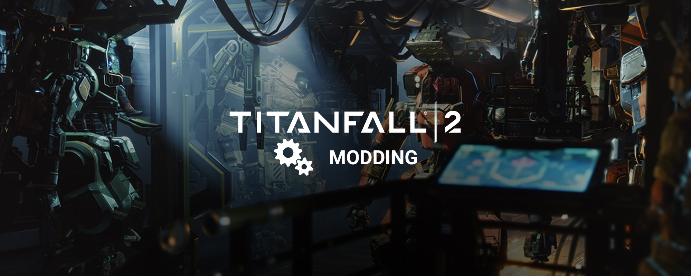

# Main page

[https://noskill.gitbook.io/titanfall2/](https://noskill.gitbook.io/titanfall2/)
[https://wanty5883.gitbook.io/titanfall2](https://wanty5883.gitbook.io/titanfall2)  
  
Welcome to this Titanfall 2 wiki ! Here is a first introduction to the different category of this wiki.  
Anyone is welcome to make suggestions for adding content / improving this wiki, suggestion are always welcome !  
  
Track wiki update on NoSkill Community Discord server where news are posted soon as any update on the wiki.  
  
Please send me a message through the NS Discord server if you notice anything wrong in the wiki.  
You can reach me via contact details.  
  
 ᵗᵒᵖ ᵗʸᵖᵒ ʰᵘⁿᵗᵉʳ ᵃⁿᵈ ᶜᵒⁿᵗʳᶦᵇᵘᵗᵒʳ ʷᶦˡˡ ᵍᵉᵗ ᵃ ˡᶦᵗᵗˡᵉ ʳᵉʷᵃʳᵈ

## Modding

Before getting into Titanfall 2 modding, you must read "[Modding introduction](https://wanty5883.gitbook.io/titanfall2/how-to-start-modding/1.-modding-introduction)" page to get a good starting point. On that page you will follow a process to learn in the easier way how to properly mod Titanfall 2. You **must read** this first page if you never modded Titanfall 2.

