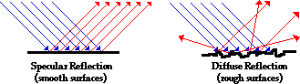

# Textures

A **texture** is a two-dimensional [raster](http://en.wikipedia.org/wiki/Raster\_graphics) image in the context of a game engine. Textures in Source are stored in the [Valve Texture Format](valve-texture-format-vtf/), and with a very few exceptions are only accessed through an intermediate [material](valve-material-type-vmt.md).

While the most common type of texture is the albedo, there are many different uses for raster images in modern game engines. For instance bump maps, which encode three-dimensional height and facing in the color value of each pixel, or specular masks, which determine the intensity of a specular reflection.

## Texture types

### Color maps

The most common type are the diffuse map, the color seen on the model. This maps varies in appearance the most, due to art direction or technical requirements of a given asset.

#### Diffuse maps

They are used to create the albedo, the diffuse reflection of light from a surface.

#### Albedo maps

They are a more specialized form of diffuse map used in PBR (Physically-Based Rendering) shaders and represent only the base colors of a surface.

#### Detail maps

They are tiled detail textures that are blended in when geometry is viewed up close.

#### Gradient maps

Can be used to modify colors of a scene or model by mapping one color to another in a 1d or 2d fashion. These are typically global assets, not specific to any model.

### Transparency maps

Also known as opacity, they are used to cut out parts of a surface, usually for alpha blending. For example: fire, grass, hair, smoke, water, windows, etc.

### Bump maps

Bump mapping is a texture mapping technique in computer graphics for simulating bumps and wrinkles on the surface of an object. This is achieved by perturbing the surface normals of the object and using the perturbed normal during lighting calculations. The result is an apparently bumpy surface rather than a smooth surface although the surface of the underlying object is not changed.


Some basic information about bump mapping can be found here:\
[https://en.wikipedia.org/wiki/Bump\_mapping](https://en.wikipedia.org/wiki/Bump\_mapping)


#### Bump maps

These are **grayscale** textures that store an _**intensity**_, the relative height of pixels from the viewpoint of the camera. The pixels seem to be moved by the required distance in the direction of the face normals. The "bump" consists on of a displacement, which takes place along the existing, and unchanged, normal vector of the face. You may either use grayscale picture or the intensity values of an RGB texture (including images).

#### Normal maps

These are images that store a _**direction**_, the direction of normals directly in the RGB values of an image. They are much more accurate, as rather than only simulating the pixel being away from the face along a line, they can simulate that pixel being moved at any direction, in a arbitrary way. The drawbacks to normal maps are that unlike bump maps, which can easily be painted by hand, normal maps usually have to be generated in some way, often from higher resolution geometry than the geometry you are applying the map to.


[https://en.wikipedia.org/wiki/Normal\_(geometry)](https://en.wikipedia.org/wiki/Normal\_\(geometry\))


#### Displacement maps

Displacement mapping allows a texture input to manipulate the position of vertices on rendered geometry. Unlike Normal or Bump mapping, where the shading is distorted to give the illusion of a bump, displacement maps create real bumps, creases, ridges, etc. in the actual mesh. Thus, the mesh deformations can cast shadows, occlude other objects, and do everything that changes in real geometry can do, but, on the other hand, requires a lot more vertices to work.

#### Radiosity normal maps

These are specialized blending of light and normal maps. Lighting can be baked as a set of three light maps, storing the lighting vectors instead of just the brightness / color. This allows the surface normal maps to receive directional lighting so the bumps and recesses are lit more accurately by the baked lighting information.

#### Height map

These are used to calculate where this 3D data would create shadow in a material, in displacement mapping to displace the actual geometric position of points over the textured surface, or for terrain where the height map is converted into a 3D mesh. It contains one channel interpreted as a distance of displacement or "height" from the "floor" of a surface and sometimes visualized as luma of a grayscale image, with black representing minimum height and white representing maximum height. When the map is rendered, the designer can specify the amount of displacement for each unit of the height channel, which corresponds to the "contrast" of the image.


More information can be found here:\
\- [http://www.povray.org/documentation/view/3.6.1/279/](http://www.povray.org/documentation/view/3.6.1/279/)\
\- [http://voxels.blogspot.com/2014/01/procedural-terrain-heightmap-generation.html](http://voxels.blogspot.com/2014/01/procedural-terrain-heightmap-generation.html)


### Specular maps

These maps define the quantity used in three-dimensional rendering which represents the amount of reflectivity a surface has. It is a key component in determining the brightness of specular highlights, along with shininess to determine the size of the highlights.

The law of reflection states that a reflected ray of light emerges from the reflecting surface at the same angle to the surface normal as the incident ray, but on the opposing side of the surface normal in the plane formed by the incident and reflected rays.


[https://en.wikipedia.org/wiki/Specular\_reflection](https://en.wikipedia.org/wiki/Specular\_reflection)


Reflection off of smooth surfaces such as mirrors or a calm body of water leads to a type of reflection known as specular reflection. Reflection off of rough surfaces such as clothing, paper, and the asphalt roadway leads to a type of reflection known as diffuse reflection.


[https://www.physicsclassroom.com/class/refln/Lesson-1/Specular-vs-Diffuse-Reflection](https://www.physicsclassroom.com/class/refln/Lesson-1/Specular-vs-Diffuse-Reflection)


#### Specular maps

These control how reflective the surface is and can adjust the shape of the reflection. Specular usually simulates only the reflections of the brightest light sources in a scene. They can also be used to control how much environment maps will appear on a surface.

#### Gloss maps

Basically these control how wide or narrow the specular highlight appears. Gloss is an **optical property** which indicates how well a surface reflects light in a **specular (mirror-like) direction**. It is one of the important parameters that are used to describe the visual appearance of an object. The factors that affect gloss are the refractive index of the material, the **angle** of incident light of the surface topography.


[https://en.wikipedia.org/wiki/Gloss\_(optics)](https://en.wikipedia.org/wiki/Gloss\_\(optics\))


#### Roughness maps

The roughness maps are used in PBR material systems, representing how smooth or rough a surface is using a combination of both diffuse and specular reflectivity.

#### Metallic maps

These are an alternative to reflectivity in PBR material systems, they differ by marking materials as metallic or non-metallic. In this method, the albedo map work like regular with non-metals, but it acts as reflectivity for metal areas. Also called metalness.

A metallic color is a color that appears to be that of a polished metal. The visual sensation usually associated with metals is its **metallic shine**. This **cannot be reproduced** by a simple solid color, because the shiny effect is due to the material's brightness varying with the **surface angle** to the **light source**. In addition, there is no mechanism for showing metallic or fluorescent colors on a computer without resorting to rendering software which simulate the action of light on a shiny surface.


[https://en.wikipedia.org/wiki/Metallic\_color](https://en.wikipedia.org/wiki/Metallic\_color)



Source & Reference:

* [https://developer.valvesoftware.com/wiki/Texture](https://developer.valvesoftware.com/wiki/Texture)
* [http://wiki.polycount.com/wiki/Texture\_types](http://wiki.polycount.com/wiki/Texture\_types)
* [https://en.wikipedia.org/wiki/Bump\_mapping](https://en.wikipedia.org/wiki/Bump\_mapping)
* [https://docs.blender.org/manual/en/2.79/render/blender\_render/textures/properties/influence/bump\_normal.html](https://docs.blender.org/manual/en/2.79/render/blender\_render/textures/properties/influence/bump\_normal.html)
* [https://docs.blender.org/manual/en/2.79/render/blender\_render/textures/properties/influence/displacement.html](https://docs.blender.org/manual/en/2.79/render/blender\_render/textures/properties/influence/displacement.html)
* [http://www.decew.net/OSS/References/D3DTutorial10\_Half-Life2\_Shading.pdf](http://www.decew.net/OSS/References/D3DTutorial10\_Half-Life2\_Shading.pdf)
* [https://en.wikipedia.org/wiki/Heightmap](https://en.wikipedia.org/wiki/Heightmap)
* [https://en.wikipedia.org/wiki/Specularity](https://en.wikipedia.org/wiki/Specularity)
* [https://en.wikipedia.org/wiki/Specular\_reflection](https://en.wikipedia.org/wiki/Specular\_reflection)
* [https://www.physicsclassroom.com/class/refln/Lesson-1/Specular-vs-Diffuse-Reflection](https://www.physicsclassroom.com/class/refln/Lesson-1/Specular-vs-Diffuse-Reflection)
* [https://en.wikipedia.org/wiki/Gloss\_(optics)](https://en.wikipedia.org/wiki/Gloss\_\(optics\))
* [https://en.wikipedia.org/wiki/Metallic\_color](https://en.wikipedia.org/wiki/Metallic\_color)

