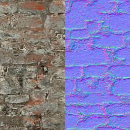
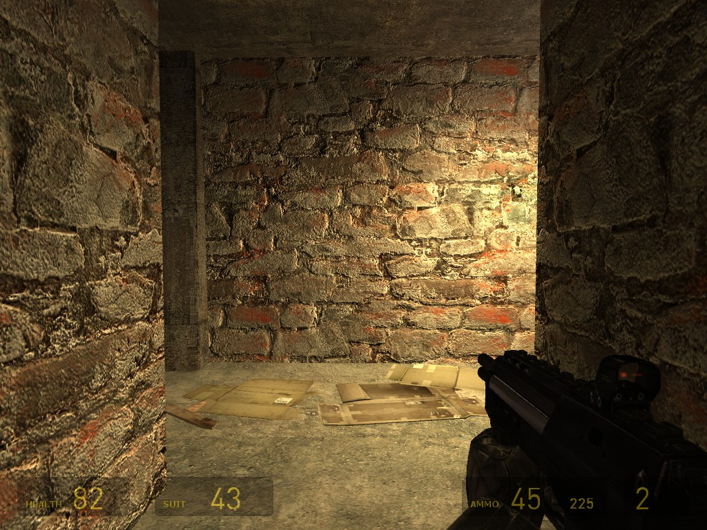

# $bumpmap

 **`$bumpmap`** is a [material](../valve-material-type-vmt.md) [shader](../shader/) parameter available in all Source games. It specifies a [texture](../) that will provide three-dimensional lighting information for a material. The texture is a [bump map](./), but the process it is used for is called [normal mapping](http://en.wikipedia.org/wiki/Normal_mapping). The two terms are often used interchangeably, however.


`$bumpmap` will disable [`prop_static`](https://developer.valvesoftware.com/wiki/Prop_static)'s per-vertex lighting in every Source game but [](https://developer.valvesoftware.com/wiki/Counter-Strike:_Global_Offensive). Not enough data is stored in the vertices for normal mapping, so the engine has no choice but to fall back.



**Note:**

* In the [`Water`](https://developer.valvesoftware.com/wiki/Water_%28shader%29) shader, `$bumpmap` is for a DX8 [du/dv map](https://developer.valvesoftware.com/wiki/Du/dv_map). Use `$normalmap` instead.
* Bumpmaps cannot be used on decal textures, except in [](https://developer.valvesoftware.com/wiki/Counter-Strike:_Global_Offensive).




### Basic syntax

```text
LightmappedGeneric
{
	$basetexture	brick/brickwall021a
	$surfaceprop	brick
	$bumpmap		brick/brickwall021a_normal
}
```



### Additional parameters

#### `$bumptransform` `<`[`matrix`](https://developer.valvesoftware.com/wiki/Matrix)`>` \(DX9+\)

Transforms the bump map texture. **To do:** Does this actually require DX9? Present in DX8 fallback shaders.The default position is `"center .5 .5 scale 1 1 rotate 0 translate 0 0"`.

1. `center` defines the point of rotation. Only useful if `rotate` is being used.
2. `scale` fits the texture into the material the given number of times. '`2 1`' is a 50% scale in the X axis.
3. `rotate` rotates the texture counter-clockwise in degrees. Accepts any number, including negatives.
4. `translate` shifts the texture by the given numbers. '`.5`' will shift it half-way.


**Note:**All values must be included!



**Bug:** Scaling the texture may cause odd issues where the Texture Lock tool in Hammer will not actually lock the texture in place.



**Bug:** Rotating textures applied on brushes will rotate around the map origin \(confirm: Orangebox engine only?\). A fix for this is to change the center position in the VMT to the brush's origin.


#### [`$ssbump`](usdssbump.md) `<`[`boolean`](https://developer.valvesoftware.com/wiki/Boolean)`>`\(New with Half-Life 2: Episode Two / Source 2007\)

Flags the bump map texture\(s\) as being self-shadowing. Click for more details.

#### `$bumpscale` `<`[`float`](https://developer.valvesoftware.com/wiki/Float)`>` \(DX8\)

Scales the bump map by the given value in DirectX 8. **To do:** Does this actually exist? Seemingly not present in DX8 fallback shaders.

#### `$bumpframe` `<`[`integer`](https://developer.valvesoftware.com/wiki/Integer)`>`

The frame to start an animated bump map on.

#### `$nodiffusebumplighting` `<`[`boolean`](https://developer.valvesoftware.com/wiki/Boolean)`>`

Stops the bump map affecting the lighting of the material's [albedo](../albedo.md), which help combat [overdraw](https://developer.valvesoftware.com/wiki/Material_optimization#Overdraw). Does not affect the [specular](https://developer.valvesoftware.com/wiki/Specular) map.


**Bug:** Does not function beyond [](https://developer.valvesoftware.com/wiki/Source_2007) [Source 2007](https://developer.valvesoftware.com/wiki/Source_2007).


#### `$forcebump` `<`[`boolean`](https://developer.valvesoftware.com/wiki/Boolean)`>` \(DX8\)

If 0, use bumpmapping if the card says it can handle it. If 1, always force bumpmapping on.

#### `$addbumpmaps` `<`[`boolean`](https://developer.valvesoftware.com/wiki/Boolean)`>` 

\(Only in Counter-Strike: Global Offensive\)Enables the usage and blending of two bump maps together for [`LightmappedGeneric`](https://developer.valvesoftware.com/wiki/LightmappedGeneric).

#### `$bumpmap2` `<`[`texture`](https://developer.valvesoftware.com/wiki/Texture)`>` \(DX9+\)

The second bump map to use, for either [`WorldVertexTransition`](https://developer.valvesoftware.com/wiki/WorldVertexTransition) or for `LightmappedGeneric` in [](https://developer.valvesoftware.com/wiki/Counter-Strike:_Global_Offensive) for bump map blending.

#### `$bumpframe2` `<`[`integer`](https://developer.valvesoftware.com/wiki/Integer)`>` 

\(DX9+\)Same as `$bumpframe`, but for the second bump map.

#### `$bumptransform2` `<`[`matrix`](https://developer.valvesoftware.com/wiki/Matrix)`>` \(DX9+\)

Same as `$bumptransform`, but for the second bump map.


**Note:**[`$detail`](https://developer.valvesoftware.com/wiki/$detail) used with `$detailscale` will override this on `LightmappedGeneric`.


#### `$bumpdetailscale1` and `$bumpdetailscale2` `<`[`normal`](https://developer.valvesoftware.com/wiki/Normal)`>` \(Only in Counter-Strike: Global Offensive\)

The strength of the first and second bump maps for bump map blending.

### Console commands

#### `mat_fastnobump` `<`[`boolean`](https://developer.valvesoftware.com/wiki/Boolean)`>`

Quickly enables/disabled normal mapping.

#### `mat_normalmaps` `<`[`boolean`](https://developer.valvesoftware.com/wiki/Boolean)`>`

Displays the bump map texture of all materials that have one in place of their [albedo](../albedo.md).\(Yes, these two commands have bump and normal the wrong way around!\)

#### `mat_bumpmap` `<`[`boolean`](https://developer.valvesoftware.com/wiki/Boolean)`>`

Enable or disable normal mapping. Default 1.


Source: [https://developer.valvesoftware.com/wiki/$bumpmap](https://developer.valvesoftware.com/wiki/$bumpmap)


