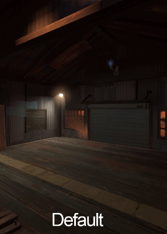

# $reflectivity

**`$reflectivity`** overrides a [VTF](../valve-texture-format-vtf/) file's embedded reflectivity value. It tells [VRAD](https://developer.valvesoftware.com/wiki/VRAD) how much light should be bounced off the material, without affecting how much it receives.


$reflectivity only affects [static light](https://developer.valvesoftware.com/wiki/Static_light).


### Usage

```text
$reflectivity "[.5 .5 .5]"            //To bounce 50% of received light
$reflectivity "[0.75 0.75 0.75]"      //To bounce 75% of received light
```

The value is a [material vector](https://developer.valvesoftware.com/wiki/Material_vector), representing a [RGB vec](../colors/#vec) color value.



![\[.25 .25 .75\] to add an extreme blue tint on the reflected light](../../../.gitbook/assets/reflectivity_tes_blue.jpg)


Source: [https://developer.valvesoftware.com/wiki/$reflectivity](https://developer.valvesoftware.com/wiki/$reflectivity)  
Reference: [https://nodraw.net/2011/02/reflectivity/](https://nodraw.net/2011/02/reflectivity/)



