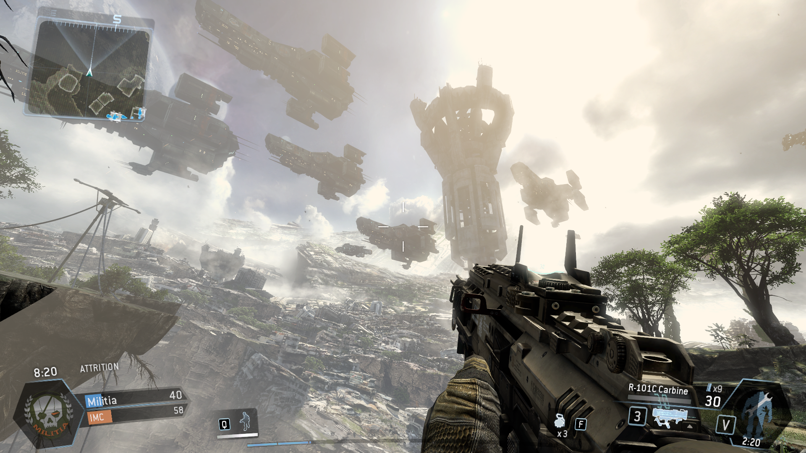

# Skybox Basics

Skyboxes are solutions intended to make maps look bigger than they are. They are typically used to display sky, along with distant, unreachable areas and landscapes, such as distant mountains or buildings

In the source engine, the skybox is also locked to the player's viewpoint, never moving or changing perspective as they move, creating the illusion of distance.

Be aware that while the most primitive shape of a skybox is a six-sided box completely enveloping the entire map, this will have a big impact on performance, compile times, and will basically create more problems than it solves. (If you have leaks, do not get tempted into using this method. The only type of map where you can use a skybox in this way, is if your map is nothing but a bunch of platforms floating in mid-air).

A skybox should instead be reserved for places the player can see but just out of reach of (by touch or with thrown/launched objects), typically only enveloping the upper part of the playing field of a map.

There are two types of skyboxes in the Source engine:

## [2D Skybox](2d-skybox.md)

Consists gives the effect of a giant cube surrounding the map used for applying textures in its interior faces. These textures usually consist of the ground meeting the sky in the horizon, clouds, and other distant details. The 2D skybox for a level is set in the `Map Properties`dialog of Hammer.

## [3D Skybox](broken-reference)

This new addition for skyboxes became available with the Source engine. It's a surrounding area constructed by the level designer, outside the bounds of the gameplay area on the map. Players can never reach the 3D skybox under normal circumstances. Maps do not require a 3D skybox to be created - it is purely optional visual addition to the map.

### See Also

* [Skybox Optimization](https://developer.valvesoftware.com/wiki/Skybox\_Optimization) - A tutorial on how to optimize a skybox.

## Source & reference


Source: [https://developer.valvesoftware.com/wiki/Skybox\_Basics](https://developer.valvesoftware.com/wiki/Skybox\_Basics)


