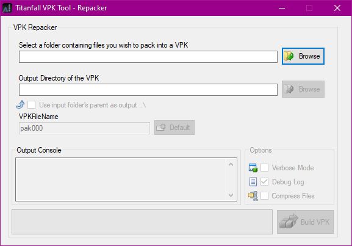

# How to backup, extract & repack

## How to backup & extract VPK's properly?

When you extract [VPK ](../../documentation/file-format/vpk-valve-pak-file.md)files, you need a directory where the files will be extracted to. This folder **should not** be inside your game directory. Before we start modding, you should create a folder to keep track of your modding files. I would recommend for you to create a folder with an easy name like `Titanfall 2 modding` on your desktop or another place you can access it easily. In this example we will use the path `C:\Users\<username>\Documents`. 

```text
C:\Users\<username>\Documents\Titanfall 2 modding
```

Once you have created this folder I recommend creating a sub-folder called `"Backup"` dedicated for, you guessed it: backups. \(Yay!\)

```text
C:\Users\<username>\Documents\Titanfall 2 Modding\backup
```

At the beginning of each guide, it will tell you what files you should backup. As an example, we will use the [crosshair modding](../../modding/weapon-config-info/crosshair-modding/) guide. At the beginning, it tells us to backup `englishclient_mp_common.bsp.pak000_dir.vpk` and `client_mp_common.bsp.pak000_000.vpk`. Copy these VPKs and paste them into your backup folder.


The next step uses the Titanfall VPK Tool. If you haven't done so already, download the VPK Tool from the [Modding tools](modding-tools/) page. Make sure you have version 3.3 or 3.4. You may have unwanted behavior by using an older version.


The VPK Tool looks like this:


Click on the 1st icon or press `CTRL + O`. Navigate to your game folder and open the VPK that is mentioned in the guide.


**Only extract** [**VPK** ](../../documentation/file-format/vpk-valve-pak-file.md)**files from the game directory. If you try to extract** [**VPK** ](../../documentation/file-format/vpk-valve-pak-file.md)**files from anywhere else, errors are caused!**


Once you have loaded the [VPK ](../../documentation/file-format/vpk-valve-pak-file.md)into the tool, click on the 5th icon to extract the VPK. I recommend you put each extracted [VPK](../../documentation/file-format/vpk-valve-pak-file.md) in a folder with the same or a similar name as the [VPK](../../documentation/file-format/vpk-valve-pak-file.md). This makes it easier to manage when you extract files from different VPK's. We will use a folder named `englishclient_mp_common`.

After you have extracted the VPK, open the folder where you extracted your files to and delete the _`extracted_logs`_ folder. You can now follow the guide to start modding.

## **How to repack VPK files properly?**

Open the repacking tool inside the Titanfall VPK Tool. You have 2 ways to do that, click on the 6th icon, or go to _`Tools > Repacker`_. The repacking window looks like this:



Once we are done with modding our crosshairs, select `Browse` next to the first box. Navigate to and select the extracted folder. Next, select `Browse` next to the second box and select your modding folder.

> C:\Users\\Documents\Titanfall 2 modding\Repack\

Then, deselect `Debug log` from the options menu, and click `Build VPK`. Once the VPK file has been built, navigate to the location you selected as the second directory. You will find two files named _`pak000_000.vpk`_ _`pack000_dir.vpk`_. Before moving those 2 files into your game directory, they have to be renamed. At the end of each guide, it it will tell you how to how to rename each file:

Rename `pak000_000.vpk` _to_ `client_mp_common.bsp.pak000_000.vpk`

Rename `pak000_dir.vpk` _to_ `englishclient_mp_common.bsp.pak000_dir.vpk`

After that is done, you can delete the debug log .txt file and move the VPKs back to your game directory. If you get a message saying the files already exist, you can replace them,

## **VPK rename / move batch script**


Bored of renaming / moving VPK files back to your game directory?


Here is a little batch script you can use!

```bash
ren "pak000_000.vpk" "client_mp_common.bsp.pak000_000.vpk"
ren "pak000_dir.vpk" "englishclient_mp_common.bsp.pak000_dir.vpk"
move "client_mp_common.bsp.pak000_000.vpk" "<ORIGINGAMES>\Titanfall2\vpk\client_mp_common.bsp.pak000_000.vpk"
move "englishclient_mp_common.bsp.pak000_dir.vpk" "<ORIGINGAMES>\Titanfall2\vpk\englishclient_mp_common.bsp.pak000_dir.vpk"
```

That's the script for renaming for _`englishclient_mp_common.bsp.pak000_dir.vpk`_, it can be adapted to any other VPKs you edit quite often. Just paste that in a blank notepad file and save it with a `.bat` extension.

**Don't forget to add the correct game directory by replacing** _`<ORIGINGAMES>`_ **with the location of you game install.** You can also replace _`<ORIGINGAMES>`_ with your steam directory or wherever your Steam game library is \(`Steam\steamapps\common`\).


Make sure to close the VPK tool before executing this script, as it will cause an error.




