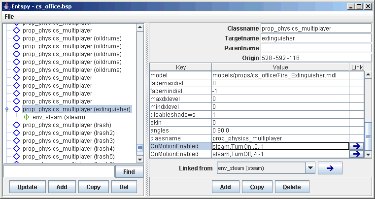

# Entspy

**Entspy**是一个可以查看和编辑[BSP](https://developer.valvesoftware.com/wiki/BSP)文件[实体](https://developer.valvesoftware.com/wiki/Entity)属性的工具。该工具对于调整较小实体的属性很有用，而且无需再次编译地图。  
该程序的最后一个版本是v0.8，发布于2nd October 2005。

## 在地图上添加重生点

给地图添加额外的重生点可能是你想要使用Entspy编辑地图实体的一个常见原因。下面是操作说明与指导：

1.运行一个本地服务器。这个可以通过向控制台输入`sv_lan 1`和`map mapname` 来实现，此命令将会加载对应地图。

2. 开启作弊。在控制台中输入`sv_cheats 1`。

3. 在控制台中输入 `map_showspawnpoints` 。地图上所有有效的重生点都会以绿色盒子的形式显示。

4. 输入`cl_showpos 1`。你当前地图的坐标（X, Y, Z） 将会显示在屏幕的右上角（在"pos:"之后的数值）。

5. 当你想要创建新重生点时，请站在不要过于靠近当前重生点的任意一个地方。另外，请记录你在每一个点的位置（坐标精确到整数位即可）。

6. 退出游戏并在Entspy中加载地图。

7. 在实体列表中，找出你想创建的重生点类型。例如，在 CS:S 中，实体`info_player_counterterrorist`代表CT方的重生点，实体`info_player_terrorist`代表T方的重生点。

8.通过选择上述重生点类型并按下在实体列表下的“Copy”按钮来给重生点实体做一个备份。

9. 编辑备份重生点的“原点（origin）”属性，以匹配你再第五步记录的位置坐标。注意，你可能需要从z坐标（最后一个数字）中减去大约50个单位，才能保证刷出点的高度是正确的。

10. 对于剩下的点位重复第七步的步骤。

11. 通过 "File/Save BSP" 菜单存储地图。

12. 现在请像将改变后的地图加载到游戏中，并再次在控制台中输入`map_showspawnpoints`命令。现在你就可以看到以绿盒子形式出现的新重生点了。如果某些重生点以红盒子形式显示，则它们是无效的。如果一个重生点与一个实体（如地面）相交，或者与另一个实体（如另一个重生点）太近，那么它就会是无效的。一般重生点间距约为至少80个单位。 

## 视频教学




引用资料：

* [https://developer.valvesoftware.com/wiki/Entspy](https://developer.valvesoftware.com/wiki/Entspy)
* [http://www.bagthorpe.org/bob/cofrdrbob/entspy.html](http://www.bagthorpe.org/bob/cofrdrbob/entspy.html)


