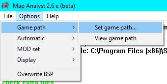
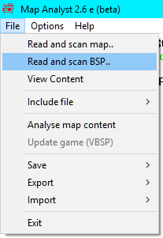
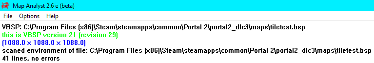
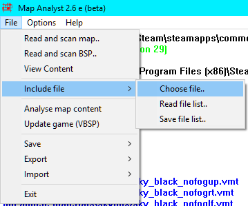
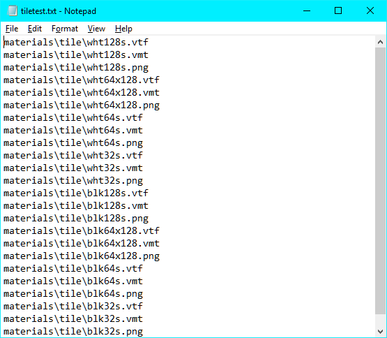
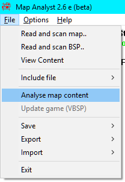
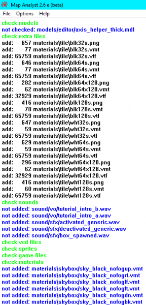
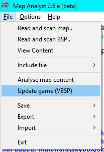

# Map Analyst

&#x20;**Map Analyst** (MAN) is a [GUI](https://developer.valvesoftware.com/wiki/GUI) tool by Rolf Hänisch for embedding custom content, such as materials, textures, models or sounds, into a .[BSP](https://developer.valvesoftware.com/wiki/BSP) file. Other packing programs sometimes won't detect custom files because their automation is flawed. MAN can circumvent that by having the user tell it directly what should be packed. Despite the age (2005), this has been confirmed to still work with Portal 2.


**Note:**This guide is a translated and condensed version of the German one included in the [ZIP](http://en.wikipedia.org/wiki/ZIP) file. Don't worry, the program is in full English.


Special thanks go to Gosuke, who gave me the idea for this program. After the first steps, a lot of mappers supported me. In addition to Gosuke, Thomas 'Flausch' Abts, DJ flyer (alias Markus), Spice, and Thorn have earned special merit. Without their help, Map Analyst would not have left beta status and many features would be missing. THANK YOU!

## Installation

The ZIP file can be unpacked anywhere. Double click on man.exe to start the program.

Before starting, the program needs to know the [game directory](../game-directory.md), for example `C:\Program Files (x86)\Steam\steamapps\common\Portal 2\portal2_dlc3`.

To set the folder path, go to **Options, Game path, Set game path...**.

To view the current game path, click on **View game path**.See the Options section below for information on making the packing process faster.

### Reading a Map

To open a map, go to **File**, and choose **Read and scan map..** for VMF or **Read and scan BSP..** for BSP. This program also supports dragging and dropping, however it may require you to change the game path.

### Specify what files to include

There's two methods of packing content. If all your packed content is in one folder, you can use the first method, which is faster and easier. Both methods require that you put the files in a folder under your [game directory](../game-directory.md), such as `C:\Program Files (x86)\Steam\steamapps\common\Counter-Strike Global Offensive\csgo\materials\decals`.

#### Choose file..

Go to **File, Include file, Choose file..** and then select all the individual files you want to pack into the map. Note that this dialog box is unable to select a folder itself, or files in two different folders. If that's your situation, check the section immediately below this one.

#### Read file list..

Open a text editor, such as Notepad. In this file, put in the filepaths of all the files you need to pack into your map. They need to be relevant to your game directory folder. Save the file, using the extension .txl. Now, go to **File, Include file, Read file list..** and select the .txl file you made before. The name of this file can be anything, but saving it with the same name as your map will let you automatically load it.

## Analyzing a Map

Next, the program has to figure out what needs to be packed. Go to **File, Analyze map content**.

One by one, all the files in the map are examined. Some text will appear with warnings about files not being added, missing, etc. You can ignore all of this unless it mentions actual custom content that you're trying to pack. The blue lines normally indicate files that don't need to be packed because they aren't custom content.

## Packing

Go to **File, Update game (VBSP)**, and that's it! Your packed map will be called **man\_betatest** unless you set the overwrite option mentioned below. Confirm the content was packed with [`sv_pure 2`](https://developer.valvesoftware.com/wiki/Sv\_pure) or ask a friend to play your map.

## Options

### Automation

Under **Options, Automatic** are three settings that can be toggled independently to make the packing process faster:

* **Include**: The list of additional files will be loaded automatically.
* **Analyze**: If a map has been successfully loaded, the analysis will start automatically.
* **Update**: If the analysis was successful, the update of the BSP will be carried out automatically.

### Verbosity

Due to how many files a single map can end up using, MAN has toggle options to control how much information it tells in the outputs under **Options, Display**.

### Overwriting

If **Options, Overwrite BSP** is turned on, MAN will overwrite the original BSP instead of making a new map file called **man\_betatest**.


&#x20;**Warning:** The author said that this may corrupt your bsp, likelihood unknown.



Source: [https://developer.valvesoftware.com/wiki/Map\_Analyst](https://developer.valvesoftware.com/wiki/Map\_Analyst)

