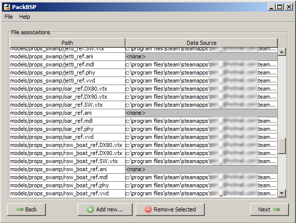

# PackBsp

PackBsp是一个允许地图制作者很容易就能嵌入自定义模型，纹理和其他资产到他们的基于Valve的[Source](http://en.wikipedia.org/wiki/Source_%28game_engine%29)引擎的地图。它通过分析地图、确定需要被加入的内容和可能存在的依赖关系，并将所有内容打包到单个BSP文件中来实现这一点。


 **警告：** 目前来说，这个工具如果在 \SteamApps\\[steam\_username\]\Source SDK\ 中检测不到老的[Source SDK](https://developer.valvesoftware.com/wiki/Source_SDK)（因为某些新的[SteamPipe](https://developer.valvesoftware.com/wiki/SteamPipe)无法更新）的话，是无法工作的。目前并没有相关人员提供更新补丁或者技术支持，所以目前建议您使用[bspzip](bspzip.md) 或 [Pakrat](pakrat.md)代替。



 **提示：**虽然目前没有开发进程，但作者欢迎任何形式的贡献或修复，您可以通过Github来提交。


例如，您的地图中可能有一个自定义模型。PackBSP将分析模型以找到它被调用的所有文件和材料，然后分析这些文件和材料以找到gibs或纹理等，直到所有的相关资源都被发掘。它将把这些文件与GCF/NCF文件夹中存在的文件进行对比，这样地图中将只包含您真正需要改变的自制内容，并且可以在您需要的内容缺失时提交错误报告给您。

## 特点

* 对于steam上所有的起源游戏mod都有效，比如说：
  * 半条命2
  * 半条命2 第一章
  * 半条命2 第二章
  * 军团要塞2
  * 胜利之日：起源
  * CS:GO
* 支持自定义内容，包括\(但不限于\):
  * 模型和武器皮肤
  * 材质和纹理
  * 背景音乐和声音
  * 粒子
  * 天空盒
* 使用和 [Hammer](http://en.wikipedia.org/wiki/Valve_Hammer_Editor)一样查找方式去查找特殊的实体数据文件。如果你可以在Hammer中选择一个材料或模型，PackBsp应该同样检测得到它。

## 支持

### 提交错误报告

要提交bug报告，请到Github页面创建一个新问题，提交**packbsp\_debug.log**的副本，此副本可以在PackBsp的根目录中文件夹找到。

### 问题和建议的对策方针（Q&A\)

**“PackBsp不会自动在我的地图中找到某个依赖项，我必须手动添加它。”**

* 请提交一个bug报告，并说明缺失的依赖关系以及关系链的类型。例如，你的地图中可能有一个prop\_static，它有一个自定义模型，这个模型可能有一个自定义皮肤，而那个皮肤材质可能有一个自定义纹理，但是纹理缺失了。

**"“引擎”的下拉框为空或缺少条目！我找不到需要运行的游戏文件！"**

* 你的Source SDK 配置可能损坏或不完整。
* 尝试快速启动缺失的游戏。
* 尝试使用在Source SDK启动器中的 "Refresh SDK Content" 选项
* 如果你能够使用游戏自带的的Hammer编辑器，但不能使用PackBsp，请提交bug报告。

**"我尝试选择steam目录，它说客户端注册表.Blob正在被另一个进程使用!"**

* Steam可能正在以某种方式重新配置自己，比如更新。请稍后再试。
* 如果稍后再次尝试还是不起作用，请尝试重新启动Steam。
* 如果问题仍然存在，请提交错误报告。

**"我的`env_projectedtexture`没有显示出来"**

* 因为它很难分析和预测某些行为，PackBsp并不支持由Hammer中的I/O系统所触发的依赖关系。
* `env_projectedtexture` 实体依赖于I/O系统，你必须配置所要使用的纹理。
* 请检查您的地图的依赖逻辑关系网来确定需要哪些文件，并手动添加它们。

**"**我有一些地图逻辑关系物，比如说一个显示道具的模型，但当我触发它时，它的的新模型消失了**"**

* 因为它很难分析和预测某些行为，PackBsp并不支持由Hammer中的I/O系统所触发的依赖关系。
* 请检查您的地图的依赖逻辑关系网来确定需要哪些文件，并手动添加它们。


源文档链接： [http://technofovea.com/blog/projects/packbsp](http://technofovea.com/blog/projects/packbsp)

引用文献：

* [http://technofovea.com/blog/](http://technofovea.com/blog/)
* [https://github.com/DHager/packbsp](https://github.com/DHager/packbsp)
* [https://developer.valvesoftware.com/wiki/Packbsp](https://developer.valvesoftware.com/wiki/Packbsp)


