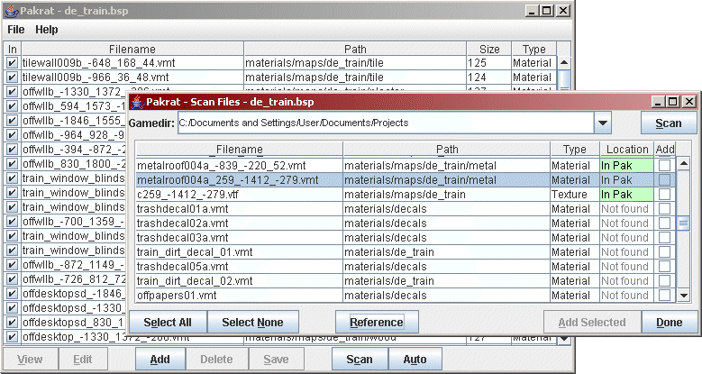

# Pakrat

**注意：** Pakrat似乎不适用于某些新版本的Source引擎。详情请查看 [VIDE](vide.md)。

**Pakrat**是Valve的[Bspzip](https://app.gitbook.com/@noskill/s/titanfall2/~/drafts/-MaYSoe1K5NhUn60ZC2N/v/chinese/how-to-start-modding/modding-introduction/modding-tools/source/bsp/bspzip/@drafts)程序的GUI替代品。

Pakrat能够扫描[. bsp](https://developer.valvesoftware.com/wiki/BSP)文件中的所有纹理、材质和模型文件，并自动将用户自制内容嵌入到. bsp文件中。


如果你删除并重新保存打包的内容，Pakrat会破坏.bsp文件中原有的文件。为了让Pakrat正确地打包您的自定义项目，您必须确保在再次保存. bsp之前将所有内容添加到. bsp文件中并且不遗漏任何内容。此外，覆盖现有版本\(例如，覆盖您当前在Pakrat中打开的地图\)也会破坏原有的文件。


Pakrat因为容易损坏文件，在使用者中的名声不太好，所以请谨慎地添加您需要嵌入的文件。


**提示：**如果需要将.nav文件添加到.bsp中，不要允许它自动修复.nav文件。

[演示视频](http://youtu.be/nRqfv8Cmc9Y)





 **请自己承担使用风险！**


## 用法

Pakrat对于在上传到Steam创意工坊之前将纹理和自制资产等打包到你的BSP中很有用，就像[p2map\_publish](https://developer.valvesoftware.com/wiki/P2map_publish)一样。这篇简短的教程将假设你在传送门2的环境中工作，并且你已经将你的自定义资产放在了SteamApps/common/Portal 2/portal2/的子文件夹中 -- 理论上，这个操作方法适用于其他所有基于起源引擎的游戏，只是对应路径不相同。

1. 下载Pakrat并将其解压缩到您的计算机上的某个地方。
2. 在Hammer中，像往常一样编译你的地图。如果有必要，还可以在游戏中构建[立方体地图](https://developer.valvesoftware.com/wiki/Cubemaps)。一旦我们用Pakrat打包了我们的文件，我们不会想再去编辑BSP文件，因为如果你试图重新打包相同的文件，

   Pakrat经常会对地图文件造成损坏。

3. 在Pakrat中, File &gt;&gt; Preferences，你可以通过浏览\portal2\ folder... 文件夹来配置游戏根目录文件夹

   （完整路径一般是这样的格式 "...Steam/SteamApps/common/Portal 2/portal2/"）。

4. 在Pakrat中，点击“Auto”并添加需要被检测到的文件。如果你想知道这实际上是在做什么，请点击“Scan”——它会在游戏根目录中查找它在BSP中检测到的文件路径。如果它无法找到任何与游戏一起出现的文件\(例如打包在VPKs中的文件\)，那么这是会一个正确的反馈，因为你只想检测你需要被添加的自定义内容。
5. 在Pakrat中，请确保您保存并覆盖的BSP与原文件文件名一致，否则它将破坏您的立方体地图。


源文档链接： [https://developer.valvesoftware.com/wiki/Pakrat](https://developer.valvesoftware.com/wiki/Pakrat)


