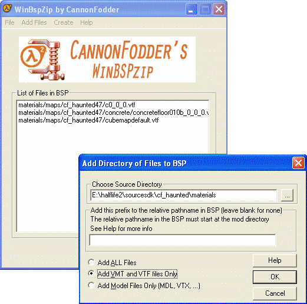

# WinBSPZip

**WinBSPZip** is a [GUI](https://developer.valvesoftware.com/wiki/GUI) frontend for Valve's [Bspzip](bspzip.md) application.

It has three main functions:

* Fixing errors in writing large files by breaking up writes to Steam [file system](http://en.wikipedia.org/wiki/file_system) write.
* Adding error checking to list file by fixing back and forward slashes and checking for spaces.
* Adding all files in a directory to the .[BSP](https://developer.valvesoftware.com/wiki/BSP).


Reference:

* [https://developer.valvesoftware.com/wiki/WinBSPZip](https://developer.valvesoftware.com/wiki/WinBSPZip)
* [http://www.chaosincarnate.net/cannonfodder/cftools.php?program=winbspzip](http://www.chaosincarnate.net/cannonfodder/cftools.php?program=winbspzip)


