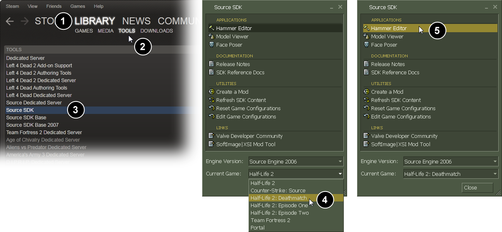
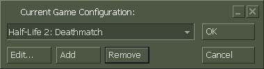
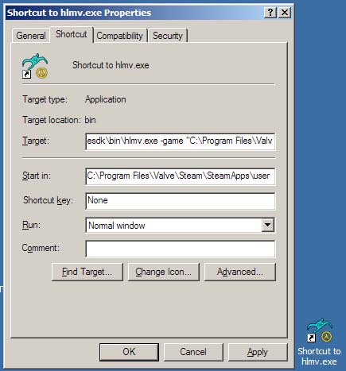

# 游戏目录

在为起源引擎制作Mod和增添内容时，正确的设置一个游戏开发环境是至关重要的。设置游戏环境时最重要的是确定游戏目录的位置。本文档解释了什么是游戏目录，以及如何使用它。

## 什么是游戏目录？

**游戏目录**是相关工具在查找游戏内容时所引用的文件夹。例如：Hammer Editor需要知道在哪里可以找到材质文件，以便可以显示它们。 `Studiomdl`将编译生成模型，但是它需要知道将编译后的模型文件放在何处。 `Vrad.exe` 将照亮地图，但它需要知道在哪里可以找到道具模型，以便它可以加载道具模型并确定如何遮挡光线。没有SDK工具可以脱离你的游戏目录而运行。

主要的起源引擎游戏目录举例：

| [Half-Life 2](https://developer.valvesoftware.com/wiki/Half-Life_2) | `C:\Program Files\Steam\SteamApps\Common\Half-Life 2\hl2` |
| :--- | :--- |
| [Counter-Strike: Source](https://developer.valvesoftware.com/wiki/Counter-Strike:_Source) | `C:\Program Files\Steam\SteamApps\Common\counter-strike source\cstrike` |
| [Half-Life 2: Deathmatch](https://developer.valvesoftware.com/wiki/Half-Life_2:_Deathmatch) | `C:\Program Files\Steam\SteamApps\Common\half-life 2 deathmatch\hl2mp` |

 假设你在SDK Launcher中选择**Create a Mod**，并输入`C:\Program Files\Steam\SteamApps\sourcemods\MyMod` 作为目录，然后输入 `Blasters` 作为Mod名称。则在下面的示例中，我们所提到的游戏目录为 `C:\Program Files\Steam\SteamApps\sourcemods\MyMod\Blasters`。

其中一种确定游戏目录的方法是查找文件名为 `GameInfo.txt`的文本文件。GameInfo.txt文件所在的目录就是你所需要的游戏目录。在上文之中，如果你创建了 `C:\Program Files\Steam\SteamApps\sourcemods\MyMod\Blasters`，则在你的游戏目录之中会存在这个文本文件`C:\Program Files\Steam\SteamApps\sourcemods\MyMod\Blasters\GameInfo.txt`. 在你找到游戏目录后，你需要告诉SDK工具该目录的位置。

想要了解自己Mod的`GameInfo.txt` 是如何生成的，亦或是其中的内容如何被使用？请参阅[GameInfo.txt File Structure](https://developer.valvesoftware.com/wiki/The_GameInfo.txt_File_Structure).

## 设置正确的游戏目录

设置有效的游戏目录，以便于所有工具都知道如何查找游戏内容，而不必每次使用时都需要重新指定它。使用Source SDK Launcher中**Current Game**的下拉列表是设置有效游戏目录的主要方法。

### 使用Source SDK Launcher来设置游戏目录

要使用Source SDK Launcher设置有效的游戏目录，请执行以下操作：

1. Double-click **Source SDK** from the Steam **Play Games** Menu.
2. Next you must choose the correct **Current Game** from the Source SDK Launcher.
3. Now launch one of the SDK tools, such as the **Hammer Editor**, by double-clicking it.




### Using VConfig to set the game directory

The **VConfig** application can also be used to set the active game directory. It provides a similar function to setting the **Current Game** in the **SDK Launcher**.

The `vconfig.exe` application is found in the `\sourcesdk\bin` directory.

For example, if you installed Steam at `C:\Program Files\Steam`, **VConfig** would be found here:

```text
C:\Program Files\Steam\SteamApps\Common\sourcesdk\bin\vconfig.exe
```

To set your active game directory with VConfig:

1. Double-click the `vconfig.exe` application.
2. Next you must choose the correct **Current Game** from the drop-down list.
3. Click **OK**.
4. Now launch one of the SDK tools, such as the **Hammer Editor**, by double-clicking it.



Alternatively, you can specify the game directory you wish to use without launching VConfig and choosing from the menu. To do this, simply run VConfig with the command-line parameter `-game [directory]`. This can be especially useful for setting the game directory in a batch file or other automated process.

For example, the following command would set the game directory to the default Half-Life 2 install path without having to actually launch VConfig:

```text
vconfig -game "C:\Program Files\Steam\SteamApps\Common\Half-Life 2"
```

## Specifying the game directory on the command line

An alternative method to set the current game directory is to directly specify the directory location on the command line when running each SDK tool. All of the SDK tools support the `-game <directory>` command line parameter. The advantage to specifying the game directory on the command line is that you are being explicit about where your game's content is to be found.

Here are some examples of running tools where you specify the game directory explicitly:

```text
%sourcesdk%\bin\studiomdl -game C:\Program Files\Steam\SteamApps\sourcemods\MyMod\Blasters mymodel.qc
```

```text
%sourcesdk%\bin\vrad -game C:\Program Files\Steam\SteamApps\sourcemods\MyMod\Blasters mymap
```

```text
%sourcesdk%\bin\hammer -game C:\Program Files\Steam\SteamApps\sourcemods\MyMod\Blasters
```

 **Note:**If you have spaces in your game directory path, you **must** use quotation marks around the game directory path:

```text
%sourcesdk%\bin\hammer -game "C:\Program Files\Steam\SteamApps\Common\counter-strike source\cstrike"
```

```text
%sourcesdk%\bin\vrad -game "C:\Program Files\Steam\SteamApps\Common\counter-strike source\cstrike" MyCstrikeMap
```

Using the `-game` command-line parameter to specify the current game directory gives you the advantage of being able to work on multiple games or MODs at once, and change your configurations for each. This can be easily done by making shortcuts to tools such as vtex with the -game parameter built-into the shortcut. When doing this, make sure to add quotes around the game directory path, if the path contains spaces.

## Notes

Left 4 Dead 2 and later don't work properly when attempting to open the Hammer Editor on a 64-bit system after upgrading from 32-bit, as there comes one or two error messages: `VCONFIG Error`

`Setup file 'gameinfo.txt' doesn't exist in subdirectory 'c:\program files (x86)\steam\steamapps\common\left 4 dead 2\bin\vconfig Check your -game parameter or VCONFIG setting.` `Error`

`Setup file 'gameinfo.txt' doesn't exist in subdirectory 'c:\program files\steam\steamapps\common\left 4 dead 2\left4dead2 Check your -game parameter or VCONFIG setting.`{



This problem however, can be fixed by editing the GameConfig.txt in the bin folder:

English or other language: Add a space and "\(x86\) after "program files" on all locations Swedish: Replace "program" with "Program Files \(x86\)"


Source: [https://developer.valvesoftware.com/wiki/Game\_Directory](https://developer.valvesoftware.com/wiki/Game_Directory)


