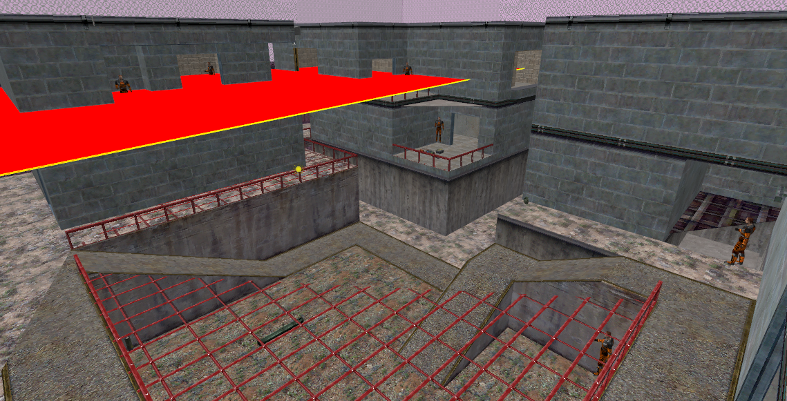
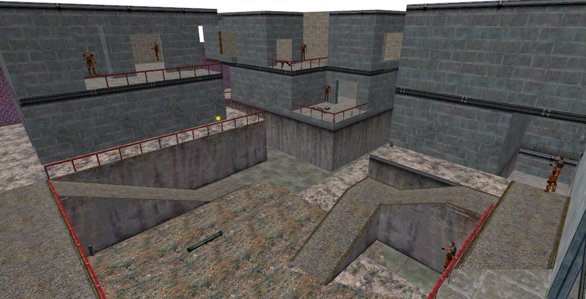

# BSP2MAP

**BSP2MAP** is a decompiler for [GoldSrc](https://developer.valvesoftware.com/wiki/GoldSrc) maps written by Skyler 'Zipster' York. It converts the [BSP](https://developer.valvesoftware.com/wiki/BSP) files into .[MAP](https://developer.valvesoftware.com/w/index.php?title=Map_%28file_format%29&action=edit&redlink=1) format, which can then be loaded into [Hammer Editor](https://developer.valvesoftware.com/wiki/Hammer_Editor). Unfortunately, Goldsource maps do not store enough information for brushwork, so the geometry has to be recreated using the polygons. BSP2MAP hollows out all brush-based entities with a thickness of one unit as a preventive measure to stealing/copying maps.


This decompiler should not be used, it does not do a great job compared to [WinBSPC](https://developer.valvesoftware.com/wiki/WinBSPC), a more accurate GoldSrc decompiler. A comparison can be seen below.



Source: [https://developer.valvesoftware.com/wiki/BSP2MAP](https://developer.valvesoftware.com/wiki/BSP2MAP)


