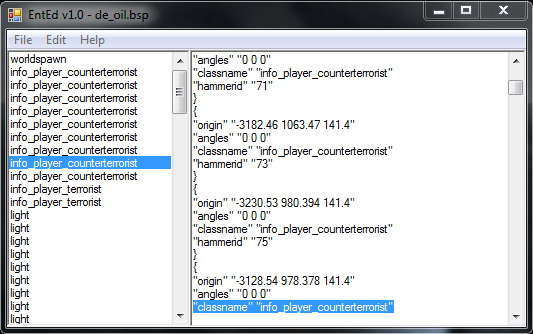

# EntEd

**EntEd** is a tool that can view and edit the [entity](https://developer.valvesoftware.com/wiki/Entity) properties of a [BSP](https://developer.valvesoftware.com/wiki/BSP) file similar to [Entspy](entspy.md).  
The program is useful for tweaking small entity properties without compile the map again.


Source: [https://developer.valvesoftware.com/wiki/EntEd](https://developer.valvesoftware.com/wiki/EntEd)


