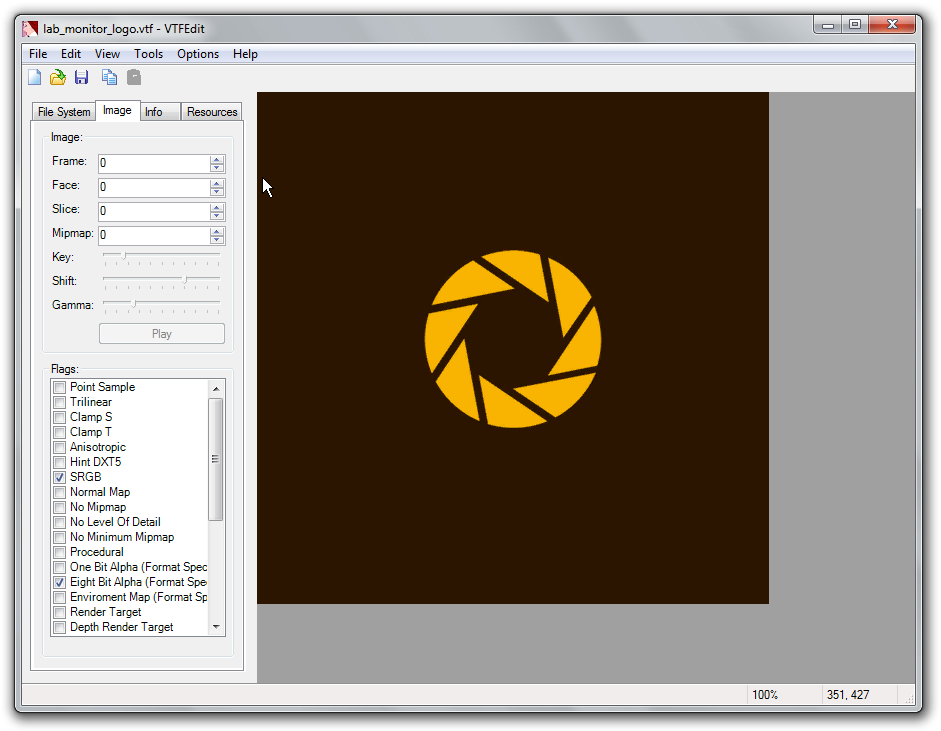
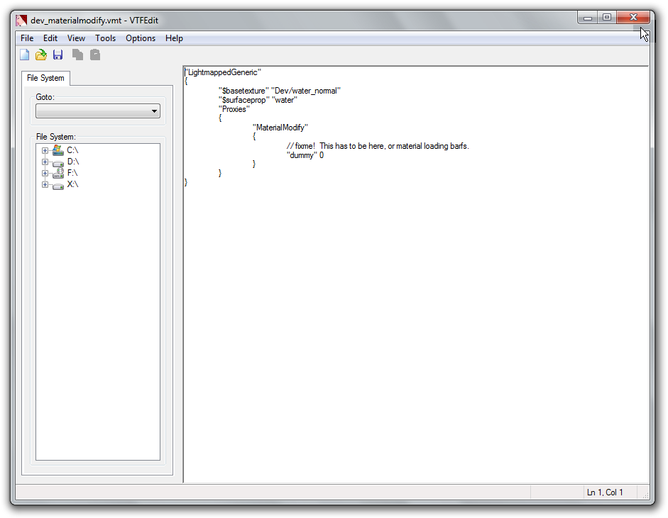

# VTFEdit

**VTFEdit** is a GUI frontend for the functions contained within [VTFLib](https://developer.valvesoftware.com/wiki/VTFLib), an LGPL open source programming library. VTFEdit is a successor to [VTFTool](https://developer.valvesoftware.com/wiki/VTFTool) and is written by [Neil "Jed" Jedrzejewski](https://developer.valvesoftware.com/wiki/User:Wunderboy) and [Ryan "Nemesis" Gregg](https://developer.valvesoftware.com/wiki/User:Nem).

VTFEdit itself was written solely by Ryan and is a .NET based GUI tool for the creation and conversion of [VTF](https://developer.valvesoftware.com/wiki/VTF) and [VMT](https://developer.valvesoftware.com/wiki/VMT) files. It is a powerful tool allowing files of various formats to be converted to/from VTF format in all of the Source texture formats.

VTFEdit produces [MIP maps](https://developer.valvesoftware.com/wiki/MIP_Mapping) and DXTn compressed images using nVidia's [nvDXTlib](http://developer.nvidia.com/object/dds_utilities.html) library, offering a wide range of formats and filters.

Other features include the ability to create [normal maps](https://developer.valvesoftware.com/wiki/Normal_Maps) from grey scale images, various sharpening filters for MIP Map generation, access to all VTF header flags, a simple tree based VMT creation system with [GCF](https://developer.valvesoftware.com/wiki/GCF) access, a WAD conversion tool, a batch conversion tool and a VMT creation wizard.


**Bug:** VTFEdit will crash if you attempt to paste anything but text into the editor.


