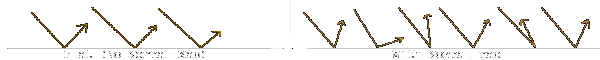
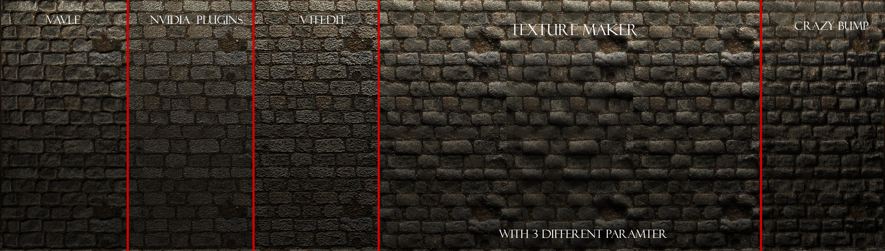

# Bump map

Textures often called **Bump Maps**, or **Normal Maps** are used to simulate three-dimensional details on a two-dimensional surface by manipulating its lighting.


 **Note:** Static props using bump maps can not be lit per-vertex, except in .



 **Note:** Bump maps cannot be used on decal textures, except in .


## Format

Each pixel in a bump map contains the \(x, y, z\) coordinates that define a  [normalized](https://developer.valvesoftware.com/wiki/Normal) [vector](https://developer.valvesoftware.com/wiki/Vector).

Because of this each color channel in a bump map has meaning:

### Red

Horizontal facing \(X axis\).

* 0 = left
* 128 = forward or facing viewer
* 255 = right

### Green

 Vertical facing \(Y axis\).

* 0 = up
* 128 = forward, or facing viewer
* 255 = down

### Blue

Height \(Z axis\).

* 0 = facing 'in' to the texture, away from the viewer. This is a 'bad' value. Anything under 128 means that the surface should be facing away from the player, which is not possible.
* 128 = maximum depth capable of receiving dynamic light. It's a bad idea to go under this.
* 255 = facing 'out' of the texture towards the viewer.


 **Note:** Valve's "flat" bump map textures use RGB values of \[120, 124, 248\]



 `dev/flat_normal` uses the above-mentioned values. However they are incorrect. An actually flat bump map should be \[128, 128, 255\]


The three channels represent a normal vector for every pixel which represents the direction that the pixel is facing in 3D spaces. This allows the engine to generate shadows and highlights on a two-dimensional surface, or give a 3D model more detail.

A bump map is largely useless for really flat surfaces like smooth concrete or metal, but even smooth concrete sometimes has enough depth to it to make one worthwhile.

## Creation

A bump map should be rendered in Tangent space and use vector dimensions X+ Y- Z+.


**Note:** There are basically two sets of rules for normal maps: DirectX and OpenGL. They interpretation of green channels are opposite. Source takes the former. Thus, the green channel may need to be inverted depending on the software used to create it.


## Programs

Various programs can automate the creation of bump maps, either by image analysis or by using 3D geometry the user pro

### 2D tools

* [Photoshop or Paint Shop Pro](https://developer.valvesoftware.com/wiki/Normal_Map_Creation_in_Photoshop_or_Paint_Shop_Pro)
* [Substance Designer](http://www.youtube.com/watch?v=WsFe-E-33IQ)
* [The GIMP](https://developer.valvesoftware.com/wiki/Normal_Map_Creation_in_The_GIMP)
* [nDo](http://www.youtube.com/watch?v=xDZDWvTUz-c)

### 3D tools

* [XSI](https://developer.valvesoftware.com/wiki/Normal_Map_Creation_in_XSI)
* [ZBrush](https://developer.valvesoftware.com/w/index.php?title=Normal_Map_Creation_in_ZBrush&action=edit&redlink=1)
* [Lightwave](https://developer.valvesoftware.com/w/index.php?title=Normal_Map_Creation_in_Lightwave&action=edit&redlink=1)
* [3ds Max](https://developer.valvesoftware.com/w/index.php?title=Normal_Map_Creation_in_3ds_Max&action=edit&redlink=1)
* [Maya](https://developer.valvesoftware.com/wiki/Normal_Map_Creation_in_Maya)
* [Blender](https://developer.valvesoftware.com/wiki/Normal_Map_Creation_in_Blender)
* [NVIDIA Melody](http://www.nvidia.com/object/melody_home.html)
* [Cinema 4D](http://planetpixelemporium.com/tutorialpages/normal2.html)
* [NormalMapper](https://developer.valvesoftware.com/wiki/NormalMapper)
* [xNormal](http://xnormal.net/)

### Other

* [Bitmap2Material 3](http://store.steampowered.com/app/325910/): Alternative to CrazyBump.
* [CrazyBump](http://www.crazybump.com/): Produces some very good normal maps. Some of them can be argued as almost having the same depth as a parallax map.
* [Filter Forge](http://filterforge.com/filters/8774.html): Can generate normal maps for its filters and external images.
* [InsaneBump](https://sites.google.com/site/ccdsurgeon/download/): Specifically made to be a free alternative to CrazyBump, produces high quality normal maps.
* [MindTex](http://mindtex.com/): A cheaper alternative to CrazyBump. Also produces high-quality normal maps.
* [Normal2dudv](https://developer.valvesoftware.com/wiki/Normal2dudv): a third party tool for converting bump maps to Dx8-friendly [du/dv maps](https://developer.valvesoftware.com/wiki/Du/dv_maps).
* [ShaderMap](http://shadermap.renderingsystems.com/): A free alternative to CrazyBump.
* [SSBump Generator 5.3](https://sourceforge.net/projects/ssbumpgenerator/): Another free, open source alternative to CrazyBump that generates Self Shadowed Bump Maps as well as normal maps.

## Conversion

### **In VTFEdit**

When converting your texture:

1. Choose your image format. Uncompressed formats like BGR888 are higher-quality than compressed formats like DXT1, but be wary of file size.
2. Check the "Normal map" box in the texture's flags list after the import is complete. It's about 1/5 of the way down the list.


**Tip:**VTFEdit can automatically generate bump maps. See the bottom-right of the import screen.


### **In Vtex**

1. Save your normal map as a [TGA](../../image-file-format/truevision-graphics-adapter-tga.md). Give it a name that ends in \_normal. The \_normal at the end of the name will affect how [Vtex](https://developer.valvesoftware.com/wiki/Vtex) converts it. For the brick wall example, we would name the file `brickwall_normal.tga`.
2. Add `nocompress 1` and `normal 1` to &lt;texture filename&gt;.txt in the same folder as your texture, then compile.

#### Implementation

See [`$bumpmap`](usdbumpmap.md).


Source: [https://developer.valvesoftware.com/wiki/Bump\_map](https://developer.valvesoftware.com/wiki/Bump_map)


