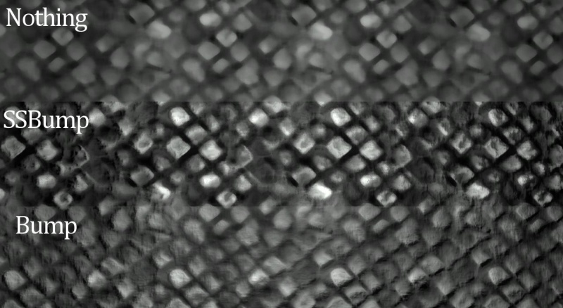
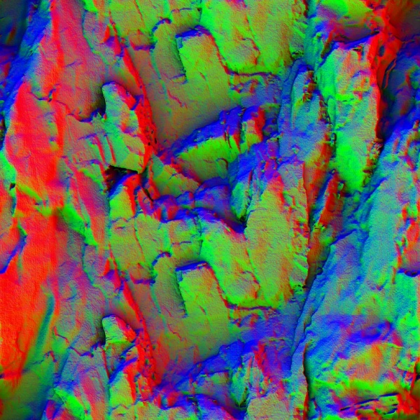
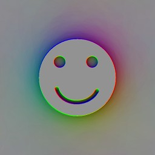
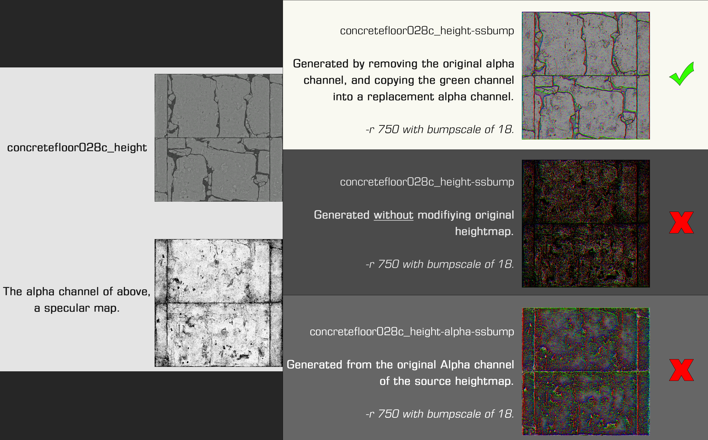
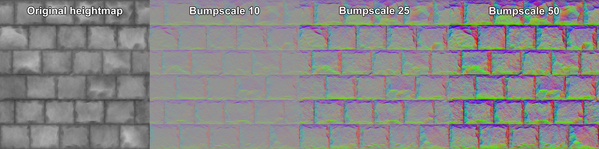

# $ssbump

**`$ssbump`** is a [material](../valve-material-type-vmt.md) [shader](../shader.md) parameter available in all Source games since [](https://developer.valvesoftware.com/wiki/Source_2007) [Source 2007](https://developer.valvesoftware.com/wiki/Source_2007) for [`LightmappedGeneric`](https://developer.valvesoftware.com/wiki/LightmappedGeneric), [`WorldVertexTransition`](https://developer.valvesoftware.com/wiki/WorldVertexTransition), [`Lightmapped_4WayBlend`](https://developer.valvesoftware.com/wiki/Lightmapped_4WayBlend). It is a boolean parameter that flags a [`$bumpmap`](usdbumpmap.md) texture as being a self-shadowing [bump map](https://developer.valvesoftware.com/wiki/Bump_map).

Standard bump maps only darken [texels](https://developer.valvesoftware.com/wiki/Texel) that are facing away from a light source. Self-shadowing bump maps darken both texels facing away and also any texels which are 'behind' them. You can read more about the technology behind it [in this paper](https://steamcdn-a.akamaihd.net/apps/valve/2007/SIGGRAPH2007_EfficientSelfShadowedRadiosityNormalMapping.pdf).


**Tip:**Self-shadowed normal mapping actually renders faster than standard normal maps!




## Example

```text
LightmappedGeneric
{
	$basetexture	nature/rockwall_cave02a
	$surfaceprop	concrete
	$bumpmap	nature/rockwall_cave_02a_height-ssbump

	$ssbump		1
	$SSBumpMathFix	1 // seen in L4D2, modifies the amount of light received. Can be any number (0 removes the effect)
}
```





## Limitations

The shadows cast by the bump map are permanently baked into the texture, [meaning that they can only appear in one of three predefined locations](http://www.interlopers.net/forum/viewtopic.php?f=16&t=27513). `height2ssbump` generates shadows for light arriving from the right, top-left, and bottom-left of the texture. If light arrives from between those directions \(such as from the left\), the nearest available baked shadows are blended between, producing an acceptable but hardly ideal image.

Additionally, in order to preserve the illusion of height, low areas of a SSBumped material will receive less light even if it arrives head-on. This can look odd if you have too intense \(rugged\) a SSBump.

## Creation

You need to use **`height2ssbump`**, a [command line](https://developer.valvesoftware.com/wiki/Command_line) SDK tool. The command is:

```text
height2ssbump <options> <path\to\heightmap.tga> <float|bumpscale>
```

The output is `<input name>-ssbump.tga`, in the same folder as the input file. `Bumpscale` controls the intensity of the ssbump \(i.e. coarseness of the surface\). **Note:**Bizarrely, the tool examines only the [alpha channel](https://developer.valvesoftware.com/wiki/Alpha_channel) of the input TGA. The original alpha channel will be passed on to the output TGA, but serves no purpose and should be deleted.

You can use **`normal2ssbump`**, another SDK tool, to generate an SSBump from a normal bump map \(as opposed to a height or displacement map\) - Unlike **`height2ssbump`** you do not need to run through the [command line](https://developer.valvesoftware.com/wiki/Command_line) or use any additional parameters; simply drag-and-drop your normal map onto the program or a shortcut. **Tip:**If you are generating an SSbump from a Valve-created heightmap, you may need to remove the alpha channel from the heightmap first, and then copy the Green channel into a replacement Alpha channel in order to generate the SSbump correctly. This can be caused by leftover [Specular](https://developer.valvesoftware.com/wiki/Specular) maps in the Alpha channel most likely used in the generation of [Env map masks](https://developer.valvesoftware.com/wiki/$envmapmask) that are stored in the alpha channel of a [Normal map](https://developer.valvesoftware.com/wiki/Normal_Maps) and enabled via the [`$normalmapalphaenvmapmask`](https://developer.valvesoftware.com/wiki/$normalmapalphaenvmapmask) material parameter.


**Tip:**Self-shadowed normal mapping actually renders faster than standard normal maps!






### Options

#### `<path/filename>`

The source [heightmap](https://developer.valvesoftware.com/wiki/Heightmap) \(TGA format\).

#### `-r <`[`int`](https://developer.valvesoftware.com/wiki/Int)`>`

Set the number of 'rays' \(default 250\). More rays take more time.

#### `-n`

Generate a conventional bump map as `<input name>-bump.tga`.

#### `-d` 

\(New with Left 4 Dead\)Generate an ssbump detail texture. **To do:** What is this for?

#### `-A`

Generate ambient occlusion in the alpha channel.

#### `-f <int>`

Set smoothing filter radius \(default 10; 0 disables\).

#### `-D`

Write out filtered result as `filtered.tga`.


Source: [https://developer.valvesoftware.com/wiki/$ssbump](https://developer.valvesoftware.com/wiki/$ssbump)


