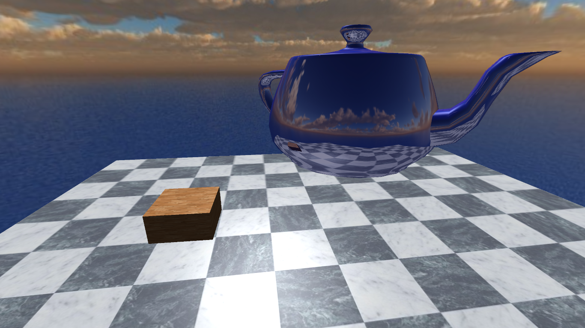

# Cube Mapping

## Cube Mapping

In computer graphics, **cube mapping** is a method of environment mapping that uses the six faces of a cube as the map shape. The environment is projected onto the sides of a cube and stored as sic square textures, or unfolded into six regions of a single texture. The cube map is generated by first rendering the scene six times from a viewpoint, with the views defined by a 90 degree [view frustum](https://en.wikipedia.org/wiki/Viewing_frustum) representing each cube face.

In the majority of cases, cube mapping is preferred over the older method of[ sphere mapping](https://en.wikipedia.org/wiki/Sphere_mapping) because it eliminates many of the problems that are inherent in sphere mapping such as image distortion, viewpoint dependency, and computational inefficiency. Also, cube mapping provides a much larger capacity to support [real-time rendering](https://en.wikipedia.org/wiki/Real-time_computer_graphics) of [reflections](https://en.wikipedia.org/wiki/Reflection_%28computer_graphics%29) relative to sphere mapping because the combination of inefficiency and viewpoint dependency severely limits the ability of sphere mapping to be applied when  there is a consistently changing viewpoint.

## History

Cube mapping was first proposed in 1986 by Ned Greene in his paper "Environment Mapping and Other Applications of World Projections", ten years after environment mapping was first put forward by Jim Blinn and Martin Newell. However, hardware limitations on the ability to access six texture images simultaneously made it infeasible to implement cube mapping without further technological developments. This problem was remedied in 1999 witht he release of the [Nvidia GeForce 256](https://en.wikipedia.org/wiki/GeForce_256). Nvidia touted cube mapping in hardware as "a breakthrough image quality feature of GeForce 256 that ... will allow developers to create accurate, real-time reflections. Accelerated in hardware, cube environment mapping will free up the creativity of developers to use reflections and specular lighting effect to create interesting, immersive environment." Today, cube mapping is still used in a variety of graphical applications as a favored method of environment mapping.

## Advantages

Cube mapping is preferred over other methods of environment mapping because of its relative simplicity. Also, cube mapping produces results that are similar to those obtained by [ray tracing](https://en.wikipedia.org/wiki/Ray_tracing_%28graphics%29), but is much more computationally efficient - the moderate reduction in quality is compensated for by large gains in efficiency.

Predating cube mapping, sphere mapping has many inherent flaws that made it impractical for most applications. Sphere mapping is view dependent meaning that a different texture is necessary for each viewpoint. Therefore, in applications where the viewpoint is mobile, it would be necessary to dynamically generate a new sphere mapping for each new viewpoint \(or, to pre-generate a mapping for every viewpoint\). Also, a texture mapped onto a sphere's surface must be stretched and compressed, and warping and distortion \(particularly along the edge of the sphere\) are direct consequence of this. Although these image flows can be reduced using certain tricks and technique like 'pre-stretching", this just adds another layer of complexity to sphere mapping.

Paraboloid mapping provides some improvement on the limitations of sphere mapping, however it requires two rendering passes in addition to special image warping operations and more involved computation.

Conversely, cube mapping requires only a single render pass, and due to its simple nature, is very easy for developers to comprehend and generate. Also, cube mapping uses the entire resolution of the texture image, compared to sphere and paraboloid mappings, which also allows it to use lower resolution images to achieve the same quality. Although handling the seams of the cube map is a problem, algorithms have been developed to handle seam behavior and result in a seamless reflection.

## Disadvantages

If a new object or new lighting is introduced into scene or if some object that is reflected in it is moving or changing some manner, then the reflection changed and the cube map must be re-rendered. When the cube map is affixed to an object that moves through the scene then the cube map must also be re-rendered from that new position.

## Applications

### Stable specular highlights

[Computer-aided design](https://en.wikipedia.org/wiki/Computer-aided_design) \(CAD\) programs use specular highlights as visual cues to convey a sense of surface curvature when rendering 3D objects. However, many CAD programs exhibit problems in sampling specular highlights because the specular lighting computations are only performed at the vertices of the mesh used to represent the object, and interpolation is used to estimate lighting across the surface of the object. Problems occur when the mesh vertices are not dense enough, resulting in insufficient sampling of the specular lighting. This in turn results in highlights with brightness proportionate to the distance from mesh vertices, ultimately compromising the visual cues that indicate curvature. Unfortunately, this problem cannot be solved simply by creating a denser mesh, as this can greatly reduce the efficiency of object rendering.

Cube maps provide a fairly straightforward and efficient solution to rendering stable specular highlights. Multiple specular highlights can be encoded into a cube map texture, which can be accesses by [interpolating ](https://en.wikipedia.org/wiki/Interpolation)across the surface's [reflection vector](https://en.wikipedia.org/wiki/Reflection_mapping) to supply coordinates. Relative to computing lighting at individual vertices, this method provides cleaner results that more accurately represent curvature. Another advantage to this method is that it scales well, as additional specular highlights can be encoded into the texture at no increase in the cost of rendering. However, this approach is limited in that the light sources must be either distant or infinite lights, although fortunately this is usually the case in CAD programs.

### Skyboxes

Perhaps the most advanced application of cube mapping is to create pre-rendered panoramic [sky images](https://en.wikipedia.org/wiki/Skybox_%28video_games%29) which are then rendered by the graphical engine as faces of a cube at practically infinite distance with the view point located in the center of the cube. The perspective projection of the cube faces done by the graphics engine undoes the effects of projecting the environment to create a cube map, so that the observer experiences an illusion of being surrounded by the scene which was used to generate the skybox. This technique has found a widespread use in video games since it allows designers to add complex \(albeit not explorable\) environments to a game at almost no performance cost.


### Skylight illumination

Cube maps can be useful for modelling outdoor illumination accurately. Simply modelling sunlight as a single infinite light oversimplifies outdoor illumination and results in unrealistic lighting. Although plenty of light does come from the sun, the scattering of rays in the atmosphere causes the whole sky to act as a light source \(often referred to as skylight illumination\). However, by using a cube map the diffuse contribution from skylight illumination can be captured. Unlike environment maps where the reflection vector is used, this method accesses the cube map based on the surface normal vector to provide a fast approximation of the diffuse illumination from the skylight. The one downside to this method is that computing cube maps to properly represent a skylight is very complex; one recent process is computing the spherical harmonic basis that best represents the low frequency diffuse illumination fro the cube map. However, a considerable amount of research has been done to effectively model skylight illumination.

### Dynamic reflection

Basic environment mapping uses a static cube map - although the object can be moved and distorted, the reflected environment stays consistent. However, a cube maps texture can be consistently updated to represent a dynamically changing environment \(for example, trees swaying in the wind\). A simple yet costly way to generate dynamic reflections, involves building the cube maps at runtime for every frame. Although this is far less efficient than static mapping because of additional rendering steps, it can still be performed at interactive rates.

Unfortunately, this technique does not scale well when multiple reflective objects are present. A unique dynamic environment map is usually required for each reflective object. Also, further complications are added if reflective objects can reflect each other - dynamic cube maps can be recursively generated approximating the effects normally generated using raytracing.



### Global illumination

An algorithm for [global illumination](https://en.wikipedia.org/wiki/Global_illumination) computation at interactive rates using a cube-map data structure, was presented at [ICCVG ](https://en.wikipedia.org/wiki/International_Conference_on_Computer_Vision)2002.

### Projection textures

Another application which found widespread use in video games is[ projective texture mapping](https://en.wikipedia.org/wiki/Projective_texture_mapping). It relies on cube maps to project images of an environment onto the surrounding scene; for example, a point light source is tied to a cube map which is a panoramic image shot from inside a lantern cage or a window frame through which the light is filtering. This enables a game developer to achieve realistic lighting without having to complicate the scene geometry or resort to expensive real-time [shadow volume ](https://en.wikipedia.org/wiki/Shadow_volume)computations.

## Memory addressing

A cube texture indexes six textures maps from 0 to 5 in order Positive X, Negative X, Positive Y, Negative Y, Positive Z, Negative Z. The images are stored with the origin at the lower left of the image. The Positive X and Y faces must reverse the Z coordinate and the Negative Z face must negate the X coordinate. If given the face, and texture coordinates $$(u, v)$$, the non-normalized vector $$( x, y, z)$$ can be computed by the function:

```text
void convert_cube_uv_to_xyz(int index, float u, float v, float *x, float *y, float *z)
{
  // convert range 0 to 1 to -1 to 1
  float uc = 2.0f * u - 1.0f;
  float vc = 2.0f * v - 1.0f;
  switch (index)
  {
    case 0: *x =  1.0f; *y =    vc; *z =   -uc; break;	// POSITIVE X
    case 1: *x = -1.0f; *y =    vc; *z =    uc; break;	// NEGATIVE X
    case 2: *x =    uc; *y =  1.0f; *z =   -vc; break;	// POSITIVE Y
    case 3: *x =    uc; *y = -1.0f; *z =    vc; break;	// NEGATIVE Y
    case 4: *x =    uc; *y =    vc; *z =  1.0f; break;	// POSITIVE Z
    case 5: *x =   -uc; *y =    vc; *z = -1.0f; break;	// NEGATIVE Z
  }
}
```


Likewise, a vector $$( x, y, z)$$can be converted to the face index and texture coordinates $$(u, v)$$with the function:

```text
void convert_xyz_to_cube_uv(float x, float y, float z, int *index, float *u, float *v)
{
  float absX = fabs(x);
  float absY = fabs(y);
  float absZ = fabs(z);
  
  int isXPositive = x > 0 ? 1 : 0;
  int isYPositive = y > 0 ? 1 : 0;
  int isZPositive = z > 0 ? 1 : 0;
  
  float maxAxis, uc, vc;
  
  // POSITIVE X
  if (isXPositive && absX >= absY && absX >= absZ) {
    // u (0 to 1) goes from +z to -z
    // v (0 to 1) goes from -y to +y
    maxAxis = absX;
    uc = -z;
    vc = y;
    *index = 0;
  }
  // NEGATIVE X
  if (!isXPositive && absX >= absY && absX >= absZ) {
    // u (0 to 1) goes from -z to +z
    // v (0 to 1) goes from -y to +y
    maxAxis = absX;
    uc = z;
    vc = y;
    *index = 1;
  }
  // POSITIVE Y
  if (isYPositive && absY >= absX && absY >= absZ) {
    // u (0 to 1) goes from -x to +x
    // v (0 to 1) goes from +z to -z
    maxAxis = absY;
    uc = x;
    vc = -z;
    *index = 2;
  }
  // NEGATIVE Y
  if (!isYPositive && absY >= absX && absY >= absZ) {
    // u (0 to 1) goes from -x to +x
    // v (0 to 1) goes from -z to +z
    maxAxis = absY;
    uc = x;
    vc = z;
    *index = 3;
  }
  // POSITIVE Z
  if (isZPositive && absZ >= absX && absZ >= absY) {
    // u (0 to 1) goes from -x to +x
    // v (0 to 1) goes from -y to +y
    maxAxis = absZ;
    uc = x;
    vc = y;
    *index = 4;
  }
  // NEGATIVE Z
  if (!isZPositive && absZ >= absX && absZ >= absY) {
    // u (0 to 1) goes from +x to -x
    // v (0 to 1) goes from -y to +y
    maxAxis = absZ;
    uc = -x;
    vc = y;
    *index = 5;
  }

  // Convert range from -1 to 1 to 0 to 1
  *u = 0.5f * (uc / maxAxis + 1.0f);
  *v = 0.5f * (vc / maxAxis + 1.0f);
}
```

## Related

A large set of free cube maps for experimentation: [http://www.humus.name/index.php?page=Textures](http://www.humus.name/index.php?page=Textures)

Mark VandeWettering took [M. C. Escher's](https://en.wikipedia.org/wiki/M._C._Escher) famous self-portrait [Hand with Reflecting Sphere](https://en.wikipedia.org/wiki/Hand_with_Reflecting_Sphere) and reversed the mapping to obtain these cube map images: [left](https://web.archive.org/web/20160304051958/http://threejs.org/examples/textures/cube/Escher/px.jpg), [right](https://web.archive.org/web/20160304045003/http://threejs.org/examples/textures/cube/Escher/nx.jpg), [up](https://web.archive.org/web/20160304054645/http://threejs.org/examples/textures/cube/Escher/py.jpg), [down](https://web.archive.org/web/20160304051833/http://threejs.org/examples/textures/cube/Escher/ny.jpg), [back](https://web.archive.org/web/20150430121812/http://threejs.org/examples/textures/cube/Escher/pz.jpg), [front](http://threejs.org/examples/textures/cube/Escher/nz.jpg)\[[permanent dead link](https://en.wikipedia.org/wiki/Wikipedia:Link_rot)\]. Here is a [three.js](https://en.wikipedia.org/wiki/Three.js) demo using these images \(best viewed in wide browser window, and may need to refresh page to view demo\): [https://web.archive.org/web/20140519021736/http://threejs.org/examples/webgl\_materials\_cubemap\_escher.html](https://web.archive.org/web/20140519021736/http://threejs.org/examples/webgl_materials_cubemap_escher.html)

You can also convert other environmental projections into a cube map \(e.g. [from equirectangular projection to cube map](http://www.jamesfmackenzie.com/2016/10/18/convert-equirectangular-projection-to-cube-faces/)\)


Source: [https://en.wikipedia.org/wiki/Cube\_mapping](https://en.wikipedia.org/wiki/Cube_mapping)  
Reference: 

1. [**^**](cube-mapping.md#cube-mapping) Fernando, R. & Kilgard M. J. \(2003\). The CG Tutorial: The Definitive Guide to Programmable Real-Time Graphics. \(1st ed.\). Addison-Wesley Longman Publishing Co., Inc. Boston, MA, USA. Chapter 7: Environment Mapping Techniques
2. [**^**](cube-mapping.md#history) Greene, N \(1986\). "Environment mapping and other applications of world projections". IEEE Comput. Graph. Appl. **6** \(11\): 21–29. [doi](https://en.wikipedia.org/wiki/Digital_object_identifier):[10.1109/MCG.1986.276658](https://doi.org/10.1109%2FMCG.1986.276658).
3. [**^**](cube-mapping.md#history) Nvidia, Jan 2000. Technical Brief: [Perfect Reflections and Specular Lighting Effects With Cube Environment Mapping](http://developer.nvidia.com/object/Cube_Mapping_Paper.html) [Archived](https://web.archive.org/web/20081004073711/http://developer.nvidia.com/object/Cube_Mapping_Paper.html) 2008-10-04 at the [Wayback Machine](https://en.wikipedia.org/wiki/Wayback_Machine)
4. [**^**](cube-mapping.md#memory-addressing) [https://msdn.microsoft.com/en-us/library/windows/desktop/ff476906\(v=vs.85\).aspx](https://msdn.microsoft.com/en-us/library/windows/desktop/ff476906%28v=vs.85%29.aspx)
5. [**^**](cube-mapping.md#memory-addressing) [http://www.nvidia.com/object/cube\_map\_ogl\_tutorial.html](http://www.nvidia.com/object/cube_map_ogl_tutorial.html)


