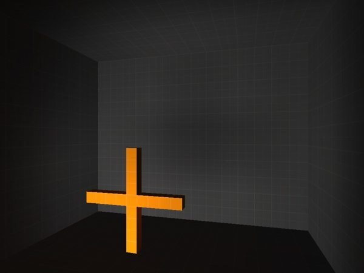
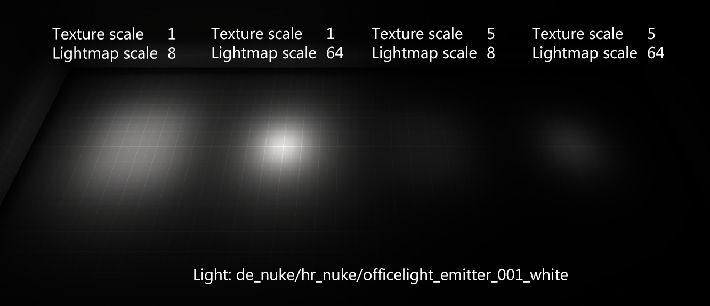
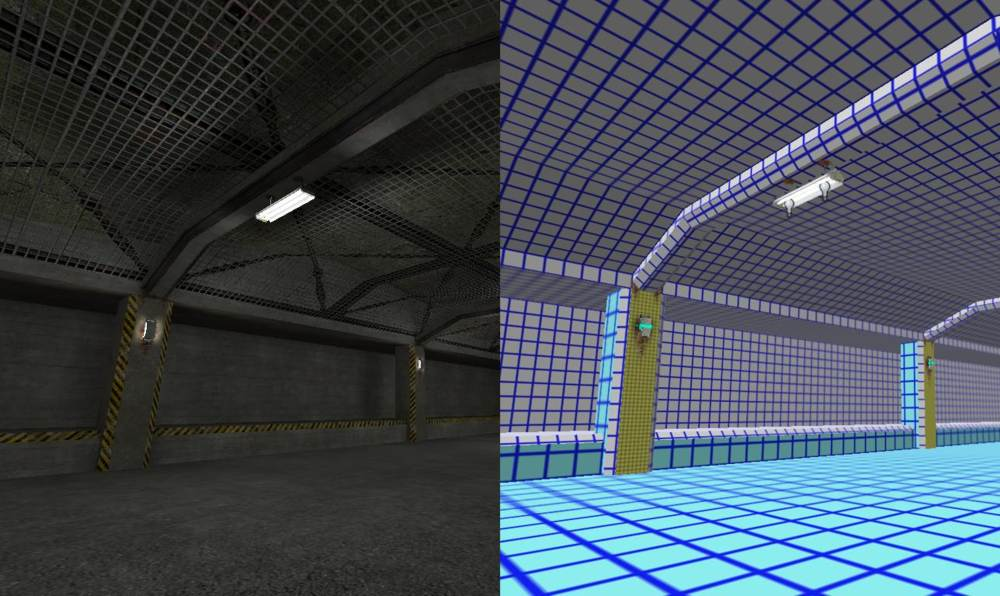
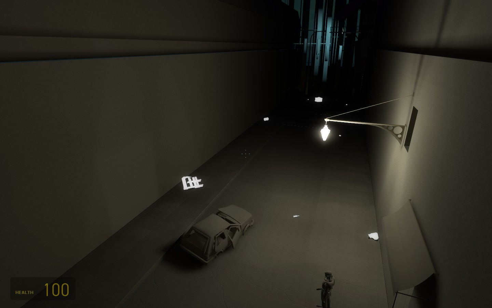

# 光照贴图

A lightmap is a generated [texture](./) applied [additively](https://en.wikipedia.org/wiki/Additive_color) to [LightmappedGeneric ](https://developer.valvesoftware.com/wiki/LightmappedGeneric)[brush ](https://developer.valvesoftware.com/wiki/Brush)faces to simulate lighting. The color values in the surface's [albedo](albedo.md) are multiplied by the color values in its lightmap.  
Lightmaps are created by [VRAD ](https://developer.valvesoftware.com/wiki/VRAD)each time a map is compiled. They are static and cannot change, though it is possible to switch lightmap 'pages" on and off \(see [Naming Lights](https://developer.valvesoftware.com/wiki/Naming_Lights)\).

## 比例

The lightmap scale of a face defines the resolution of its lightmap. The default scale of 16 makes each lightmap pixel \("luxel"\) 16 [units ](https://developer.valvesoftware.com/wiki/Unit)across, while a lightmap scale of 1 males one luxel equal one unit. [The Hammer Face Edit Dialog](https://developer.valvesoftware.com/wiki/Hammer_Face_Edit_Dialog) is used to change the value per-face.

Lowering scale will make lightmap shadows sharper, but leads to larger map file size, slightly slower rendering and exponentially slower compiles \(that at very low scales start to eat up shocking amounts of system memory\).

When generating lightmaps, VRAD does not create [penumbras](https://en.wikipedia.org/wiki/Umbra,_penumbra_and_antumbra#Umbra). The effect can be done by placing multiple lights near each other to simulate a non-point source of light, and/or increasing lightmap scale \(which is why the relatively large value of 16 is the default\).


**Note:** Each compiled [brush](https://developer.valvesoftware.com/wiki/Brush) polygon can host a maximum of 31x31 luxels. VBSP will chop faces to get extra luxels on if it needs to. That is also the reason for the limited displacement luxel density.



**Tip:** [Fog ](https://developer.valvesoftware.com/wiki/Dust,_Fog,_%26_Smoke)in reality increases atmospheric scattering, making all shadows a lot more diffuse. Look at [light\_environment](https://developer.valvesoftware.com/wiki/Light_environment)'s sun spread angle.


## 优化

Lightmap optimization can be done by eye with the aid of a compiled map: faces with low lighting contrast can have their scales increased, and vice versa faces with high contrast should be considered for lower scale. Just beware of setting a face's scale so high that it ends up a 'blop' of light that doesn't blend with its neighbors \(use `mat_fullbright 2`to spot this\). 

Remember to take into account the size of a face, too. Moving a very large face even one point up or down can have a huge impact. Don't be afraid to split the face up if that helps, or to drop a bit of detail from huge floor or wall faces.

## Hammer视图

Clicking the camera control in the top-left of a 3D view in Hammer provides the option of "3D Lightmap Grid". This view textures each brush surface with a grid that represents its lightmap scale \(shown in the last section\).

Tool brushes are textured like any other in this mode, despite being invisible in-game, so switch them all off from their auto-[visgroup](https://developer.valvesoftware.com/wiki/Visgroup).

## 控制台指令

The following are all [cheats](https://developer.valvesoftware.com/wiki/Sv_cheats):

`mat_fullbright 2mat_fullbright 2`

Replaces all [albedos](https://developer.valvesoftware.com/wiki/Albedo) with a grey tone, leaving just lighting information.

`mat_luxels <`[`bool`](https://developer.valvesoftware.com/wiki/Bool)`>`

Display luxels on all brush surfaces.


**Note:**Distorts on displacements, this is not a bug.



**Bug:** This command appears to be broken in Source SDK 2013 Singleplayer.


`mat_filterlightmaps <bool>`

Control whether luxels are smoothed together in the same way as [texels](https://developer.valvesoftware.com/wiki/Texel).

`r_avglightmap <bool>`

Doom mode! Averages lightmap values across each polygon.

`mat_showlightmappage <`[`int`](https://developer.valvesoftware.com/wiki/Int)`>`

Unwraps each lightmap into a small, tessellating display in the top left of the screen. Not terribly useful to modders.

`r_lightmap <?>`

**To do:** [Use uncertain](https://github.com/VSES/SourceEngine2007/blob/43a5c90a5ada1e69ca044595383be67f40b33c61/src_main/engine/gl_lightmap.cpp#L1011).

`r_unloadlightmaps <bool>`

**To do:** Unknown. Possibly a way of flushing lightmap data between map loads?


Source: [https://developer.valvesoftware.com/wiki/Lightmap](https://developer.valvesoftware.com/wiki/Lightmap)


