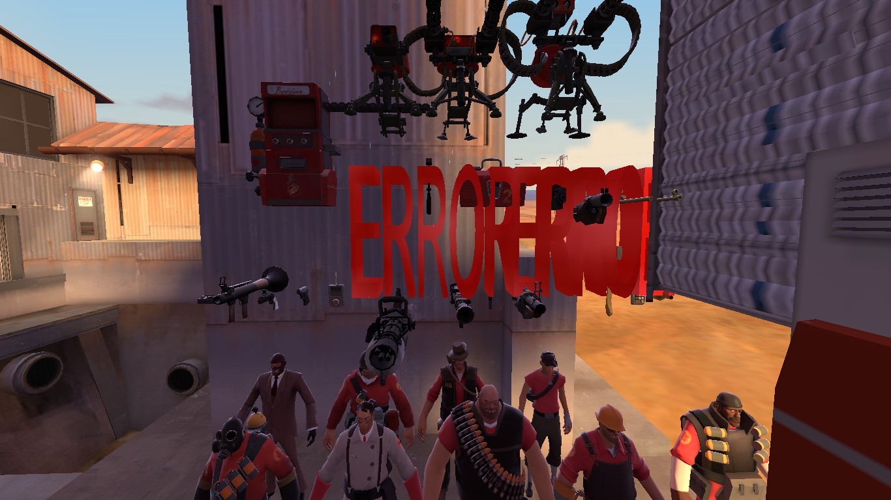

# Missing content

When distributing a map or mod, care must be taken to ensure that any custom content \(sounds, materials, textures, models, etc.\) is also distributed, or else players will have an unintended experience.

* Missing materials/textures show up as a black-and-magenta checkerboard.
* Missing models show up as red 3D text saying "Error" \(in Portal 2 the 3D Error text is a light blue\)
* Missing sounds are absent \(in Portal 2, a missing sound is indicated by [Dr. Kleiner](https://developer.valvesoftware.com/wiki/Dr._Isaac_Kleiner) saying "Oh, fiddlesticks. What now?"\)
* Missing particles \(at least in Portal 2 and Team Fortress 2\) appear as a spray of red X's.

If the missing contents shipped with the Source SDK, and are not custom creations, it is likely a problem with your game configuration. See [Incorrect Hammer configuration](https://developer.valvesoftware.com/wiki/Incorrect_Hammer_configuration) for more information.

### Common problems

One very common problem is when users see a black-and-magenta checkerboard "sheen" or reflection on surfaces. This is caused by a missing texture, generally due to missing [cubemaps](https://developer.valvesoftware.com/wiki/Cubemaps), which must be "built" in-game prior to distributing the map.


Source: [https://developer.valvesoftware.com/wiki/Missing\_content](https://developer.valvesoftware.com/wiki/Missing_content)


