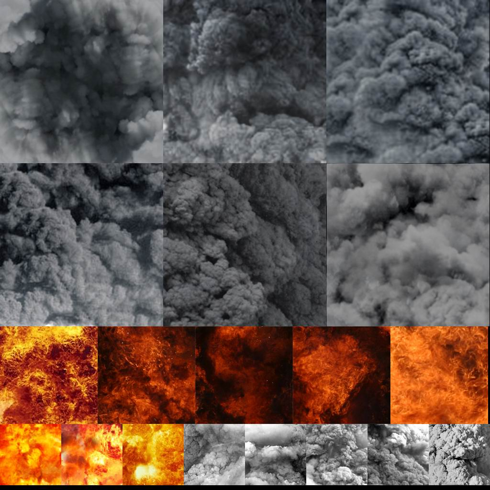
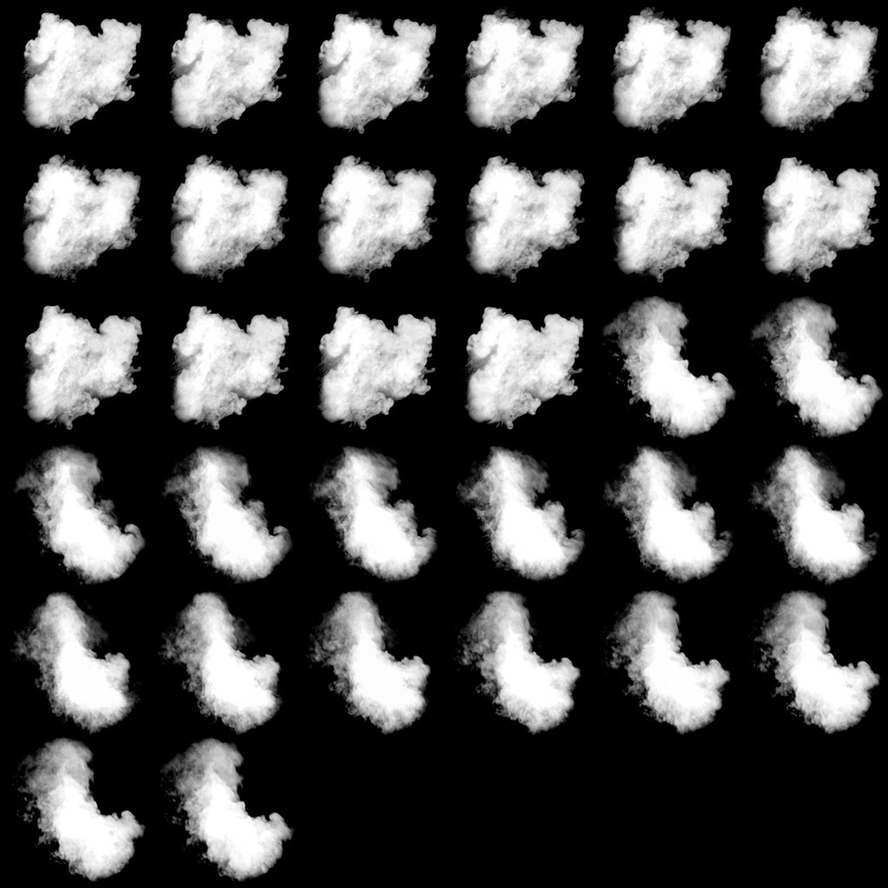

# 创建动画粒子

动画粒子是通过一个材料集合建立的“表”构成的动画。您可以通过**mksheet.exe**和**vtex**工具来创建动画粒子。

## 创建MKS文件

首先，请把你想要组成动画粒子表的材料放在一个单独的子文件夹中，一般情况下这些材料都会以他们最终构成的粒子名称命名。例如，smoke1.vmt 就位于 `materials/particles/smoke1 subdirectory` 目录下。

接下来，请创建一个和你想要创建的粒子名称相同的文件，并赋予其一个.mks扩展名。比如说，对于smoke1.vmt来说，其应该命名为smoke1.mks

mks文件定义了粒子动画的工作序列。你可以组织材料以构成你需要播放的序列，并通过其定义帧数和播放速率，以及是否需要循环。

下面是一个.mks文件的例子：

```text
// 序列1
sequence 0
loop
frame mymaterial1.tga 1
frame mymaterial2.tga 1

// 序列2
sequence 1
frame mymaterial3.tga 1

// 多重图像序列 (每帧多个图像，用于纹理叠加)
sequence 2
frame fire_base0.tga fire_additive0.tga 1
frame fire_base1.tga fire_additive1.tga 1

// 同时结合两帧alpha通道的序列
// 包含一个特殊着色器的alpha和绿色通道
sequence 3
frame frame0.tga{g=a},frame1.tga{a=a} 1
frame frame2.tga{g=a},frame3.tga{a=a} 1
```

### 序列 sequence

一个序列可以通过引用一串编号来对mksheet（表文件）中的帧进行排序。这将允许你在创建粒子时选择不同样式的动画以及帧组合。 

### 帧 frame

制作帧需要两个参数。首先是此帧使用的材质，其次是此帧的播放速率。值为1的回放速率告诉渲染器以正常速度播放，而0.5意为播放时间变为粒子动画标准定义中的一半。同理，当值为2时，播放速度变为原来的两倍。

### 循环 loop

此参数会高速渲染器去连续循环此帧。如果没有这个参数，渲染器将在播放完此序列中的所有帧之后停止工作。 

此外，帧可以分开打包alpha通道和RGB通道。这个操作将会从一组输入帧中获取其的alpha通道信息并将其存储在输出的alpha通道信息表中。同理，RGB信息将会被记录在RGB通道信息表中。有趣的是，每一个输出表都会有其自己的序列，各自的帧大小也是完全不相干的，例如，RGB可以拥有200x200的图像，而alpha可能只有150x150的，下面是一个例子：

```text
// 在RGB和alpha中存储独立帧数据的序列
// 一个完整的序列由一组rgb和一组alpha序列组合构成

// 此处，Packmode使mksheet将RGB帧与Alpha帧分开。
packmode rgb+a

// 序列1——alpha帧循环
sequence-a 0
LOOP
frame reframedSmokeSprites170_0033.tga 1
frame reframedSmokeSprites170_0035.tga 1

// 序列2——RGB帧循环
sequence-rgb 1
LOOP
frame smokeTex0001_341.tga 1
frame smokeTex0002_341.tga 1
```

这个.mks文件的输出如下所示。RGB和alpha通道将会分开显示。注意，每个帧的大小都不是2的幂，而且RGB帧和Alpha帧之间完全不相干的。





## 编译工作表

一旦材料被成功创建，所有的.tga和.mks文件将会被移动到`"Steamapps/common/SourceSDK/bin/orangebox/bin"` 文件夹。你可以在这个文件夹中，创建一个.bat批处理文件，并写入：

```text
mksheet <sheetname>.mks <sheetname>.sht <sheetname>.tga
```

此工具包含一个主参数和两个可选参数。主要参数是mks表，它将定义如何创建.sht和.tga文件。第一个可选参数是.sht文件，第二个可选参数是要创建的.tga文件，它有先前指定的所有.tga文件组成。第二和第三个参数需要包含你希望最终创建的材料的名称呢过。例如，为了构建一个smke1.vmt，输入语句如下：

```text
mksheet smoke1.mks smoke1.sht smoke1.tga
```

由此，你将会得到一个或多个编译后的.tga文件，一个.sht文件和一个空白的.file文件。.file文件没有实际作用，你可以选择直接删除。

## 编译纹理

现在，你应该已经生成了一个.tga文件。接下来，你可以使用 vtex.exe 工具来编译这哦.tga文件。拖拽你的.tga文件（一个或者多个）和.sht文件到你游戏的"materialsrc"文件夹。例如，对于半条命2来说，这个文件夹的路径是"common/Half-Life 2/hl2/materialsrc"。完成这步之后，请打开一个新窗口，并定位到 vtex.exe 的目录。然后，只需将.sht文件拖拽到vtex.exe中，即可进行编译。编译完成材料将会位于基本材质文件夹中。例如，对于半条命2来说，这个文件夹的路径是"common/Half-Life 2/hl2/materials"。


[VTFEdit](../../../how-to-start-modding/modding-introduction/modding-tools/#vtf-and-vmt) 目前可能并不支持此形式的编译。


## 注解

你可以在多个序列中使用相同的图像文件（或者在同一个序列中多次使用），且不会在输出表中出现重复。可以有实际运用的场景有异步/非同时序列，粒子序列，循环和非循环序列等等。

从实际角度来说，你应该尽可能地将纹理整合到同一张表中，并为不同的粒子系统使用不同的序列（可能需要你对序列进行命名）。这将允许粒子系统产生较少的状态变化，提高运行效率。

## 在3ds Max中自动化

你现在可以使用Wall Worm直接将渲染序列导出到起源引擎中。改系统将会允许你导出 IFL \( 图像文件列表 Image File List\)位图所构成的TGA位图。然后根据位图参数自动生成MKS。最后，根据.sht文件和TGA文件一起创建mksheet。详情请参阅此文档： [http://dev.wallworm.com/document/187/exporting\_animated\_particle\_textures.html](http://dev.wallworm.com/document/187/exporting_animated_particle_textures.html)


源文档链接： [https://developer.valvesoftware.com/wiki/Animated\_Particles](https://developer.valvesoftware.com/wiki/Animated_Particles)


