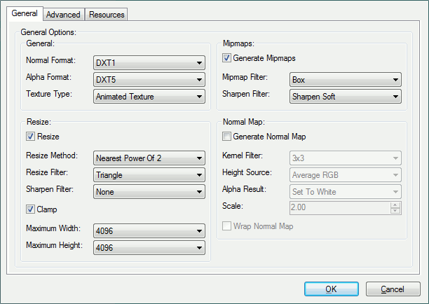
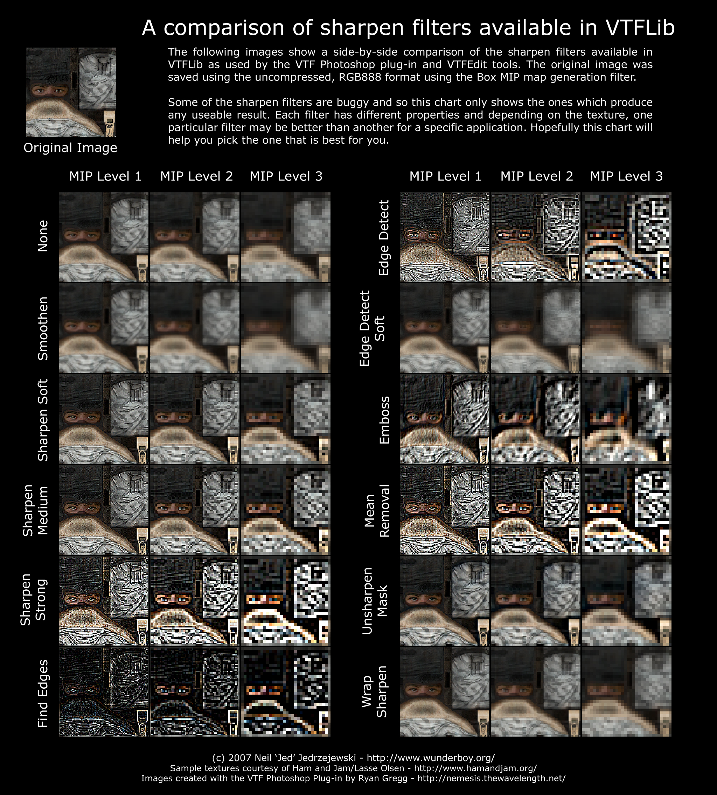
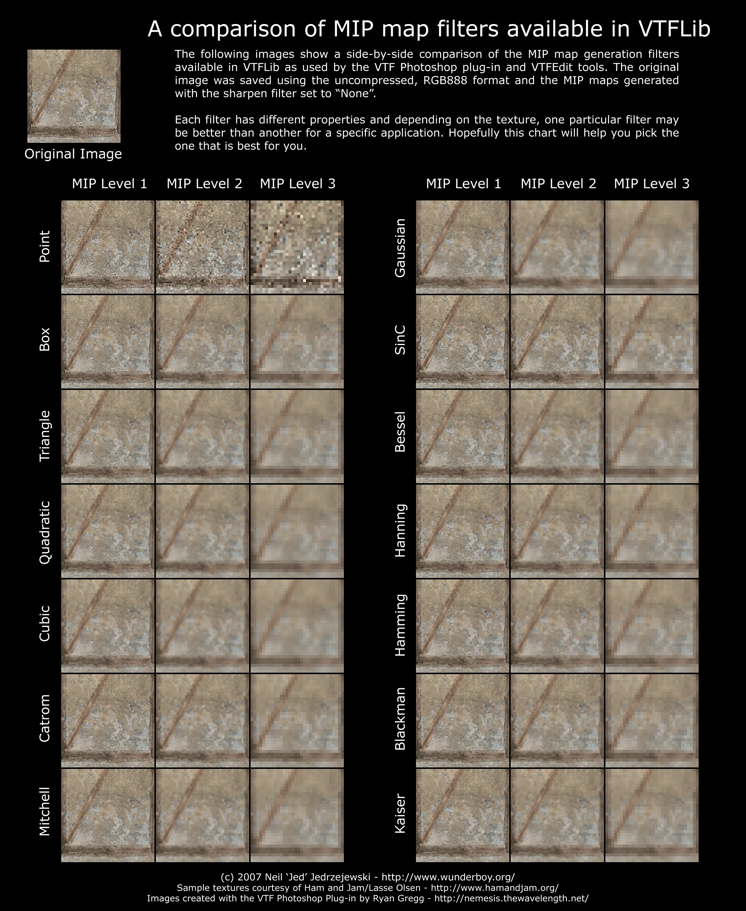
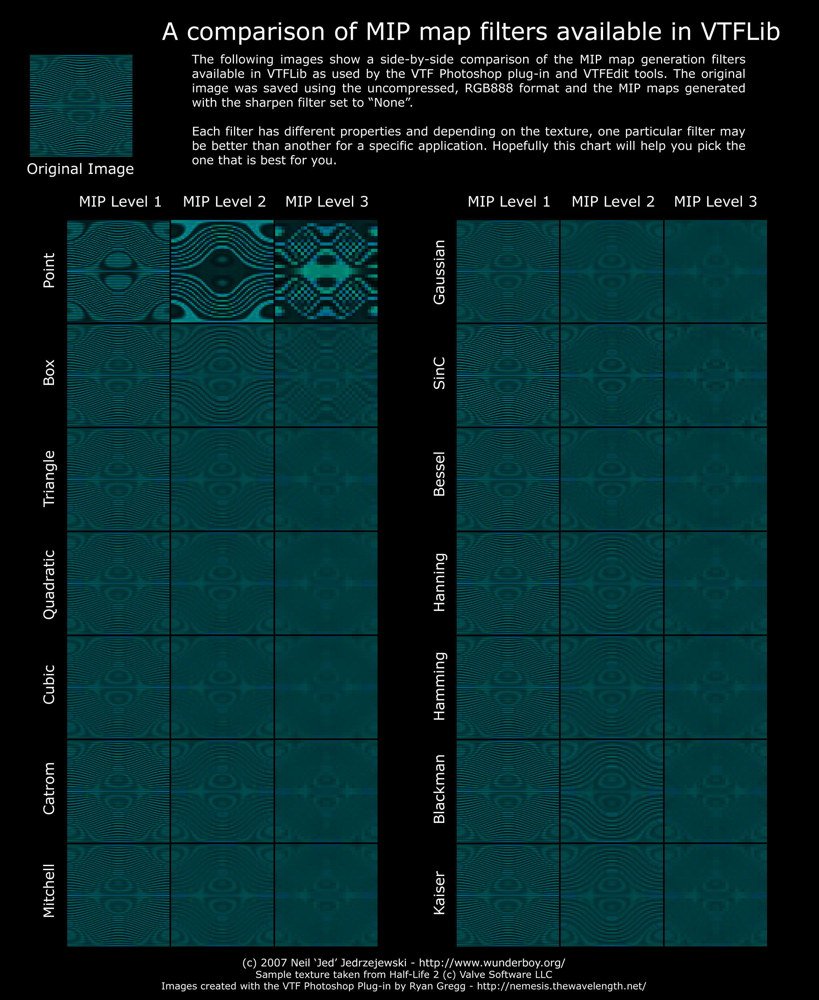
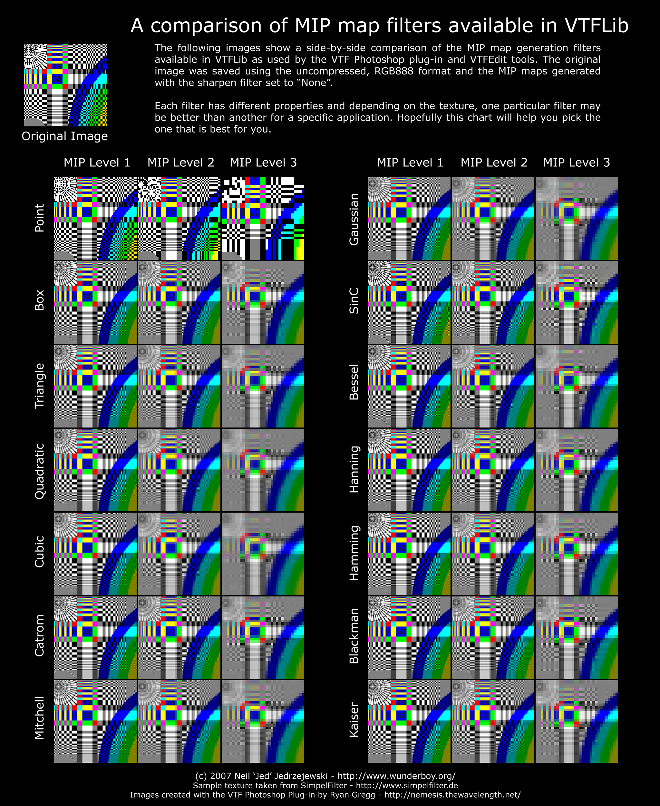
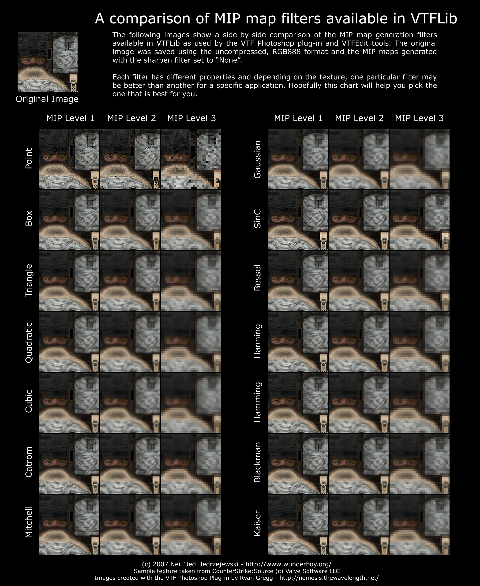

# Creating a Material

This tutorial is a step-by-step guide to creating a brand new [material](../valve-material-type-vmt.md), including the creation of the material's [texture](./).

## Creating a texture

Any image file can be used as a texture, so long as both of its dimensions \(height and width\) are a power of two: 2, 4, 8, 16, 32, 64, 128, 256, 512, 1024, 2048 and so on. To decide which to use, examine existing textures that fill the same role as yours. Higher resolutions lower performance but make an image sharper when viewed up close.

Different classes of object have different standard resolutions \(e.g. character models' are very high\). Check Valve's choices in `source materials.gcf` with [GCFScape](https://developer.valvesoftware.com/wiki/GCFScape) if you are ever confused. ****


**Note:**Texture source files should be saved in a lossless format like [TGA](../../file-format/truevision-graphics-adapter-tga.md) pre-compile, to prevent unnecessary loss in quality.


## **Converting the texture**

Textures must be converted to the [Valve Texture Format \(VTF\)](./) before Source can  use them. The tool Valve provides for this is [VTEX](https://developer.valvesoftware.com/wiki/Vtex). It's a [command line](https://developer.valvesoftware.com/wiki/Command_line) tool with quite a few limitations, so the third-party tool [VTFEdit](../../../how-to-start-modding/modding-tools/#vtf-and-vmt) is preferable: it provides a graphical user interface, allows you to change a texture's properties without re-compiling it from scratch, accepts a wide range of image formats, and doesn't require the creation of script files for each and every texture. There are a handful of situations where you'll need to fall back on VTEX... but only a handful \(Animate texture with [spritesheet technique](animated-particles.md)\).

Also, if you have textures that use transparency, it is recommended that you save in TIFF format before importing to VTFEdit as PNG transparency tends to have problems. \(There are VTF plug-ins that let you save to the format directly from [Photoshop](../../../how-to-start-modding/modding-tools/#graphics-animation-color-editors), [GIMP ](../../../how-to-start-modding/modding-tools/#graphics-animation-color-editors)and [Paint.net](../../../how-to-start-modding/modding-tools/#graphics-animation-color-editors), but this tutorial will not cover them as not everyone uses those tools\).

To import your texture with VTFEdit, use  `File > Import` or press **Ctrl+I**. Select your image and you will be presented with the import screen:



### General settings

There settings are the most important. There are three:

* Normal format
  * The color/compression format that should be used if the texture is opaque.
* Alpha format
  * The color/compression format that should be used if the texture has an alpha channel.
* Texture type

  * If you imported more than one image, this determines what they will be used as \(animation frames/[cubemap ](../cube-mapping.md)faces/depth slices\).

  If you're making a plain and simple world texture you won't need to change any of these. If you're making a texture with fine gradient detail however, you'll need to choose a[ non-lossy compression mode](./#choosing-an-image-format).

### Mipmap settings

[Mipmaps](../mip-mapping.md) are low-resolution versions of a texture that swap in when a surface is far away from the camera. They greatly reduce the amount of texture resizing needed, improving both performance and image quality. Mips are required for texture [LOD ](https://en.wikipedia.org/wiki/Level_of_detail)to work.


 **Tip:**Textures that will appear in the 3D world should have [mipmaps](../mip-mapping.md). To conserve memory, textures that will only be used in a 2D interface should not.


The following images demonstrate the various [mipmap ](../mip-mapping.md)filters available in [VTFEdit](../../../how-to-start-modding/modding-tools/#vtf-and-vmt):











### Normal map settings

These \(mis-labelled\) settings allow you to automatically generate a [bump map](https://developer.valvesoftware.com/wiki/Bump_map) from your input image. You'll want to do this properly with an image editor for the material you ship, but the automated option is there is you want quick results or a base to work from.

## Configuring & saving

When you hit OK the input file is converted \(there may be quite a lengthy pause for large images\) and the output VTF appears. Now all that is left is configuring the texture with the options in the checkbox list on the left-hand side of the screen. See [Valve Texture Format image\_flags](./#image-flags) for descriptions of each.

Finally, save the file somewhere under your game or mod's  `\materials` folder.

## Creating a material

Source doesn't access textures directly. Everything goes through a [material](../valve-material-type-vmt.md).

[Materials](../valve-material-type-vmt.md) are script files that can be created in any text editor, but it's recommended that you use one of the [software listed](../../../how-to-start-modding/modding-tools/#general) in conjunction with the community-made [syntax highlighting rules](https://developer.valvesoftware.com/wiki/Notepad%2B%2B_VDF_languages). For your material to be detected, **you must save it under your game or mod's**  **`\materials` folder with the extension `.vmt`**.


 **Note:** If you are creating materials and textures exclusively for a map for a existing mod, consider using  [BSPZIP](https://developer.valvesoftware.com/wiki/BSPZIP)\[Packbsp](https://developer.valvesoftware.com/wiki/Packbsp)\[Pakrat](https://developer.valvesoftware.com/wiki/Pakrat)\[Compile Pal](https://developer.valvesoftware.com/wiki/Compile_Pal) to package the material and texture files within the map file itself. This will avoid them ever becoming lost.


### Syntax

A material file looks like this:

```text
<shader>
{
	<parameter> <value>
	...
}
```

```text
LightmappedGeneric
{
	$basetexture coast\shingle_01
	$surfaceprop gravel
}
```

There are many [shaders](https://developer.valvesoftware.com/wiki/Shader) to choose from, but most materials will use either [`LightmappedGeneric`](https://developer.valvesoftware.com/wiki/LightmappedGeneric) \([brushes](https://developer.valvesoftware.com/wiki/Brush)\) or [`VertexLitGeneric`](https://developer.valvesoftware.com/wiki/VertexLitGeneric) \([models](https://developer.valvesoftware.com/wiki/Model)\). The third most common shader is [`UnlitGeneric`](https://developer.valvesoftware.com/wiki/UnlitGeneric), which is used for [UI](https://developer.valvesoftware.com/wiki/VGUI2) materials and the occasional [tool texture](https://developer.valvesoftware.com/wiki/Tool_texture).

### Parameters

For a list of all documented shader parameters, see [Category:List of Shader Parameters](https://developer.valvesoftware.com/wiki/Category:List_of_Shader_Parameters).

With a shader chosen you're onto parameters \(also called commands\). There are hundreds of options for what to put in a material so this article will only cover the most common, which are accepted by more or less all shaders. They are:

* [`$basetexture`](../shader/usdbasetexture.md)
* [`$surfaceprop`](https://developer.valvesoftware.com/wiki/$surfaceprop)
* [`$envmap`](https://developer.valvesoftware.com/wiki/$envmap)
* [`$bumpmap`](../bump-map/usdbumpmap.md)
* [`$detail`](https://developer.valvesoftware.com/wiki/$detail)
* [`$selfillum`](https://developer.valvesoftware.com/wiki/$selfillum)
* [`$model`](https://developer.valvesoftware.com/wiki/$model_%28VMT%29)


 **Tip:** If you ever need to use a space or tab character in a parameter value, you must wrap the while value with "quote marks". You'll often see absolutely everything wrapped like this - save yourself some typing, as that's unnecessary.



 **Tip:** To refresh materials in-game - use this console command: `mat_reloadallmaterials`, this will reload every single material. It's recommended to use this command to prevent game from freezing and some other weird artifacts: `mat_reloadmaterial "vmt_name without .vmt"`. Example: `mat_reloadmaterial "monitor_screen"`. Mat\_reloadtextures is presented too.


## Source & reference


Source: [https://developer.valvesoftware.com/wiki/Creating\_a\_Material](https://developer.valvesoftware.com/wiki/Creating_a_Material)

Reference: [https://en.wikipedia.org/wiki/Level\_of\_detail](https://en.wikipedia.org/wiki/Level_of_detail)



\*\*\*\*

\*\*\*\*

