# Skyboxes

## Preparation

Navigate to your folder and find this VPK file:

> Origin Games\Titanfall2\vpk\

Copy these files and paste them into an empty folder somewhere else:

* englishclient\_mp\_\*mapname\*.bsp.pak000\_dir.vpk
* client\_mp\_\*mapname\*.bsp.pak000\_000.vpk


Make sure to make a Backup of every single Map you edit, Since every map has it's own VPK.


You will need the Titanfall VPK Tool, the program which will allow you to open and repack Titanfall VPK files. [Here](https://noskill.gitbook.io/titanfall2/how-to-start-modding/modding-tools)

## Unpacking

Now that these files have been backed up and everything installed. Navigate to your game folder and open this file:

> Origin Games\Titanfall2\vpk\englishclient\_mp\_\*mapname\*.bsp.pak000\_dir.vpk

[How to extract VPK's properly ?](https://noskill.gitbook.io/titanfall2/how-to-start-modding/how-to-backup-extract-and-repack)

## Editing

Go to this location in your extracted folder

> \models\vistas

This folder contains the models for the skyboxes and scene elements. Edit those files at your own risk.

The only working Skybox is the extraction scene named `planet_blue_sun.mdl` which is present in every `\models\vistas` directory \(except live fire maps, excluding deck\). Because it is mandatory for the successful extraction phase process of every map.  

To swap skyboxes simply duplicate `planet_blue_sun.mdl` and rename the duplicate to the name of the skybox of the map. 

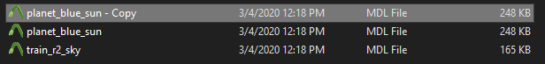

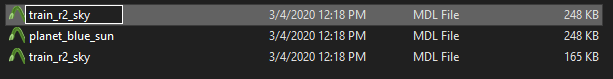

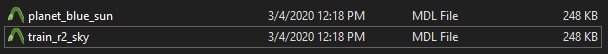

#### Exceptions

Some maps have the ending **\_**_**se**_ instead of _**\_sky**_. It is the exact same editing process though.

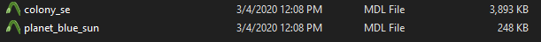

Some maps feature an additional file in the directory.  Make sure not to swap the wrong ones.

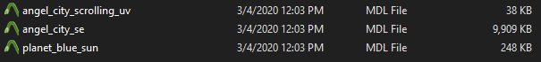

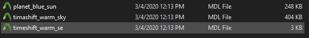

#### What not to do

Removing the Files will result in the disappearing of the skybox.

Renaming other skyboxes to the existing ones of the map and replacing them leads to the textures not loading in, since they are applied via a script, which is not in the VPK itself. 

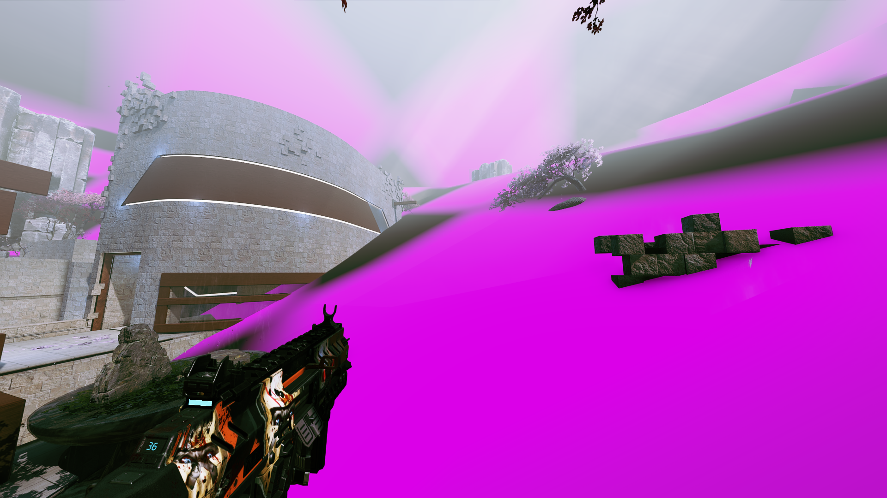

The reason behind this not working is because the textures are not applied via a VPK. Every map has a different VPK. Textures that are not normally on the map stay missing because the script applying them does not apply them there. Once we figured out how to edit `.rpak` files changing actual skyboxes becomes a possibility. 

### Examples

Obviously this wasn't made to be the skybox for normal maps. So there are little errors all around the place.

**Note that the old scene lights are still presents and might look a little out of place on some maps.**

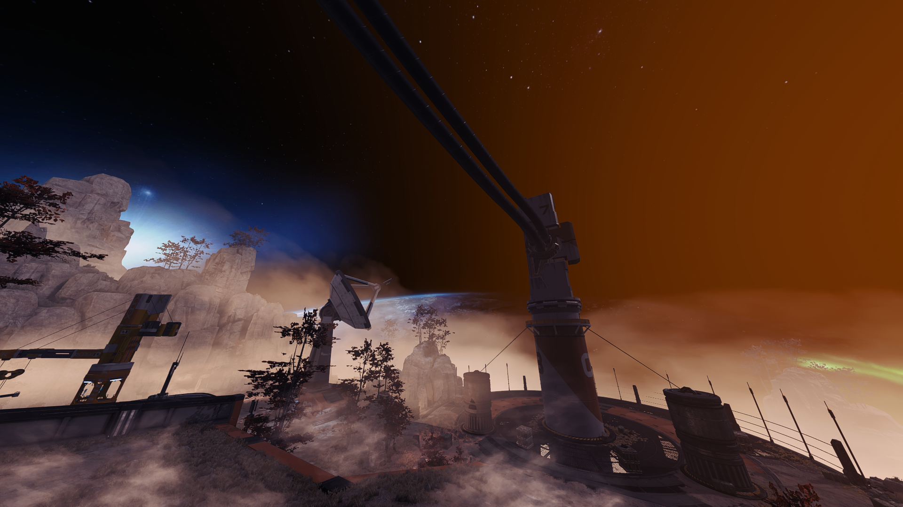

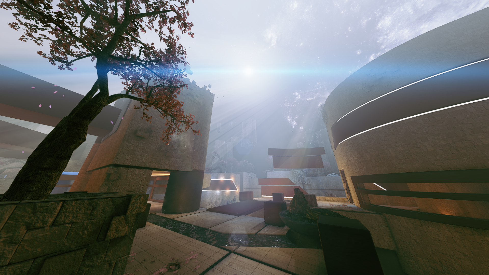

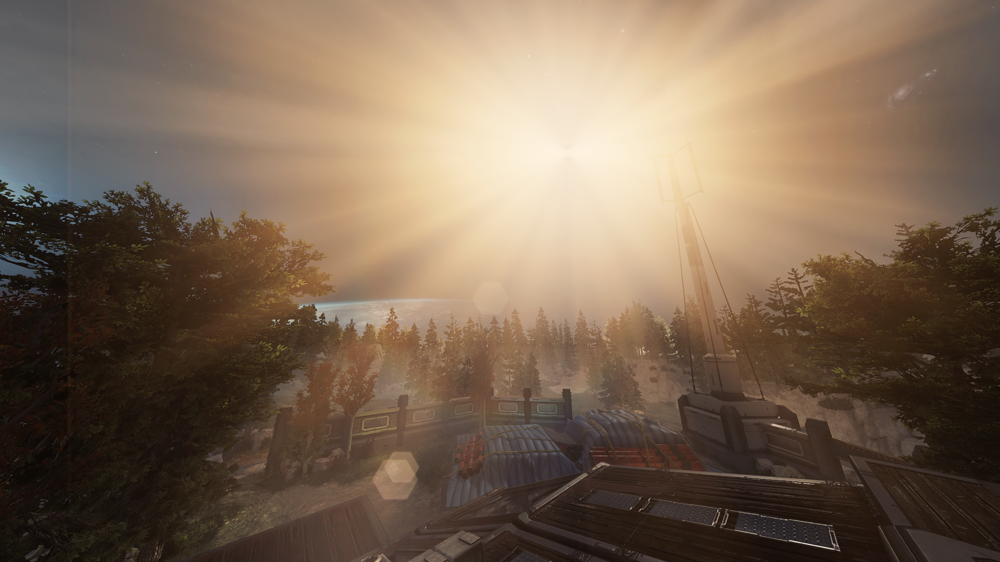

**Note that the** _**ENTIRE**_ **surrounding scenery disappears.**

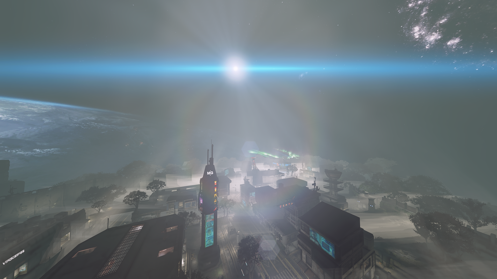

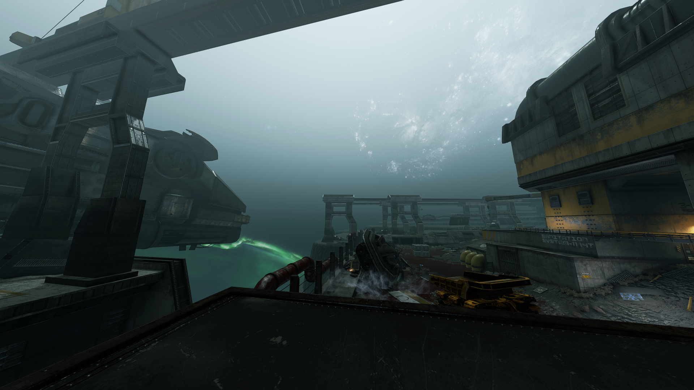

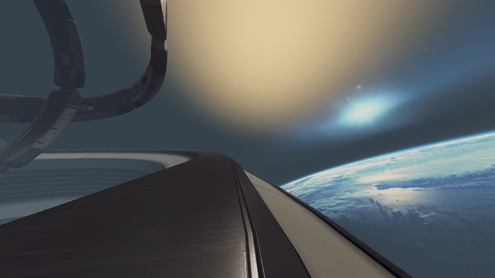

 

## Repacking

[How to repack VPK files proprely?](https://noskill.gitbook.io/titanfall2/how-to-start-modding/how-to-backup-extract-and-repack#how-to-repack-vpk-files-properly)

After following the previous link step by step:

Rename pak000\_000.vpk _to_ **client\_mp\_\*mapname\*.bsp.pak000\_000.vpk**

Rename pak000\_dir.vpk _to_ **englishclient\_mp\_\*mapname\*.bsp.pak000\_dir.vpk**


Make sure not pay attention when renaming them because every map has it's own VPK.


Place both of the renamed files back into your game directory and then launch Titanfall 2. You should be able to see the changed skybox!

> Origin Games\Titanfall2\vpk\

