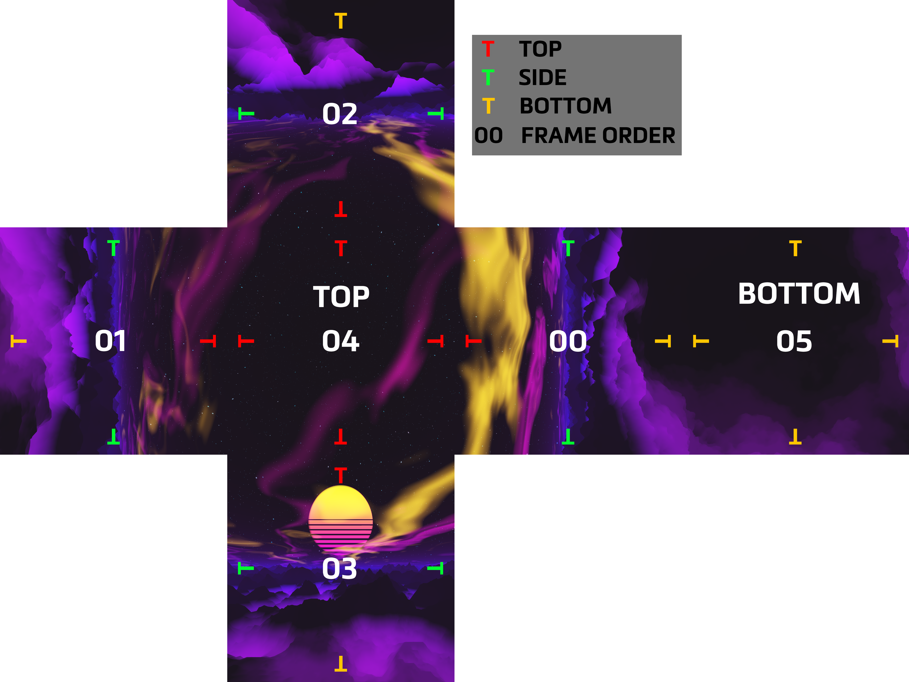
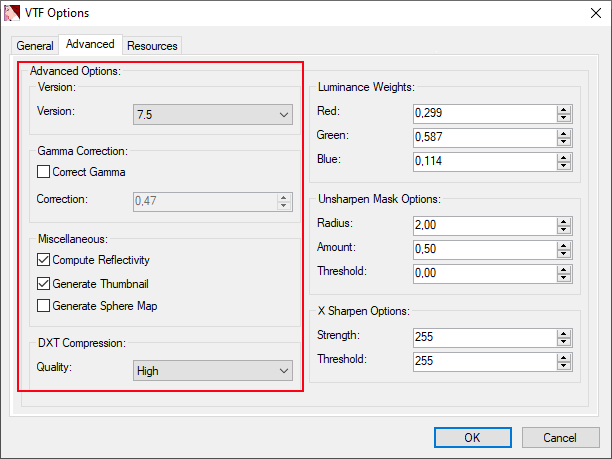

# Maps - Cube Map

## Preparation

Locate your game folder and find this folder if you are on Origin:

> Origin Games\Titanfall2\vpk\\

Or this folder if you are on Steam:

> Steam\steamapps\common\Titanfall2\vpk\\

Copy these files and paste them in a backup folder somewhere else:

* `englishclient_mp_mapname.bsp.pak000_dir.vpk`
* `client_mp_mapname.bsp.pak000_000.vpk`


Check the [list of VPK archives](https://noskill.gitbook.io/titanfall2/game-values/file-location/vpk-file-names), their names can be confusing



Make sure to make a Backup of every single Map you edit, Since every map has it's own VPK.


You will need the Titanfall VPK Tool, the program which will allow you to open and repack Titanfall VPK files. [Here](https://noskill.gitbook.io/titanfall2/how-to-start-modding/modding-tools)

## Unpacking

Now that these files have been backed up and everything is installed. Navigate to your game folder and open this file:

> Origin Games\Titanfall2\vpk\englishclient\_mp\_**mapname**.bsp.pak000\_dir.vpk

[How to extract VPK's properly ?](https://noskill.gitbook.io/titanfall2/how-to-start-modding/how-to-backup-extract-and-repack)

## Editing

Navigate to this location in your extracted folder

> \materials\skies

This folder contains the texture for the cubemap. The file we are looking for are `.vtf` files. Once you did open them you can view the different faces of the cubemap by using the face parameters in [VTFedit](../../how-to-start-modding/modding-introduction/modding-tools/#vtf-and-vmt).

.png>)

A cube map have 6 individual pictures as a cube have 6 faces. When each individual faces are put together they should look like this

.png>)

To make a new cubemap from scratch. You need to split a 360° picture into 6 individual picture. You can use this website to do so [https://jonaszeitler.se/cubemap-toastmap-generator/](https://jonaszeitler.se/cubemap-toastmap-generator/)\
Using the plan bellow you should rename each individual faces according the number to be loaded in the correct order in VTFedit.


You also need to rotate the faces as in the map. The color code give you the correct rotation.


Once renaming and rotating the faces you need to import all of them in VTFedit. You do so by selecting multiple files at once.

.png>)

When the picture are loaded into VTFedit you will have some parameters to select. Use the parameters as it is showed in the examples bellow

.png>)

Once you click OK, VTFedit will process for some seconds then you will have your texture generated. You can navigate through the different faces by changing its values. It does not change the file, it is only a preview.

You are now done making a custom cubemap. You now need to replace it with the vanilla one.


Making backup of the original texture is very handy !


## Skybox list


Here is some ready to use skyboxes: [Skybox list](https://github.com/Wanty5883/Titanfall2/tree/master/picture/skyboxes)


## Repacking

[How to repack VPK files properly?](https://noskill.gitbook.io/titanfall2/how-to-start-modding/how-to-backup-extract-and-repack#how-to-repack-vpk-files-properly)

After closely following the previous link step by step:

Rename `pak000_000.vpk` _to_ `client_mp_*mapname*.bsp.pak000_000.vpk`

Rename `pak000_dir.vpk` _to_ `englishclient_mp_*mapname*.bsp.pak000_dir.vpk`


Make sure to pay attention when renaming them because every map has it's own VPK.


Place both of the renamed files back into your game directory and then launch Titanfall 2. You should be able to see the changed [skybox](../../documentation/textures/skybox-basics/)!
