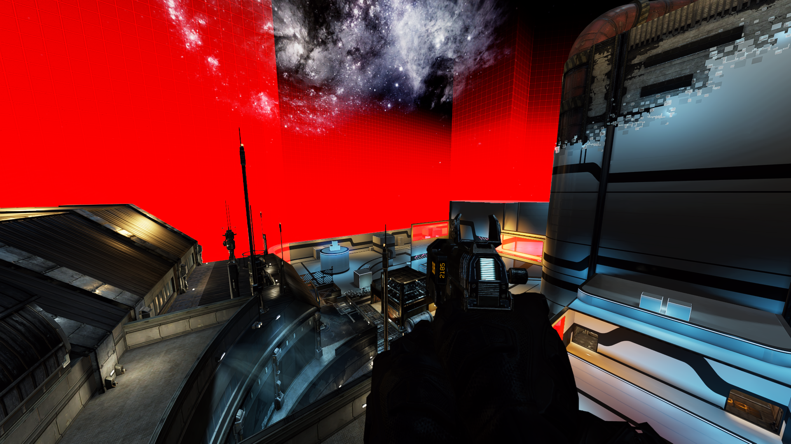
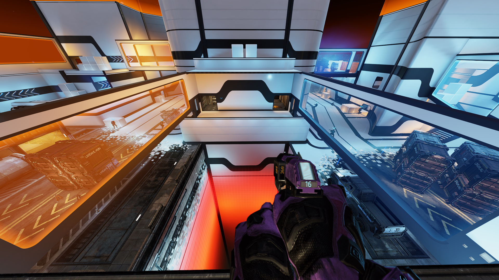

# Holographic wall color

## Used VPK


* englishclient\_mp\_wargames.bsp.pak000\_dir.vpk


You will need the Titanfall VPK Tool, the program which will allow you to open and repack Titanfall VPK files. [Here](https://noskill.gitbook.io/titanfall2/how-to-start-modding/modding-tools)

## Extracting



## Editing 

Navigate to this location in your extracted folder.

> materials\world\utility

This location contains all the `.vmt` files of the holographic walls

Following bulleted list contains names of the files in this location and their short descriptions. Picture examples are located further in this guide.

* `holo_map_grid_light_blue.vmt` blue arrows
* `holo_map_grid_light_blue_shootable.vmt` blue holographic walls
* `holo_map_grid_mip0.vtf` base texture used by holographic walls
* `holo_map_grid_orange.vmt` orange arrows 
* `holo_map_grid_orange_shootable.vmt` orange holographic walls and outer holographic walls
* `holo_map_grid_red_dense.vmt` holographic walls of the pit

Open a `.vmt` file you want to edit.

To edit colors simply change the values of `"$color2"`. For more details on changing these values, refer to [Color & Texture info](https://noskill.gitbook.io/titanfall2/information/textures/colors/color-and-texture-info#usdlayercolor)

These material files leave quite lot of possibilities, you could replace textures the walls use, make them transparent, clear, changing colors, put any picture on them, play a gif, etc. In the page linked down bellow you will find additional information to modify the material and texture files. Feel free to experiment with it and share your results in our Discord community.



### Examples

![As mentioned in the bulleted list these are orange arrows with &quot;$color2&quot; changed to &quot;\[3 0 1.65\]&quot;](../../../.gitbook/assets/titanfall-2-screenshot-2021.02.05-16.18.02.39.png)

![As mentioned in the bulleted list these are blue arrows with &quot;$color2&quot; changed to &quot;\[0 1.5 3\]&quot;](../../../.gitbook/assets/titanfall-2-screenshot-2021.02.05-16.18.33.95.png)

![As mentioned in the bulleted list these are orange holographic walls with &quot;$color2&quot; changed to &quot;\[4 0 0\]&quot; \(red\) and blue holographic walls with &quot;$color2&quot; changed to &quot;\[0 4 0\]&quot; \(green\)](../../../.gitbook/assets/titanfall-2-screenshot-2021.02.05-16.17.32.05.png)

![As mentioned in the bulleted list these are holographic walls of the pit with &quot;$color2&quot; changed to &quot;\[4 4 0\]&quot; \(yellow\)](../../../.gitbook/assets/titanfall-2-screenshot-2021.02.05-17.16.37.14.png)





## Repacking



This guide will be updated with making the walls transparent, clear, changing colors, putting any picture on them, playing a gif, etc. if there is interest shown in the Discord community.

