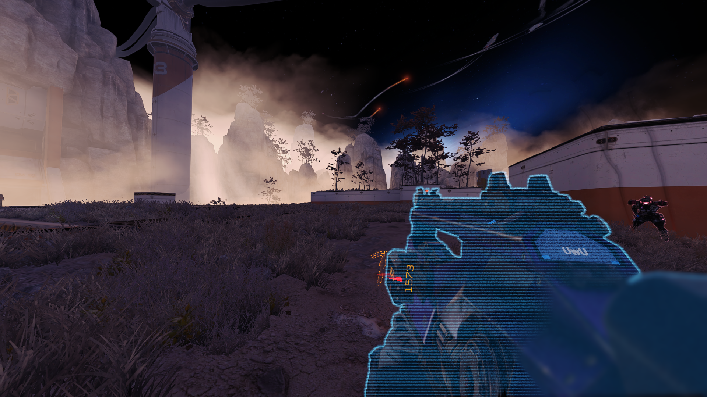

# Sonar Detected

## Preparation

For this guide you will need a VPK tool and a text editor.


[tools](../../intro/duction/tools/)


### Used VPK


`englishclient_mp_common.bsp.pak000_dir.vpk`


## Extracting


[vpk-packpack.md](../../intro/duction/vpk-packpack.md)


## Editing

Navigate to following location

`englishclient_mp_common.bsp.pak000_dir.vpk\scripts\vscripts\sh_highlight.gnut`

open this `.gnut` file in a text editor of your choice and look for the following line

```
global const HIGHLIGHT_COLOR_ENEMY = <1.0, 0.36, 0.12> //float3( 0.63, 0.80, 0.93 );
```

To change color, simply change values in "<1.0, 0.36, 0.12>".

### Examples



## Repacking


[vpk-packpack.md](../../intro/duction/vpk-packpack.md)

