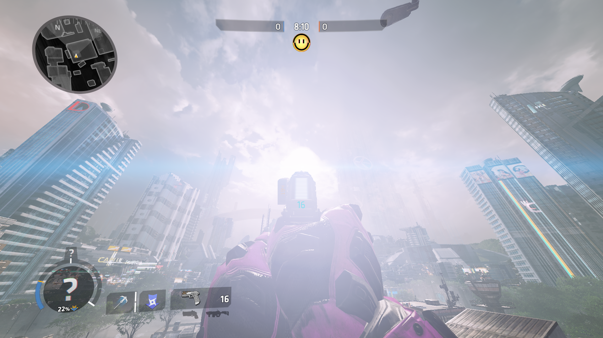
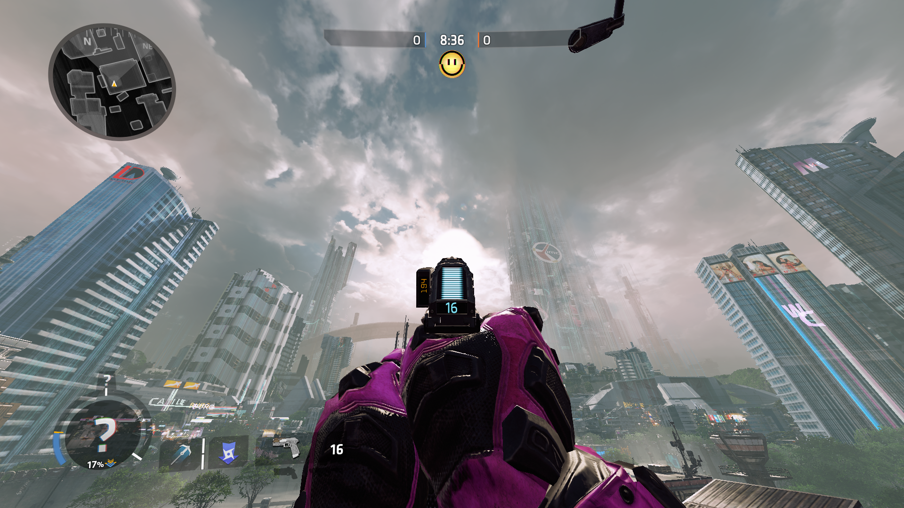

# 移除太阳效果

## Preparation

Locate your game folder and find this folder if you are on Origin:

> Origin Games\Titanfall2\vpk\

Or this folder if you are on Steam:

> Steam\steamapps\common\Titanfall2\vpk\

Copy these files and paste them in a backup folder somewhere else:

* `englishclient_frontend.bsp.pak000_dir.vpk`
* `client_frontend.bsp.pak000_000.vpk`

For the next step you'll need the [Titanfall VPK Tool](https://noskill.gitbook.io/titanfall2/how-to-start-modding/modding-tools), a program which allows you to open and repack Titanfall VPK files. 

## Unpacking 

Now that these files have been backed up, navigate to your game folder and open this file:

> Titanfall2\vpk\englishclient\_frontend.bsp.pak000\_dir.vpk

​[How to extract VPK files properly?](https://noskill.gitbook.io/titanfall2/how-to-start-modding/how-to-backup-extract-and-repack)

## Editing

Sun flares are blinding and they don't really add much to the game when they are this pronounced.

It also occurs on Relic, Rise, and Exoplanet, to name a few.

To remove the sun flares, once you have extracted the frontend vpk, navigate to the `\particles` folder, and delete the following files:

`env_sun_red_dwarf.pcf`

`env_sun_haven.pcf`

`env_sun.pcf`

After you repack the vpk, you should be able to see without getting blinded.

## Repacking 

​[How to repack VPK files properly?](https://noskill.gitbook.io/titanfall2/how-to-start-modding/how-to-backup-extract-and-repack)​

After following the step by step in the previous link:

Rename `pak000_000.vpk` _to_ `client_frontend.bsp.pak000_000.vpk`

Rename `pak000_dir.vpk` _to_ `englishclient_frontend.bsp.pak000_dir.vpk`

Place the renamed files back into your game directory, and you will be able to see your results!

