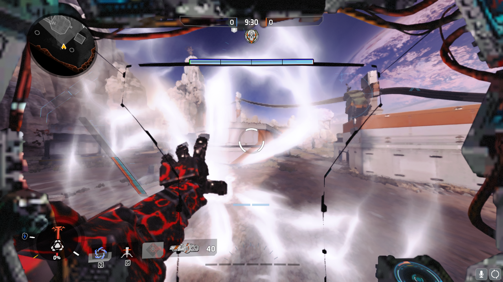
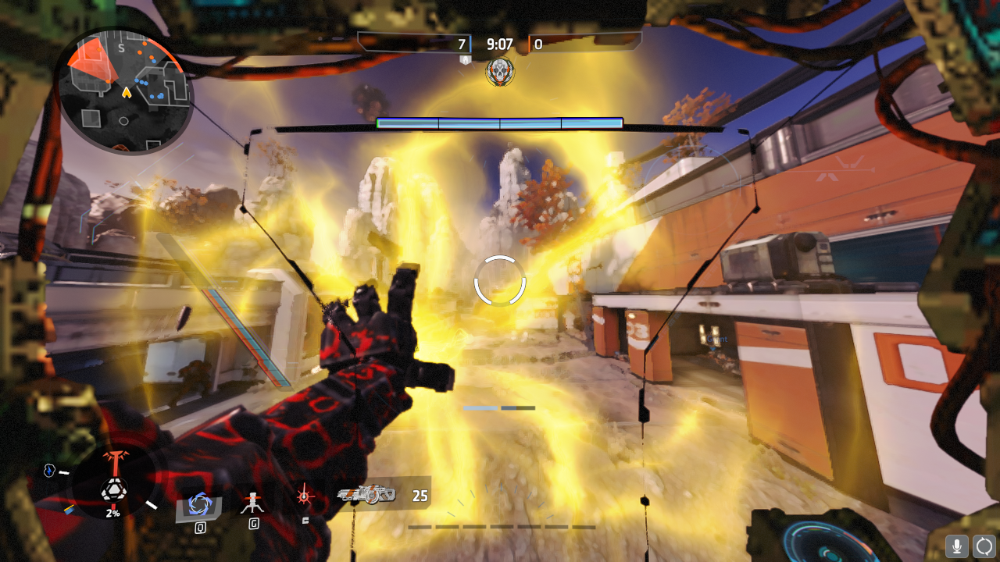

# 漩涡防护罩颜色

## Preparation

In this guide you will have to edit .nut files. You can use text editor for that such as Atom, NotePad++, VIM and many other ones would work fine.

Navigate to your folder and find this VPK file:

> Origin Games\Titanfall2\vpk\

Copy these file and paste them in an empty folder somewhere else:

* englishclient\_mp\_common.bsp.pak000\_dir.vpk
* client\_mp\_common.bsp.pak000\_000.vpk

You will need the Titanfall VPK Tool, the program which will allow you to open and repack Titanfall VPK files. [Here](https://noskill.gitbook.io/titanfall2/how-to-start-modding/modding-tools)

## Unpacking

Now that these files have been backed up and everything installed. Navigate to your game folder and open this file:

> Origin Games\Titanfall2\vpk\englishclient\_mp\_common.bsp.pak000\_dir.vpk

[How to extract VPK's properly ?](https://noskill.gitbook.io/titanfall2/how-to-start-modding/how-to-backup-extract-and-repack)

## Editing

To edit the vortex shield color you need to go this directory

> scripts\vscripts\weapons\

Open the file _`_vortex.nut`_ with your text editor as recommended above. In this file find the following code block

```text
const VORTEX_SPHERE_COLOR_CHARGE_FULL               = <115, 247, 255>   // blue
const VORTEX_SPHERE_COLOR_CHARGE_MED                = <200, 128, 80>    // orange
const VORTEX_SPHERE_COLOR_CHARGE_EMPTY              = <200, 80, 80>     // red
const VORTEX_SPHERE_COLOR_PAS_ION_VORTEX            = <115, 174, 255>   // blue
```

The color code is [rgb ](../../../information/textures/colors/#rgb)0 – 255. The value FULL, MED and EMPTY are the different energy states of Ion. The last one \(PAS\_ION\_VORTEX\) is for amped vortex shield tier, if you are using this tier on your Ion, this line will overwrite FULL.

It is not recommend you use pure color \(pure pink is 255 0 255 for example\) they are too bright and would be difficult to see through. It is recommended to reduce the value between 170 to 200 instead of 255. You can change the different energy states to the same color, but you won’t know the amount of energy on an enemy Ion vortex shield anymore. I personally use pink, purple then original red.

### Example







## Repacking

[How to repack VPK files proprely ?](https://noskill.gitbook.io/titanfall2/how-to-start-modding/how-to-backup-extract-and-repack)

After following step by step the previous link

Rename pak000\_000.vpk _to_ **client\_mp\_common.bsp.pak000\_000.vpk**

Rename pak000\_dir.vpk _to_ **englishclient\_mp\_common.bsp.pak000\_dir.vpk**

Place both of the renamed files back into your game directory and then launch Titanfall 2. You should be able to see your new crosshair!

> Origin Games\Titanfall2\vpk\

