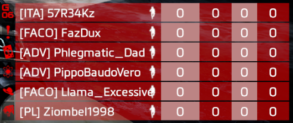
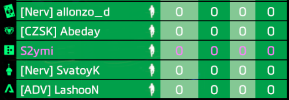
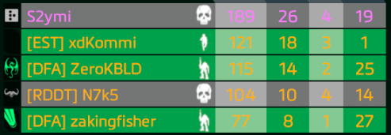
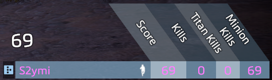

# Scoreboard colors

## Preparation

In this guide you will have to edit text. Simply use a text editor for that such as Atom, NotePad++, VIM or one that you prefer.

Locate your game folder and find this folder if you are on Origin:

> Origin Games\Titanfall2\vpk\\

Or this folder if you are on Steam:

> Steam\steamapps\common\Titanfall2\vpk\\

Copy these files and paste them in a backup folder somewhere else:

* `englishclient_frontend.bsp.pak000_dir.vpk`
* `client_frontend.bsp.pak000_000.vpk`

For the next step you'll need the [Titanfall VPK Tool](https://noskill.gitbook.io/titanfall2/how-to-start-modding/modding-tools), a program which allows you to open and repack Titanfall VPK files.&#x20;

## Unpacking <a href="#unpacking" id="unpacking"></a>

Now that these files have been backed up, navigate to your game folder and open this file:

> &#x20;Origin Games\Titanfall2\vpk\englishclient\_frontend.bsp.pak000\_dir.vpk

​[How to extract VPK files properly?](https://noskill.gitbook.io/titanfall2/how-to-start-modding/how-to-backup-extract-and-repack)​

## Editing

To edit the colors, go to this location:

> \englishclient\_frontend.bsp.pak000\_dir.vpk\scripts\vscripts\\

All colors on the scoreboard are stored in one file, `sh_consts.gnut`. The file is quite large, so it's recommended to navigate through it using the search (ctrl+F) function.

Colors of individual elements are stored as a vector variable which is made out of 3 integer variables that accept the values from 0 to 255; each of the integers corresponds to a certain amount of one of the basic [rgb colors ](https://noskill.gitbook.io/titanfall2/information/textures/colors#rgb)(red, green or blue). In simpler terms, you'll be changing the color by changing the amount of red, green and blue it has; 0 means no color at all (black) and 255 means the maximum.


[colors](../../../documentation/textures/colors/)


### Enemy's color

Lines: 255, 256 and 257; 1st line corresponds to red, 2nd to green,  3rd to blue

```
global const int ENEMY_R = 
global const int ENEMY_G = 
global const int ENEMY_B = 
```

Example, values used were R=200 G=0 B=0:



### Team's color

Lines: 250, 251 and 252; 1st line corresponds to red, 2nd to green,  3rd to blue

```
global const int FRIENDLY_R = 
global const int FRIENDLY_G = 
global const int FRIENDLY_B = 
```

Example, values used were R=0 G=255 B=50:



### Party's color

Lines: 265, 266 and 267; 1st line corresponds to red, 2nd to green,  3rd to blue

```
global const int PARTY_R = 
global const int PARTY_G = 
global const int PARTY_B = 
```

Example, values used were R=255 G=111 B=0:



### Your name's color

Lines: 260, 261 and 262; 1st line corresponds to red, 2nd to green,  3rd to blue

```
global const int LOCAL_R = 
global const int LOCAL_G = 
global const int LOCAL_B = 
```

Example, values used were R=255 G=50 B=255:



## Repacking <a href="#repacking" id="repacking"></a>

After following [this guide](https://noskill.gitbook.io/titanfall2/how-to-start-modding/how-to-backup-extract-and-repack), rename:

* `pak000_000.vpk` to `client_frontend.bsp.pak000_000.vpk`
* `pak000_dir.vpk` to `englishclient_frontend.bsp.pak000_dir.vpk`

Then place both of the renamed files back into your game's vpk folder. After starting the game you should be able to see the changes you've made.
