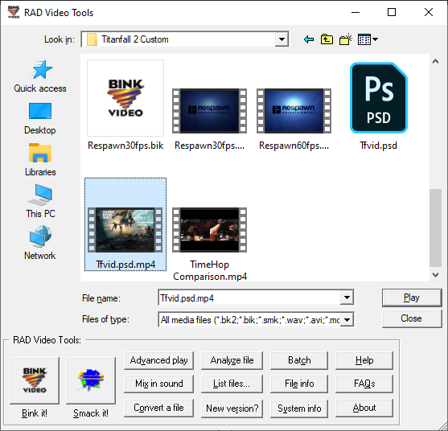
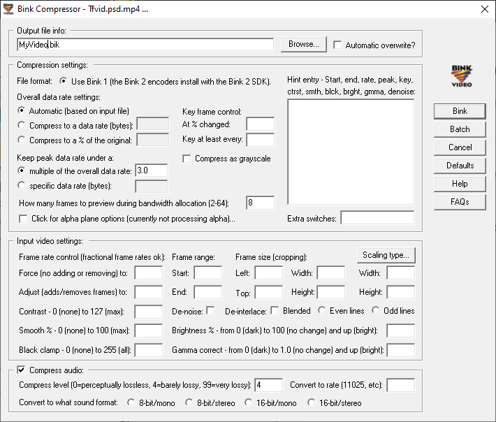
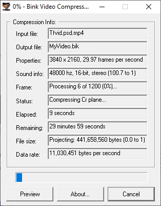
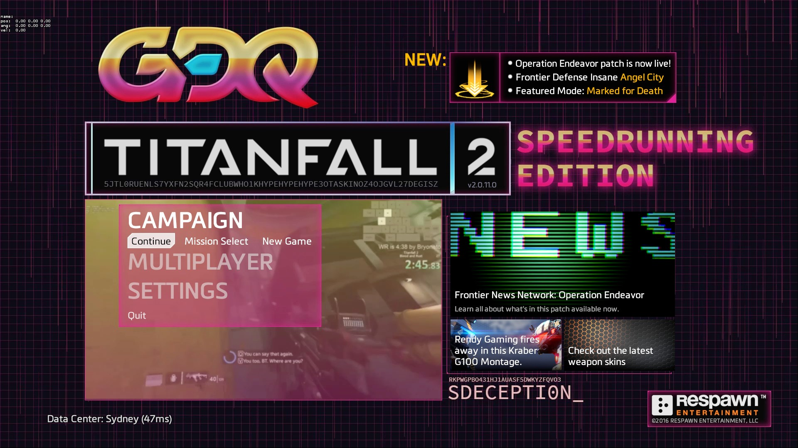

# Menu Background

For this tutorial you will need **Rad Video Tools** which you can find on the [Modding Tools](../../../how-to-start-modding/modding-tools/) page as well as **Quicktime 7.6** for Windows \(this will help to convert your video the bik format\).

1\) After installing **Rad Video Tools** open the program and navigate to the video you wish to use for your custom menu and click the **Bink it** button.

2\) Select the options you want for your video but for the most part the default settings will work. Once you're happy with the settings you want click the **Bink** button on the right hand side.

3\) After clicking the **Bink** button you will need to wait till the video is done converting. In the meantime you should make a backup of the original video which can be found in the media folder under: `Titanfall2\r2\media`

4\) Now to replace the menu you will need to rename your converted file to **menu\_act01.bik** and place it in the media folder. You can now launch your game to see the new menu.

Some already made Custom Menu's

* [SGDQ 2019](https://www.youtube.com/watch?v=jVn4hRA8pJY)
* [GDQx 2018](https://www.youtube.com/watch?v=b-mU1Nq4eck)

