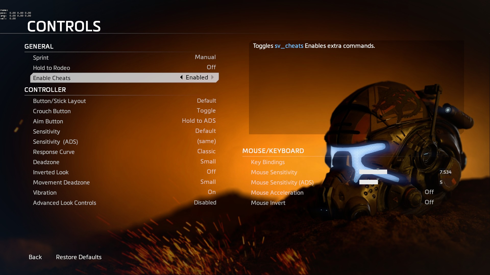

# 控制



## 文件位置

The Controls menu file is located  in `englishclient_frontend.bsp.pak000_dir.vpk`**,**  and is made up of two files:

* `resource\ui\menus\controls.menu`
* `scripts\vscripts\ui\menu_controls.nut`

## 工作原理

Each settings toggle that resides in the Controls menu and other menu's like Advanced HUD are layed out like this:

```text
SwchAutoSprint
		{
			ControlName				RuiButton
			InheritProperties		ControlsSwitchButton
			style					DialogListButton
			pin_to_sibling			ImgGeneralSubheaderBackground
			pin_corner_to_sibling	TOP_LEFT
			pin_to_sibling_corner	BOTTOM_LEFT
			xpos					-22
			navUp					BtnControllerOpenAdvancedMenu [$GAMECONSOLE]
			navUp					SwchMouseInvertY [!$GAMECONSOLE]
			navDown					SwchHoldToRodeo
			tabPosition				1
			ConVar					"autosprint_type"
			list
			{
				"#MENU_AUTOMATIC_SPRINT_OFF"			0
				"#MENU_AUTOMATIC_SPRINT_ON"				1
				"#MENU_AUTOMATIC_SPRINT_ON_PILOTONLY"	2
				"#MENU_AUTOMATIC_SPRINT_ON_TITANONLY"	3
			}
		}
```

`SwchAutoSprint` is the variable name of the setting.

`pin_to_sibling` is the variable name of the setting above it.

`navUp` is the variable name of the setting you will navigate to when pressing up \(usually above it\).

`navDown` is the variable name of the setting you will navigate to when pressing down \(usually below it\).

`ConVar` the source variable that you are modifying e.g `cl_showpos`, `cl_showfps`, or `sv_cheats`.

`list` a set of options for the `Convar`:

```text
list
{
    "Disable" 0
    "Enable" 1
}
```

## 添加说明

In the `menu_controls.nut` file, create a new line close to the other settings to keep them organised an easy to come back to later. You will now need to setup a new button for your setting variable:

```text
SetupButton( Hud_GetChild( menu, "SwitchEnableCheats" ), "Enable Cheats", "Toggles `1sv_cheats`0 Enables extra commands." )
```

The new setting I'm creating is for `sv_cheats` which I've called `SwitchEnableCheats`.

`"Enable Cheats"` is the setting name that you will see in the menu \(see screenshot for example\).

``"Toggles `1sv_cheats`0 Enables extra commands."`` is the description of the setting.

You will notice that there is a ```1`` and a ```0``. These will change the color of the text. 1 sets it blue and 0 sets it back white.


The last thing you will need to do is add one more line to the file under this function, which is already in the file:

```text
void function Controller_ResetToDefaults()
{

}
```

Add your new setting to the function like this:

```text
SetConVarToDefault( "sv_cheats" )
```

`sv_cheats` being the Source Variable that you added.

## 避免错误

When adding new settings, make sure you adjust the `pin_to_sibling`, `navUp`, and `navDown` of the previous and next setting, otherwise you can overlap them.

