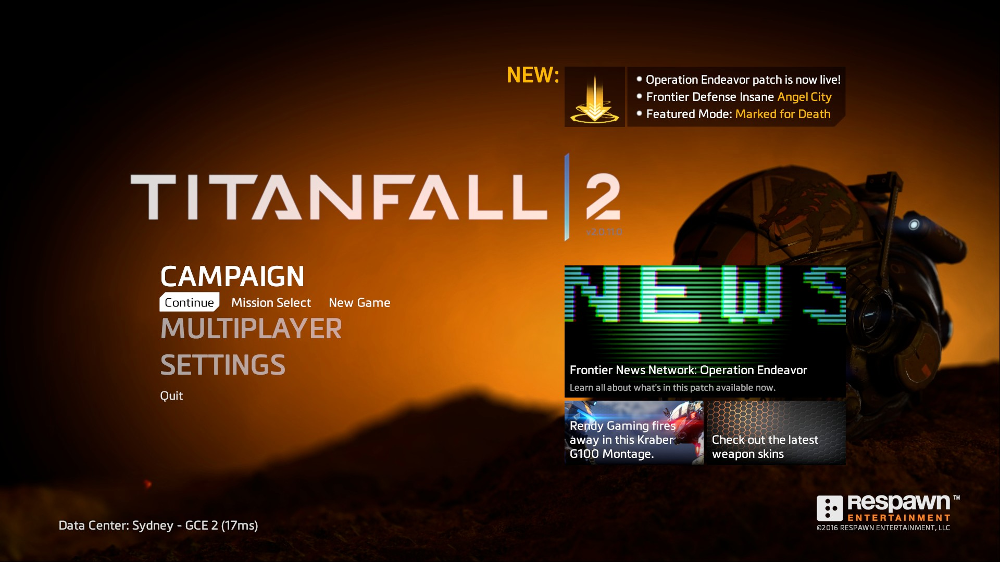
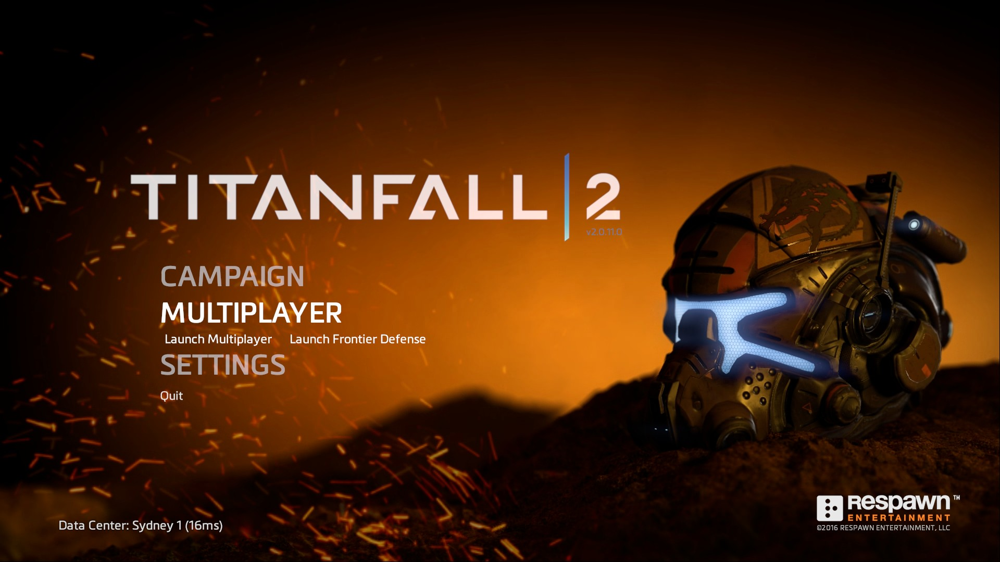

# Whats new and Spotlight



## Tools

You will need the:

* [Titanfall VPK Tool](../../../how-to-start-modding/modding-introduction/modding-tools/)
* [VPK renamer / move (Optional)](../../../how-to-start-modding/modding-introduction/modding-tools/)

## Whats New

Up in the top right hand corner there is a UI element showing off the new elements of the game. The assets for the UI element are located in the games **rpack** files which we dont have access to, however we can remove it since the game is no longer receiving updates.

To remove the UI element you will need to unpack `englishclient_frontend.bsp.pak000_dir.vpk` and edit the file `\resource\ui\menus\panels\mainmenu.res`.

Find the `WhatsNew` section in the file:

```
WhatsNew
    {
        ControlName				RuiPanel
        ypos					380
        wide					740
        tall					125
        rui                     "ui/whats_new.rpak"
        visible					1

        pin_to_sibling			PinFrame
        pin_corner_to_sibling	TOP_RIGHT
        pin_to_sibling_corner	TOP_RIGHT
    }
```

Set visible to 0:

```
visible					0
```

You can now repack your VPK and you will no longer see the **Whats New** UI element.

## Spotlight

On the right side of the screen you will 3 UI elements grouped together:

* News - Frontier News Network: Operation Endeavor
* Rendy Gaming fires away in his Kraber G100 Montage.
* Check out the latest weapon skins

To remove these elements you will need to unpack `englishclient_frontend.bsp.pak000_dir.vpk` and edit the file `\resource\ui\menus\panels\spotlight.res`.

There are 3 sections in this file:

* `SpotlightLarge`
* `SpotlightSmall0`
* `SpotlightSmall1`

To hide each section set `visible` to 0

```
visible					0
```

You can now repack your VPK and you will no longer see the **Spotlight** elements.


