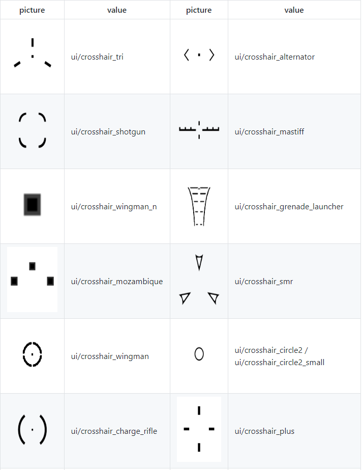
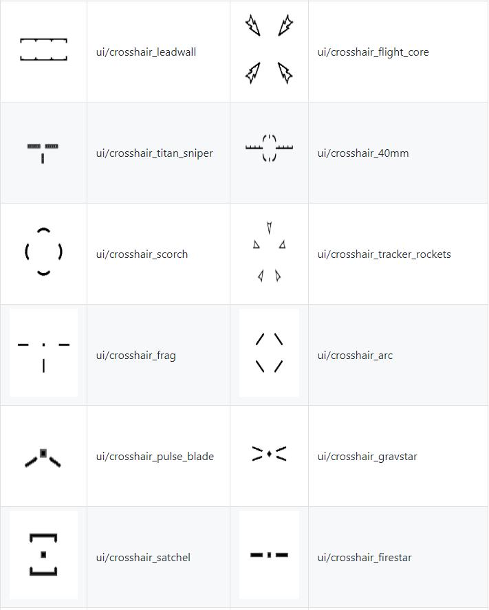

# 准星修改

## 前期准备

进入以下目录并找到所需的VPK文件：

> Origin Games\Titanfall2\vpk\

复制粘贴下面的文件到其他空的文件夹之中:

* englishclient\_mp\_common.bsp.pak000\_dir.vpk
* client\_mp\_common.bsp.pak000\_000.vpk

你将会用到Titanfall VPK Tool来打开和重新打包《泰坦陨落2》VPK 文件。[工具链接](https://noskill.gitbook.io/titanfall2/v/chinese/how-to-start-modding/modding-introduction/modding-tools)

## 解包

现在，这些文件已经备份完毕并且所有东西都已准备就绪。在软件中进入游戏目录并打开这个文件：

> Origin Games\Titanfall2\vpk\englishclient\_mp\_common.bsp.pak000\_dir.vpk

[如何正确地解包VPK文件？](https://noskill.gitbook.io/titanfall2/v/chinese/how-to-start-modding/modding-introduction/how-to-backup-extract-and-repack)

## 编辑

进入解包文件夹中下面的目录：

```text
englishclient_mp_common.bsp.pak000_dir.vpk\scripts\weapons
```

这个文件夹包含所有武器的"配置文件"，修改文件所产生的风险由你自己承担。如果因为你修改核心数值而导致的账号封禁，别把责任归咎于我。

查找下面的代码块来得到准星代码部分的位置。

```text
active_crosshair_count                      “1”
rui_crosshair_index                         “0”

RUI_CrosshairData
```

从这部分到_`RUI_CrosshairData`_ 括号的底部都是我们将要修改的地方！\(终于到有意思的地方了！\)

若要修改准星，你需要把_`ui`_ 改成你想要的；你可以在下文中找到不同的准星数值。

例如：

把_`ui/crosshair_tri`_改成_`ui/crosshair_alternator`_

它会把经典的步枪/冲锋枪准星\(在R201, CAR, R97等等上面使用的\) 改为转换者的准星。

可以同时组合多个不同的准星；你需要复制_`Crosshair_1`_括号内的内容，并且里面的数值就像下面的例子一样。

```text
Crosshair_1
{
    “ui”                                     “ui/crosshair_plus”
    “base_spread”                            “0.0”
    Args
    {
        //isFiring weapon_is_firing
    }
}
```

不要复制粘贴上面例子中的数值，请使用你正在编辑的文件中的值！

### active\_crosshair\_count

```text
active_crosshair_count "2"
```

这个数值用于设置你同时使用的准星数量。要同时使用多个准星，你需要修改这个数值为你在 `Crosshair_x`括号内融合的准星总数。

你可以修改_`base_spread`_这个数值来改变准星的基础大小。这不会影响武器的实际扩散，而是更改了屏幕中心和准星不同部分之间的距离。（可以使用正值或负值）

### ui/crosshair

这些数值就是准星本身。你可以将它们替换为在其他配置文件中找到的任何其他ui/crosshair数值 。如果你找到了新的准星，你可以发消息给我。

有些准星是动态的，比如冲锋枪、破片手榴弹和其他一些有动画效果的准星。在某些情况下，改为动态准星可以正常使用，在其他情况下则不行。举个正常使用的例子：我最喜欢的准星组合是在北极星的电浆磁轨炮上使用冲锋枪的准星。一个不起作用的例子：在CAR上使用破片手榴弹的准星则不能正常使用。






### base\_spread

这个数值用于修改准星的基础大小。这不会影响武器的实际扩散，而是更改了屏幕中心和准星不同部分之间的距离。（可以使用正值或负值）

### RUI\_CrosshairData & Arguments

Args or arguments can change how the crosshair is acting

| Argument | Value | Note |
| :--- | :--- | :--- |
| adjustedSpread | weapon\_spread |  |
| adsFrac | player\_zoomFrac |  |
| ammoFrac | "progress\_weapon\_clip\_ammo\_frac" |  |
| ammoFrac | "progress\_grapple\_power" |  |
| chargeFrac | player\_chargeFrac |  |
| chargeLevel | player\_chargeLevel |  |
| chargeMaxTime | eWeaponVar.custom\_float\_0 |  |
| chargeStartTime | weapon\_script\_time\_0 |  |
| clipAmmo | weapon\_ammo |  |
| clipSize | weapon\_clipSize |  |
| crosshairMovementX | crosshair\_movement\_x |  |
| crosshairMovementY | crosshair\_movement\_y |  |
| dryfireTime | "weapon\_latest\_dryfire\_time" |  |
| isActive | weapon\_is\_active |  |
| isAmped | weapon\_is\_amped |  |
| isFiring | weapon\_is\_firing |  |
| isGrappleInRange | "grapple\_in\_range" |  |
| isLocked | smartammo\_locked |  |
| isReloading | weapon\_is\_reloading |  |
| isSprinting | player\_is\_sprinting |  |
| readyFrac | progress\_ready\_to\_fire\_frac |  |
| regenRate | "eWeaponVar.regen\_ammo\_refill\_rate" |  |
| smartFov | "eWeaponVar.smart\_ammo\_search\_angle" |  |
| teamColor | crosshair\_team\_color |  |

More argument information on this page



### 配置文件名称

不同武器配置文件的列表，有时候名字和游戏名字不一样。.



## 重新打包

[如何正确地重新打包VPK文件？](https://noskill.gitbook.io/titanfall2/v/chinese/how-to-start-modding/modding-introduction/how-to-backup-extract-and-repack#ru-he-zheng-que-di-zhong-xin-da-bao-vpk)

在按步骤完成了上方链接的内容之后：

重命名pak000\_000.vpk为**client\_mp\_common.bsp.pak000\_000.vpk**

重命名pak000\_dir.vpk为**englishclient\_mp\_common.bsp.pak000\_dir.vpk**

将两个重命名完成的文件放回下面所示的文件夹之中并覆盖文件，然后启动《泰坦陨落2》。你就能看见你的新准星了！

> Origin Games\Titanfall2\vpk\

