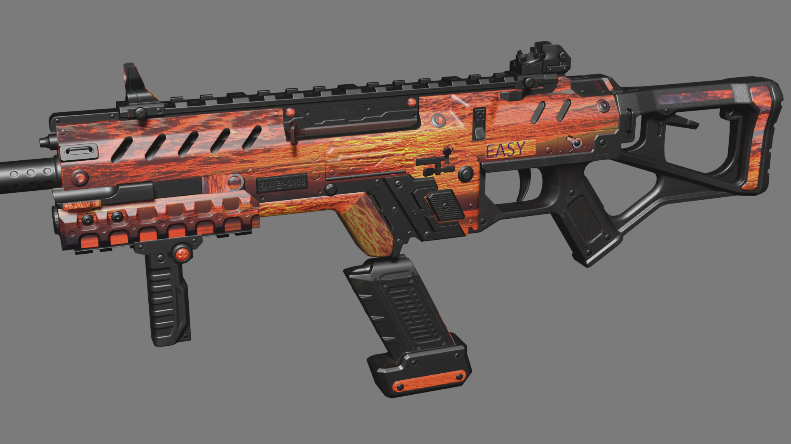

# Custom Gun Skin Gallery

Want to submit your custom skin to the gallery? Join the NoSkill Discord server and submit your skin to the `#custom-skins` channel! Make sure to tag your post with `CGSsubmission` so it can be filtered.   
  
Post info like the author, name of the skin, if it's animated \(if so, how many frames\) and if your skin for pbr or vtf/vmt version. Custom gun skin renders from Blender with white backgrounds are greatly encouraged for the Gallery.


Definitions:  
A **treated** skin is a skin edited to to compensate for broken shaders.  
A **wrap** is the 2D image that is used in `.vtf` files to surround a 3D model.  
A skin created from **factory reference** was created using the factory skin wrap as a reference.


## Sunset Fire by \*Author\*

Sunset fire was practice to start a skin from vanilla-scratch. This is an animated gun that says EASY KILLS every second. Download here:







## Not Your Savior by \*Author\*

Not Your Savior,was a skin testing out how to make skins not so bold and overly matte. Using details like dots and accents. Download here:





