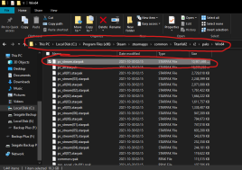
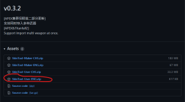
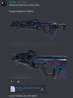
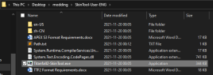

# DDS Format (partial)

## Installing DDS Skins with a tool and a premade skin.


DirectXeon made this short video that covers the basics of installing


Before we do anything else, you want to create a backup of the file `pc_stream.starpak`. You can locate it in the game directory here: `\Titanfall2\r2\paks\Win64`. It is the biggest file in the folder, about 10GB. Make sure the backups are not in the game directory, maybe put it in on your desktop. This is where the skins are stored.

Next you want to download the latest full release (`c0.3.2` as of the writing of this guide) of Pandora's skin tool here: [https://github.com/zxcPandora/Titanfall2-SkinTool/releases](https://github.com/zxcPandora/Titanfall2-SkinTool/releases). Download `SkinTool-User-ENG.zip`

The final download is a skin from #custom-skins-collection in our [Discord](https://discord.gg/sEgmTKg), I'll use my own that I made a while ago. (Note: you don't need to extract the zip folder that has the skin)

After you extract the skin tool, run the application: (note, you may have to run as administrator if it doesn't work)

First, you have to set the game path. Click `Set` and then `SetGamePath`. Locate `Titanfall2.exe` (or just the `Titanfall2` application if you don't have extensions on.

Next, click the three dots on the right and select the zipped skin you downloaded

.png>)

Click `Import Skin` and you're done!

.png>)

.png>)

.png>)


If you don't see the skins in game (_in_ game, not the menu), you may need to turn up your texture filtering to at least 8x


## Tools:

### [Titanfall2 SkinTool](https://github.com/zxcPandora/Titanfall2-SkinTool) - DDS Skin tool

Made by zxcPandora, Titanfall2 SkinTool is a Titanfall 2 and R5R tool with a UI to easily apply DDS skins that are formatted accordingly. This tool can apply weapon and pilot skins.

### [Titanfall2 DDS Tool](https://github.com/greishuhs/Titanfall2-DDS-Tool) - DDS Skin tool

Made by greishuh/Gracious, Titanfall2 DDS Tool is a tool with cmd ui to more manually apply DDS weapon skins. Not recently updated.

[Video using Gracious tool.](https://youtu.be/1\_nSqO\_q3oA)

### [Titanfall2 SkinTool](https://github.com/Strykus/Titanfall2-SkinTool) - DDS Skin tool

Edited by Strykus, Titanfall2 SkinTool is a tool. This tool can apply Titan skins and Attachment skins.

## Videos:

DirectExon's Info and Tutorials of Skin Installation.


DirectXeon's video tutorial


headassbtw's Blender Tutorials of Custom Skin for the C.A.R.


headassbtw Custom skin in Blender Guide


Mauey's Newer Tutorial (below)


Mauey Latest Tutorial. Tool assisted.


Mauey's Old Tutorial (may be obsolete) (below)


Mauey Outdated Tutorial. Manual.


## Resources for manual modding for DDS skins.

### List of hex offsets by MrSteyk(via Wayback Machine):&#x20;

[https://web.archive.org/web/20210725135838/https://gist.githubusercontent.com/mrsteyk/f9f853d93139cd395c1a49ab24b17b3d/raw/fdae77196a8f861c03373b243573096bd88406c0/common.rpak.log](https://web.archive.org/web/20210725135838/https://gist.githubusercontent.com/mrsteyk/f9f853d93139cd395c1a49ab24b17b3d/raw/fdae77196a8f861c03373b243573096bd88406c0/common.rpak.log)
