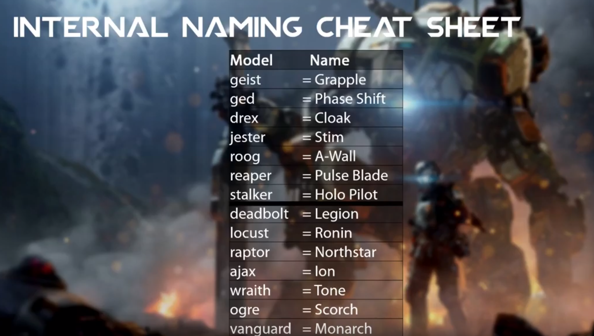

# Making Custom Skin Info & Resources

## &#x20;This is just resources and info.

Tutorials or suedo Tutorials can be found under the Making Custom Skins category.

## Possibilities?

Below is a page where you can find can kind of skins you can make. Don't be shy to make something new. Some objects needs or function with a certain format.


[custom-skin-info-and-formats](../../custom-skin-info-and-formats/)


## List of to do/get to make a skin:

* .mdl file of choice edited and converted to .obj (or of choice) for editing application.
* Editing application; Image editing software, 3D workspace; Blender, Substance Painter.
* Creativity. Images or videos to draw inspiration or to implement.

## Recommended Software:

This is software that has been used and tested to create CGSs.&#x20;

#### [Substance Painter](https://www.substance3d.com) - "Substance becomes Adobe Substance" (paid, app)

"Substance painter is a specialized texturing tool which utilizes a procedural Physically Based Rendering (PBR) workflow."

Substance Painter is better than Blender for this scenario. Substance Painter can both view and edit on a 3d model or a flat UV. It can also use more advanced brushes, smart textures, and truly live viewing of edits or shaders. Substance Painter can also create many maps such as specular, glossiness, and much more to increase quality. Now acquired by Adobe and expensive.

#### [Adobe Photoshop](https://www.photoshop.com) - "The world is your canvas, so grab inspiration from all around you and have fun experimenting." (paid, app)

Adobe photoshop is a image editing and photo retouching application.

We use this application to edit over the original texture and create our own custom texture. Photoshop is recommended Image Editor for CGS because of the native support in Blender that lets us reload images without needing to export, save as, import, connect. \
With reload .psd support in Blender we can refresh the .psd to use the the most recent changes made. To "reload" the image we use a Blender Add-ons; Node Wrangler, then press ALT+R in the "shading" tab.&#x20;

#### [Blender](https://www.blender.org) - "Blender's mission is to bring the best 3D technology as tools in the hands of artists, for all platforms, everywhere in the world, free and open source forever." (free, app)

"Blender is the free and open source 3D creation suite. It supports the entirety of the 3D pipeline—modeling, rigging, animation, simulation, rendering, compositing and motion tracking, video editing and 2D animation pipeline."

We use this application to view our 3D models and 2D skins wrapped onto our 3d models. You can also create 3D renders, 3D printable files, and much MUCH more. This is super useful to view our work.

## Useful Websites:

#### [Coolors](https://coolors.co) - "the super fast color scheme generator"

Coolors is a color palette generator with many options to find what you need.

#### [Color Picker online](https://imagecolorpicker.com) - "HEX Color Picker"

I personally use this. If you have a safer or better website feel free to let us know. I use this because i can pick specific pixels and its the easiest when uploading my own images to rip colors from.pps

### Image Editing websites & apps.

#### [Pixlr.com](https://pixlr.com) - "online graphic designer" (free website)

Yeah its a free photo image editing and works but sometimes breaks. You don't lose files when it "breaks".

#### [Photopea](https://www.photopea.com) - "Online Photo Editor" (free website)

Another and if not a better image editing website than Pixlr. Heard very well from this website.&#x20;

#### [Affinity](https://affinity.serif.com/en-us/) - "Professional Image Editing Software" (paid, 50$ each)

[Affinity Photo](https://affinity.serif.com/en-us/photo/) and [Affinity Designer](https://affinity.serif.com/en-us/designer/) offers trials, and offers their software at $50 USD per app. I have seen extended trials(3 months) and deals for $25 USD per app. I enjoy this software for being capable and affordable, although I haven't found an add-on for real-time support in Blender.&#x20;

#### [GIMP](https://www.gimp.org) - "GNU Image Manipulation Program" (free, app)

" GIMP is a cross-platform image editor available for GNU/Linux, OS X, Windows and more operating systems. It is [free software](https://www.gnu.org/philosophy/free-sw.html), you can change its [source code](https://git.gnome.org/browse/gimp) and [distribute](https://www.gnu.org/licenses/quick-guide-gplv3.en.html) your changes."

GIMP is widely used and recommended by many people. There is also quite a few of add-ons for GIMP, including a vtf export add-on that can help with needing to make many vtf's for example making each frame for an animated CGS.

#### [Substance Painter](https://www.substance3d.com) - "Substance becomes Adobe Substance" (paid, app)

&#x20;"Substance painter is a specialized texturing tool which utilizes a procedural Physically Based Rendering (PBR) workflow."

Substance Painter is better than Blender for this scenario. Substance Painter can both view and edit on a 3d model or a flat UV. It can also use more advanced brushes, smart textures, and truly live viewing of edits or shaders. Substance Painter can also create many maps such as specular, glossiness, and much more to increase quality. Now acquired by Adobe and expensive.

## Useful Apps:

#### [Autohotkey](https://www.autohotkey.com) - "The ultimate automation scripting language for Windows"

"AutoHotkey is a free, open-source scripting language for Windows that allows users to easily create small to complex scripts for all kinds of tasks such as: form fillers, auto-clicking, macros, etc."

AutoHotkey is used by many to create custom keybind macro. Usually using a numpad as the macro start key. Find their website and info at [by clicking these words](https://www.autohotkey.com). As coding goes, there is many ways to code macros. Personally i use the code below to refresh Photoshop file to update the skin in Blender;

```
Numpad1::send {ctrl down}{s down}{ctrl up}{s up}
Numpad3::send {alt down}{r down}{alt up}{r up}
Numpad2::send {ctrl down}{z down}{ctrl up}{z up}
]::Suspend
\::ExitApp
```

* Numpad1: Saves (CTRL+S)
* Numpad2: Undo (CTRL+Z)
* Numpad3: Reloads images in Blender with NodeWrangler (ALT+R)&#x20;

## Useful Pages:

### 2D Wireframe

Wireframes are a 2D cover to help with organization, detail, shape, size, and accuracy of your skin. Learn how with the page link below.


[2d-wireframes.md](2d-wireframes.md)


### 2D Textures (factory skin reference)

Base textures from the game to help with color, shape, and organization for 2D skin creation. Learn how to export the base textures here:


[exporting-using-legion.md](../../../../../r2-ripping/exporting-using-legion.md)


### Acquiring models for skinning:

We already have a good wiki page for exporting models. Found below.


[model-ripping.md](../../../../../r2-ripping/model-ripping.md)


Below page could also help with exporting with legion.


[exporting-using-legion.md](../../../../../r2-ripping/exporting-using-legion.md)


## Resources:

### Naming Sheet for Titanfall 2 Models (and tables).



| Pilot Model | Pilot In-game |
| ----------: | ------------- |
|       geist | Grapple       |
|         ged | Phase Shift   |
|        drex | Cloak         |
|      jester | Stim          |
|        roog | A-Wall        |
|      reaper | Pulse Blade   |
|     stalker | Holo Pilot    |

| Titan Model | Titan In-game |
| ----------: | ------------- |
|    deadbolt | Legion        |
|      locust | Ronin         |
|      raptor | Northstar     |
|        ajax | Ion           |
|      wraith | Tone          |
|        ogre | Scorch        |
|    vanguard | Monarch       |


40 minute video hosted on Youtube about Apex Legends Blender tutorial.



17 minute video hosted on Youtube about Titanfall2 Custom Skin Guide.

