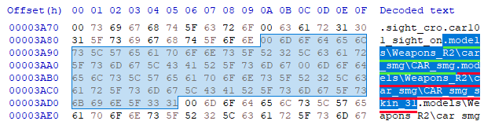
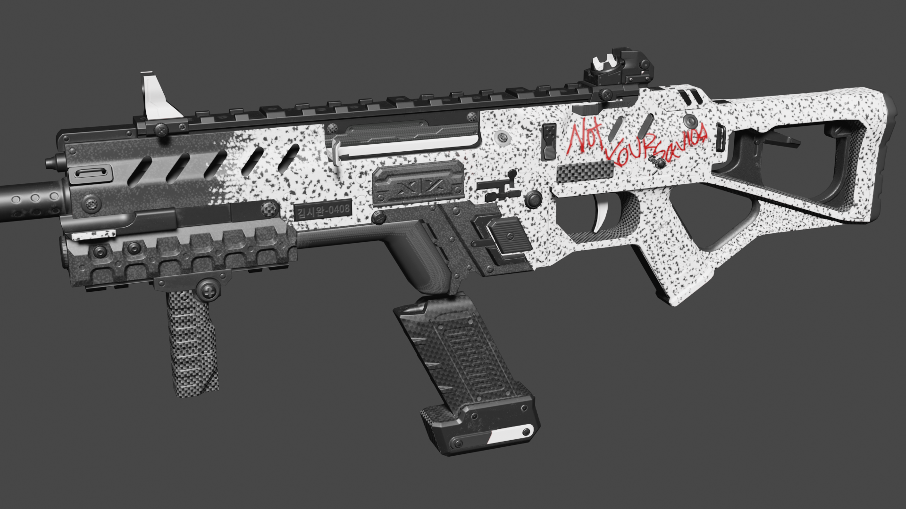
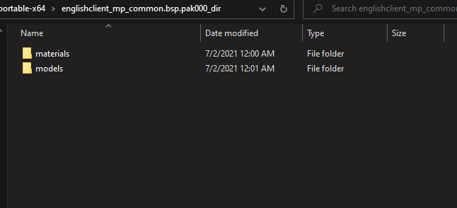
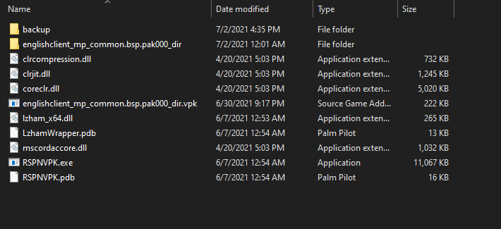
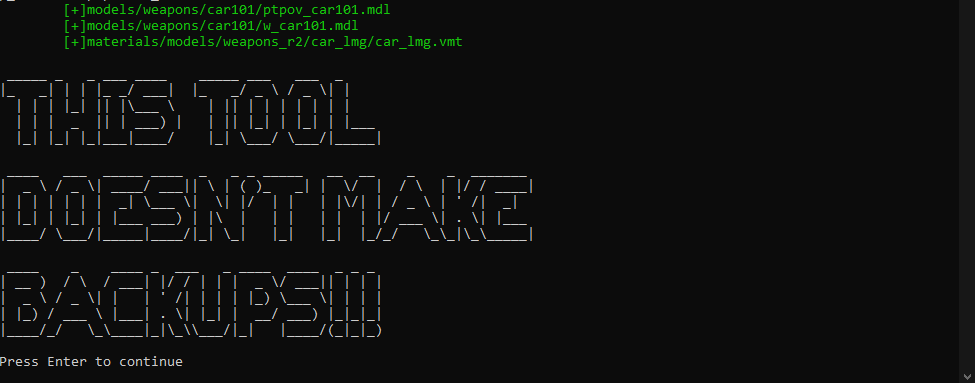

# VTF Format

## Introduction

In this article, we will be editing the path in a weapon's `.mdl` file to modify the weapon skin to use a custom skin, and applying a custom skin using `.vtf` and `.vmt` files.

## Preparation

Locate your game folder and find this folder if you are on Origin:

> Origin Games\Titanfall2\vpk\

Or this folder if you are on Steam:

> Steam\steamapps\common\Titanfall2\vpk\

Copy these files and paste them in a backup folder somewhere else preferably a backup folder:

* `englishclient_mp_common.bsp.pak000_dir.vpk`
* `client_mp_common.bsp.pak000_000.vpk`

And `client_mp_common.bsp.pak000_228` if you have used RSPNVPK for mods before.

## Unpacking <a id="unpacking"></a>

Now that these files have been backed up and everything installed. Navigate to your game folder and open this file:

> \Titanfall2\vpk\englishclient\_mp\_common.bsp.pak000\_dir.vpk

​[How to extract VPK's properly ?](https://noskill.gitbook.io/titanfall2/how-to-start-modding/how-to-backup-extract-and-repack)

## Retrieving files to edit

From your extracted vpk, navigate to the `\models\weapons\` folder, and then to the folder of the gun you want to edit. Start by creating a file path on your desktop that has the same name as the common vpk \(without the `.vpk` extension\), and replicating the file path that the `.mdl` files are in:`\englishclient_mp_common.bsp.pak000_dir\models\weapons\<gun name>`


We are creating this path so that we can copy and repack the VPK using RSPNVPK


In this example, I will use the CAR smg, so I will copy the 2 `.mdl` files to`\englishclient_mp_common.bsp.pak000_dir\models\weapons\car101` 

## Editing .mdl's with a Hex Editor

Time to use the Hex Editor. I will be using HxD in this example.

We will be using a hex editor to adjust the weapons texture path to something we can work with/input our own textures. To start, open your .mdl file in the hex editor. Using this, we can edit the file path for the factory skin, or for each non-paid weapon skins.

Once you've opened your file press CTRL+F and search for `skin31` . If nothing shows up, then search for `skin_31`. This is part of one of the paths that you can edit to change the skins. The 2 paths for the 2 skins are `.models\WeaponsR2\<gun name>\<gun name>` and `.models\WeaponsR2\<gun name>\<gun name>_skin31` / `.models\WeaponsR2\<gun name>\<gun name>_skin_31`

You can have 2 custom skins per gun in the game. Editing `\<gun name>` replaces the path used for the factory \(default\) skin, and `\<gun name>_skin31` will replace the path for all of the non-paid skins. 



Hex Editors work differently from normal text. It replaces instead of deleting then placing new objects. So click before the letter you want to change and press the key of the letter you now want. We will make a simple change of changing the path from `.models\Weapons_R2\car_smg\CAR_smg` to `.models\weapons_r2\car_lmg\car_lmg` . The new path can be whatever you want , but to keep the gallery organized, we have a list of recommended names for each gun. After you save your edits, the file will be saved and you will have a `.mdl.bak` extension file. You can go ahead and delete the `.mdl.bak` file, as it's just the unedited `.mdl`.


Notice that we made the edited path lowercase. If you are using RSPNVPK, you need to use lowercase in the edited path.


Now that we have edited our paths, we can start the process of applying custom skins!

## VTF's and VMT's

### VTF

With our new paths for custom skins, we need to create the folders following said paths. In the same folder on your desktop, create the file path `englishclient_mp_common.bsp.pak000_dir\materials\models\weapons_r2\<edited gun name>`.

For this example, the path would be `englishclient_mp_common.bsp.pak000_dir\materials\models\weapons_r2\car_lmg`. Next, put a `.vtf` file of your choice in the weapon folder \(`\car_lmg`\). A Valve Texture Format \(VTF\) is a texture that the Source engine uses. That texture is used in our custom skin. If you don't have one, we have a few in the gallery. See below on how to get VTF's:



The `.vtf` we will be using for an example is the Not Your Savior skin:



Find the download in the gallery:



### VMT File \(managing file\)

Now that we have our VTF\(s\) in our file system, We can create a Valve Material Type \(VMT\) file, which manages the `.vtf` and applies it to the models. In the folder with your VTF, create a blank text document and name it the last string in the path that you edited with the `.vmt` extension:



Note that if you want to change the `skin31` or `prime` paths, your `.vmt` file will have to be the same number of characters. For ease of use, just use the name of the path \(example `.vmt` name: `car_lmg_skin_31.vmt).`


Next, we are going to create a small bit of code so the skin \(`.vtf`\) is applied to the model. Open the `.vmt` file in a text editor and copy the code below, replacing the values inside of `<>`, and not using the `.vtf` extension:

```text
"VertexlitGeneric"
{
	$basetexture "models\weapons_r2\<gun name>\<vtf name>"
}
```

In our example, the code would be:

```text
"VertexlitGeneric"
{
	$basetexture "models\weapons_r2\car_lmg\90notyoursavior"
}
```

After you are done, save and that's it for the VMT. You can find more documentation about VMT's here:



After you are done with editing the `.mdl` files and the `.vmt` and `.vtf` files, your folder on your desktop should look like this:




Make sure you have a backup of the vpks you are modding before continuing in case something breaks or you are not satisfied with the results


## Setting up and using [RSPNVPK](https://github.com/squidgyberries/RSPNVPK)

Now we are ready to compile our VPK. We will be using [RSPNVPK](https://github.com/squidgyberries/RSPNVPK). Copy the folder on your desktop from earlier and  `englishclient_mp_common.bsp.pak000_dir.vpk` from your game directory into the RSPNVPK directory:



Now drag and drop `englishclient_mp_common.bsp.pak000_dir.vpk` onto the `RSPNVPK.exe` . It should bring up a command prompt. Press `ENTER` to start, and `ENTER` when RSPNVPK tells you it is finished.



After the tool is finished, copy `englishclient_mp_common.bsp.pak000_dir.vpk` and `client_mp_common.bsp.pak000_228.vpk` into your game directory and you should be done!

## Final Product?



Say thanks to YawdinXiro for creating a Not you Savior Showcase for the Wiki.   
Thanks YawdinXiro! \(Note; due to different mods, the showcase video lighting is different. The skin wont look exactly like this for you.\)

