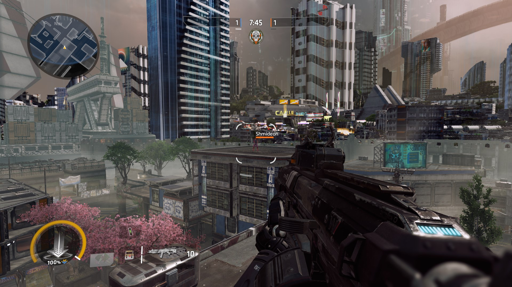
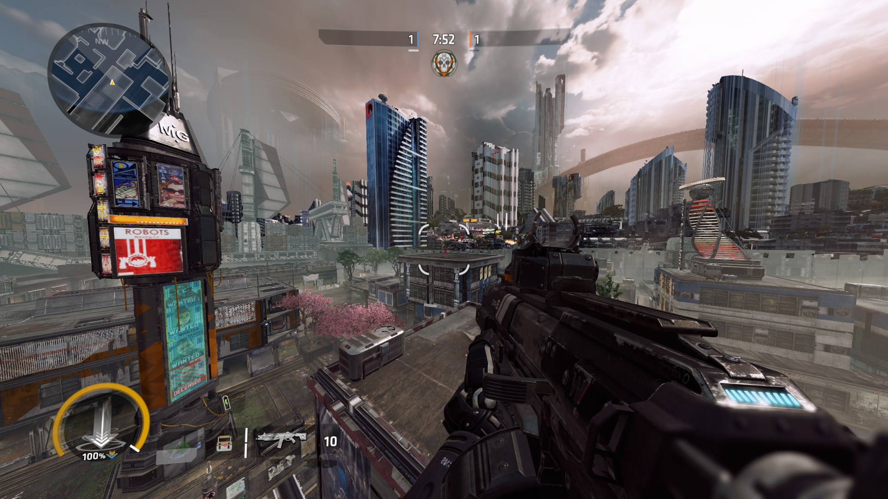
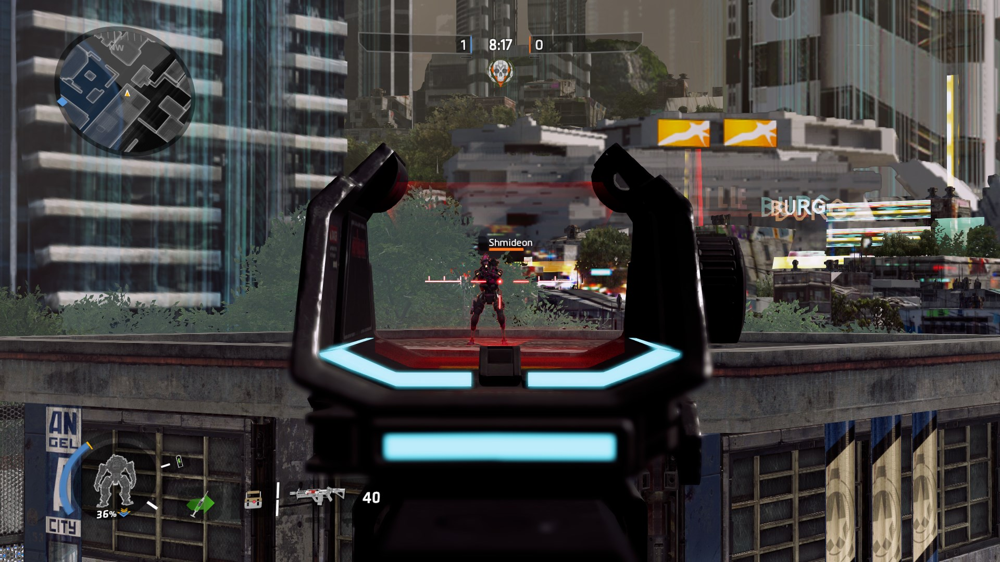
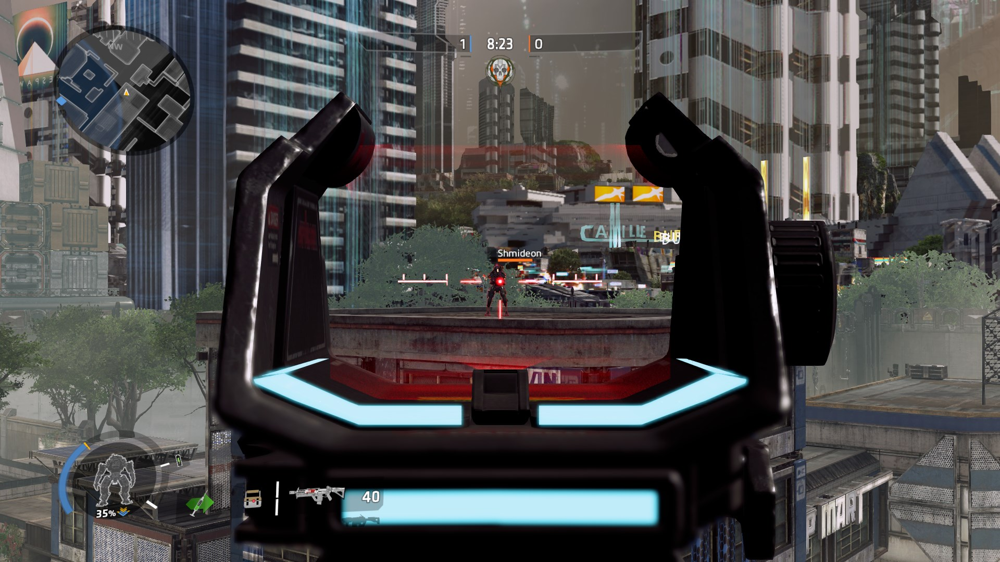

# 一键更换武器视野

## 前期准备

在本指南中，您需要去编辑一个配置文件，即 `.cfg` 文件。请注意：如果你没有 `autoexec.cfg`文件在`Origin Games\Titanfall2\r2\cfg\` 目录中，你需要手动去新建一个同名文件。  
  
进入以下文件目录，并查找 `autoexec.cfg` 文件：

> Origin Games\Titanfall2\r2\cfg\

使用你的文本编辑器打开它。


您也可以为配置文件使用其他的名称，但需要使用命令来执行它。


## 介绍

起源引擎游戏处理放大时，通过将瞄准镜的视野改变为一个较小的数字，来达到放大的效果。  
本指南将教你如何将此效果应用于腰射视图，我们可以通过绑定一个按键来在不同视野之间循环切换来实现这一点。

## 编辑

在文本编辑器中打开你的 `autoexec.cfg` 并键入下面的代码行：

```text
bind "MOUSE4" fovtoggle
	alias fovtoggle "fov1"
		alias "fov1" "cl_fovScale 1.0; alias fovtoggle fov2"
		alias "fov2" "cl_fovScale 1.6875; alias fovtoggle fov1"
```

请注意，低于1.0的 `cl_fovScale` 数值将会默认设为1.0。

我把视野切换开关绑定到了“MOUSE4”，你可以把它绑定到任何你喜欢的按键上。  
  
上面的代码行表示视野将在`cl_fovScale 1.6875 (118.125 FOV)`和 `cl_fovScale 1.0 (70 FOV)`  
之间切换。然而，在你移动鼠标时切换视野的同时，鼠标的灵敏度没有随着一起切换。正如你所想到的，将被放大。  
  
要使鼠标灵敏度与视野缩放比例对应匹配，需要将鼠标灵敏度值除以视野放大的数值（在我的设置中，该比例值为 `1.6875 / 1.0 = 1.6875`\)，在上面比例值的情况下，放大后鼠标的灵敏度应为`3.848 / 1.6875 = 2.2802962963`.  
  
现在将恰当的鼠标灵敏度值添加到 `"fov1"` 和 `"fov2"`之中

```text
bind "MOUSE4" fovtoggle
	alias fovtoggle "fov1"
		alias "fov1" "cl_fovScale 1.0; alias fovtoggle fov2; m_sensitivity 2.2802962963"
		alias "fov2" "cl_fovScale 1.6875; alias fovtoggle fov1; m_sensitivity 3.848"
```

这将确保鼠标移动时不会被放大，并且感觉与缩小时相同。

## 样例














**资源：**

* [https://developer.valvesoftware.com/wiki/Field\_of\_View](https://developer.valvesoftware.com/wiki/Field_of_View)
* [https://en.wikipedia.org/wiki/Frustum](https://en.wikipedia.org/wiki/Frustum)
* [https://en.wikipedia.org/wiki/Angle\_of\_view](https://en.wikipedia.org/wiki/Angle_of_view)
* [https://en.wikipedia.org/wiki/Parallax](https://en.wikipedia.org/wiki/Parallax)


