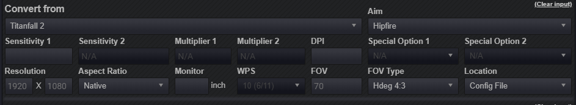

# Weapon FOV Modding

## Preparation

Navigate to your folder and find this VPK file:

> Origin Games\Titanfall2\vpk\

Copy these files and paste them into an empty folder somewhere else:

* englishclient\_mp\_common.bsp.pak000\_dir.vpk
* client\_mp\_common.bsp.pak000\_000.vpk

You will need the Titanfall VPK Tool, the program which will allow you to open and repack Titanfall VPK files. [Here](https://noskill.gitbook.io/titanfall2/how-to-start-modding/modding-tools)

## Unpacking

Now that these files have been backed up and everything installed. Navigate to your game folder and open this file:

> Origin Games\Titanfall2\vpk\englishclient\_mp\_common.bsp.pak000\_dir.vpk

[How to extract VPK's properly ?](https://noskill.gitbook.io/titanfall2/how-to-start-modding/how-to-backup-extract-and-repack)

## Introduction

The way Titanfall 2 and other source engine games handles magnification when "aiming down sights" is by changing the FOV to a smaller number, which gives the effect of magnification. This tutorial will teach you how to modify the FOV when ADS with any weapon. We will do this by modifying the `"zoom_fov"` variable that each weapon/scope has. 

## Editing

Navigate to this location in your extracted folder

> \scripts\weapons

This folder contains the "config files" for the weapons. Edit those files at your own risk, if you get banned because you edit some important value don’t blame me.

Find this part of code in the file:

```text
	// Behavior
```

In this section, find the line called `"zoom_fov"`this is the variable we will be changing in order to get the desired zoom for our weapon when we ADS. Look for the number in quotations, like this:

```text
"zoom_fov"                                        "35"
```

This is the default variable for `"zoom_fov"`  with the Wingman Elite. So when `"zoom_fov"` is set to `"35"`, this gives us a true horizontal FOV of 69.51, when our base hip fire FOV is set to 110. 

IMPORTANT: The horizontal FOV of your weapon when zoomed in will depend on your base hip fire fov. 

As a basis of understanding, the lower the variable for `"zoom_fov"` is set to, the more your weapon will zoom in when ADS. Therefore, the higher the variable is set to, the weapon will zoom in less. The max variable you can input is `"70"`. When `"zoom_fov"` is set to `"70"`, your weapon will not zoom in at all, and will remain at your hip fire FOV. 

You can also have different Zoom FOVs for different scopes on each weapon. To do this, find the `Mods` section for the weapon you are editing. We will use HCOG on Wingman Elite as example, look for something like this:

```text
hcog
		{
			"bodygroup3_set"	"1"
			"bodygroup4_set"	"0"
			"bodygroup5_set"	"0"
			"viewmodel_offset_ads"							"0 -6.7 -0.75"
			"zoom_fov"										"35"
			"anim_alt_idleAttack"	"1"

			"dof_zoom_nearDepthStart"						"6.161"
			"dof_zoom_nearDepthEnd"							"9.204"
		}
```

Now add the line `"zoom_fov"` to the section, followed by a few spaces and then a number in quotation marks like this:

```text
hcog
		{
			"zoom_fov"        "45"
			"bodygroup3_set"	"1"
			"bodygroup4_set"	"0"
			"bodygroup5_set"	"0"
			"viewmodel_offset_ads"							"0 -6.7 -0.75"
			"zoom_fov"										"35"
			"anim_alt_idleAttack"	"1"

			"dof_zoom_nearDepthStart"						"6.161"
			"dof_zoom_nearDepthEnd"							"9.204"
		}
```

The variable you chose to input for your zoom\_fov for each scope should be different, so that you can equip a different scope at any time in game, and thus get your desired zoom. 

## How to calculate

In order to determine exactly what your true horizontal FOV will be when ADS, we can use this formula:

Take your cl\_fovScale value and multiply by the variable you choose for your `"zoom_fov"`. If you don't know your cl\_fovScale, then you can determine that by dividing your hip fire FOV by 70. For this example we will use 110 FOV. 

**110/70 = 1.5714** &lt;---- this number is our cl\_fovScale \(when fov is set to 110\)

We then multiply that number \(cl\_fovScale\) by whatever number we chose for our zoom\_fov variable. In this example we will use "56", as that's what I currently have it set to for my Wingman Elite. 

1.5714 x 56 = **87.99** &lt;---- this number is your horizontal FOV in 4:3 aspect ratio, which is what Source engine uses to calculate our actual horizontal FOV. Now we need to convert this number to 16:9, which will give us our _true_ horizontal fov. For this, you can just use a tool like [mouse-sensitivity.com](https://www.mouse-sensitivity.com/). Select Titanfall 2, and by default, the calculator should look like this:



All we need to do here is in put the FOV number we just acquired from our previous calculation, in my example I got 87.99


Now scroll down and you will be greeted with your converted fov calculations:


The green number next to Actual HFOV is your true horizontal FOV when zoomed in with a weapon.

## Repacking

[How to repack VPK files proprely?](https://noskill.gitbook.io/titanfall2/how-to-start-modding/how-to-backup-extract-and-repack#how-to-repack-vpk-files-properly)

After closely following the previous link step by step:

Rename pak000\_000.vpk _to_ **client\_mp\_common.bsp.pak000\_000.vpk**

Rename pak000\_dir.vpk _to_ **englishclient\_mp\_common.bsp.pak000\_dir.vpk**

Place both of the renamed files back into your game directory and then launch Titanfall 2. You will now be able to see your new desired field of view for weapons when aiming down sight!

> Origin Games\Titanfall2\vpk\

### Misc Notes

The in game slider for FOV is wrong. When fov is set to 110, your cl\_fovScale remains at 1.55, which means your horizontal fov is actually 108.5, instead of 110. To always ensure that you're playing on the correct fov. Take the number you wish to have for your horizontal fov and divide it by 70. Using 110 as an example 110/70 = 1.5714. We then need to change the cl\_fovScale variable in order to actually have 110 fov in game. To do this, go to 

> \Documents\Respawn\Titanfall2\profile

And open up `profile.cfg`. Ctrl + F to find `cl_fovScale` and then set it to 1.5714 or whatever number you used to get the correct variable. Save it, and next time you're in game you will have the correct fov. Reminder: changing your fov again in game will require you to redo this change. 

