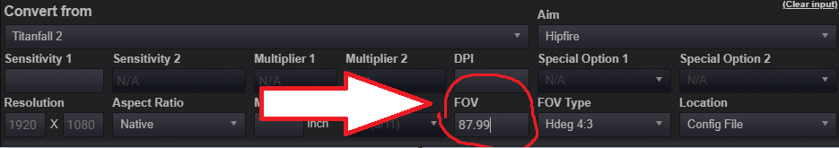
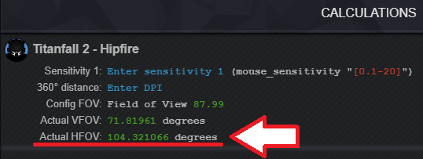

# 武器视野

## 用到的VPK


* englishclient\_mp\_common.bsp.pak000\_dir.vpk


你将会用到Titanfall VPK Tool来打开和重新打包《泰坦陨落2》VPK 文件。 [工具链接](https://noskill.gitbook.io/titanfall2/v/chinese/how-to-start-modding/modding-introduction/modding-tools)



## 介绍

《泰坦陨落2》和其他起源引擎游戏处理武器瞄准放大的效果时（即右键瞄准），是通过改变武器视野为一个较小的数字来达到放大的效果。本指南将会指导你修改任何武器右键放大时的视野，我们将通过修改每个武器/瞄准镜的 `"zoom_fov"` 变量来实现这一点。

## 编辑

进入下面的解包文件夹：

> \scripts\weapons

这个文件夹包含所有武器的"配置文件"，修改文件所产生的风险由你自己承担。如果因为你修改核心数值而导致的账号封禁，别把责任归咎于我。

在文件中找到这部分代码：

```text
	// Behavior
```

在这一节中，找到名为`"zoom_fov"`的行；这是我们将要修改的变量，以便在使用武器右键瞄准时，变为所需要的缩放。在代码行中查找如下所示的数字：

```text
"zoom_fov"                                        "35"
```

这是小帮手精英`"zoom_fov"` 的默认变量值。 所以当 `"zoom_fov"` 设置为 `"35"`,且基础腰射视野设为110时，我们所得到的实际的水平视野为69.51。


 放大时武器的水平视野取决于你的腰射视野设置。


作为基础知识， 变量`"zoom_fov"` 的值设置得越低，你的武器在右键瞄准时放大的幅度就越大；变量的值设置得越高，放大的幅度就越小。您可以修改的变量最大值是 `"70"`。 当 `"zoom_fov"` 设为 `"70"`时，你的武器视野将不会再次放大，并且时刻保持为腰射视野。

你也可以对每件武器不同的瞄准镜设置不同的放大视野。为此，找到你正在编辑的武器的 `Mods` 部分。我们将使用小帮手精英上的HCOG镜作为例子，查找如下内容：

```text
hcog
		{
			"bodygroup3_set"	"1"
			"bodygroup4_set"	"0"
			"bodygroup5_set"	"0"
			"viewmodel_offset_ads"							"0 -6.7 -0.75"
			"zoom_fov"										"35"
			"anim_alt_idleAttack"	"1"

			"dof_zoom_nearDepthStart"						"6.161"
			"dof_zoom_nearDepthEnd"							"9.204"
		}
```

现在将代码行 `"zoom_fov"` 添加到这一节之中，后面加上几个空格，然后在英文状态的双引号中添加一个数字，如下所示：

```text
hcog
		{
			"zoom_fov"        "45"
			"bodygroup3_set"	"1"
			"bodygroup4_set"	"0"
			"bodygroup5_set"	"0"
			"viewmodel_offset_ads"							"0 -6.7 -0.75"
			"zoom_fov"										"35"
			"anim_alt_idleAttack"	"1"

			"dof_zoom_nearDepthStart"						"6.161"
			"dof_zoom_nearDepthEnd"							"9.204"
		}
```

你为每个瞄准镜设置变量`zoom_fov`的数值应该是互不相同的。这样你就可以在游戏中随时装备不同的瞄准镜，从而获得所需要的武器视野缩放。

## 如何换算

为了准确地确定右键瞄准时你的实际水平视野，我们可以使用以下公式：

使用你 `cl_fovScale`的数值乘以你在 `"zoom_fov"`中设置的数值。如果你不知道你的`cl_fovScale`，那你可以通过将腰射视野除以70来确定。 对于下面的例子，我们将使用110视野。


**110/70 = 1.5714** &lt;---- 这个数值就是我们的cl\_fovScale \(当视野设为110时\)


然后我们将这个数字 \(cl\_fovScale\) 乘以我们为zoom\_fov中设置的数值。在这个例子中，我们将使用“56”，因为这是我目前为我的小帮手精英所设置的。


1.5714 x 56 = **87.99** &lt;---- 这个数字是你在4:3屏幕比例中的水平视野。


4:3屏幕比例是起源引擎用于计算我们实际水平视野的依据。 现在我们需要把这个屏幕比例转换成16:9，这将是我们实际使用的水平视野。为此，您可以使用 [mouse-sensitivity.com](https://www.mouse-sensitivity.com/)网站来计算。选择Titanfall 2，在默认情况下，计算器如下所示：


我们需要做的就是把刚才计算得到的视野值放进去。在上面的例子中，我得到了87.99



现在鼠标向下滚动，你将看到转换后的视野计算：



Actual HFOV旁边的绿色数字是就用武器放大时的实际水平视野。

## 重新打包



### 杂项注释

游戏内FOV的滑块有误。 当fov设置为110时，你的 `cl_fovScale` 保持在1.55，这意味着你的水平fov实际上是108.5，而不是110。要想确保你的FOV正确，需要把你想要的水平FOV的数字除以70。 以110为例110/70=1.5714。然后我们需要改变 `cl_fovScale` 变量，以便在游戏中实际拥有110的FOV。要执行此转换操作，请进入以下目录：

> \Documents\Respawn\Titanfall2\profile

然后打开 `profile.cfg`。按"Ctrl + F" 来查找 `cl_fovScale` 然后将其设置为1.5714或任何你获取的正确变量的数值，保存文件。下次你打开游戏时，你的FOV就是你所需要的。重要提醒：在游戏中再次更改FOV将需要你重新进行此项更改。

