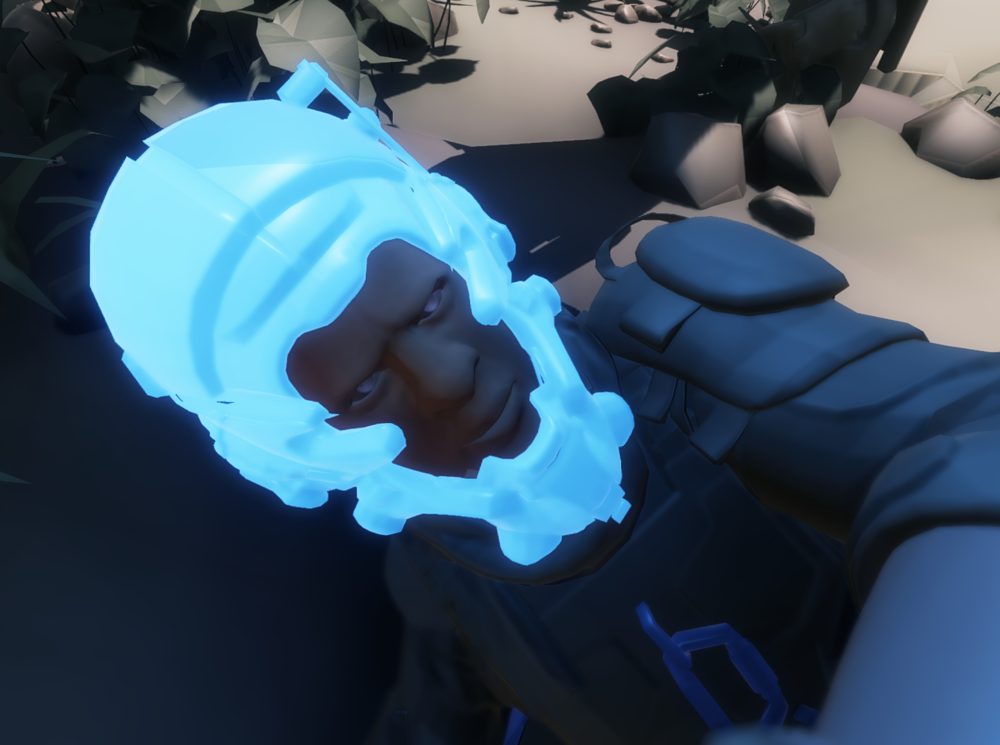
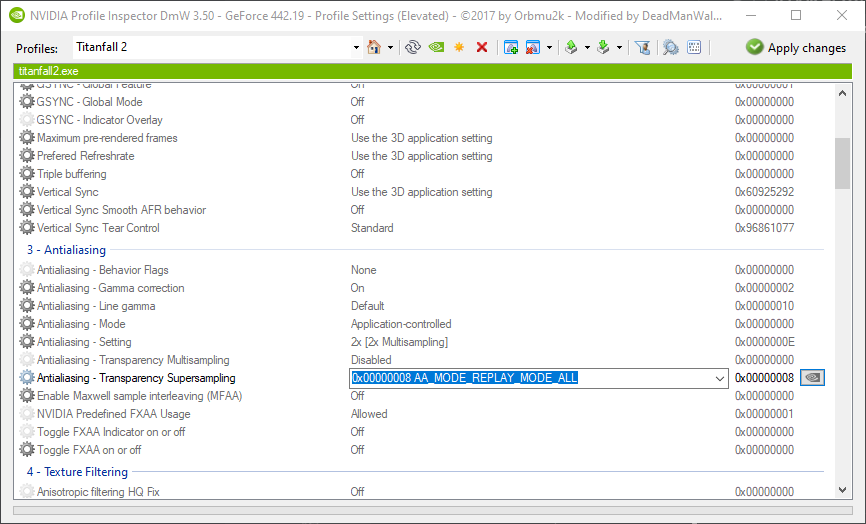
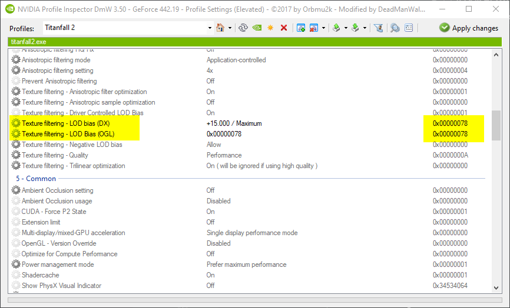

# 低配模式

## 前提条件

此处调整需要 [NVIDIA inspector](https://nvidia-inspector.en.lo4d.com/windows) \(NVIDIA GPU\) 或是 [ATI Tray Tools](http://www.majorgeeks.com/files/details/ati_tray_tools.html) \(AMD GPU\)。对于性能调整部分，您可能还需要一个代码编辑器，例如 [VS Code](https://code.visualstudio.com/) 或是 [Notepad++](https://notepad-plus-plus.org/downloads/).

## 极简模式修改

这些修改除了降低模型的多细节层次外，不会降低游戏视觉的真实度。这会使游戏看起来有点像塑料和平面，但不会降低能见度或其他任何东西。（如下图所示）




### NVIDIA显卡

#### **第一步.** 打开`NVidiaProfileInspectorDmW.exe` 软件\([工具链接](https://github.com/DeadManWalkingTO/NVidiaProfileInspectorDmW/releases)\)，然后从下拉菜单中选择《泰坦陨落2 》；


#### 第二步. 设置"Antialiasing - Transparency Supersampling" 为 `0x00000008 AA_MODE_REPLAY_MODE_ALL` ；



#### 第三步. 修改 "Texture filtering - LOD bias \(DX\)" 和 "Texture filtering - LOD Bias \(OGL\)" 为 `0x00000078`；



#### 第四步. 单击"Apply changes"按钮；

#### 第五步. 打开《泰坦陨落2》游戏，然后享受低配模式!

### AMD显卡

_**我们无法提供此部分的屏幕截图，因为我们没有可供测试的ATI/AMD/Radeon卡。很抱歉给您带来的不便。**_ 

1. 进入到： direct3d → settings → additional → texture lod adjustment
2. 设置为10 \(或者更高的数值，数值越高，游戏画面越低\)
3. 打开《泰坦陨落2》游戏，然后享受低配模式!

## 性能修改

这些调整会使你的游戏看起来像一坨糊，与上述选项结合使用，亦或是单独使用。

#### 配置文件调整

在 `C:\Users\<user>\Documents\Respawn\Titanfall2\local` 目录中，你可以找到名为 `videoconfig.txt`的文件。下面所示部分必须修改；查找并替换此文件中的每个参数，或从下面修改的参数中复制它们。


不要复制后面的吐槽（//及后面的内容）


```c
"VideoConfig"
{
	"setting.cl_particle_fallback_base"		"0" // makes particles less cool
	"setting.cl_particle_fallback_multiplier"		"0" // makes particles even less cool
	"setting.mat_picmip"		"4" // screws with shading and texture loading
	"setting.r_lod_switch_scale"		"0" // makes everything not in the player's viewmodel insanely low detail
	mat_disable_bloom 1 // removes shiny bits around light sources
	mat_specular 0 // just raises performance, fucks with reflections a bit
	mat_bumpmap 0 // something texture related
	r_dynamic 0 // fuck if i know something to do with dynamic lighting
}
```

不要将这些微调与V-sync或AA方法（TSAA除外）结合使用，这会导致错误。.

## 来源和文章

[Titanfall 2 on low-end PCs](http://www.neogaf.com/forum/showthread.php?t=1306327)

[aske1836's comment from discussion "Titanfall 2 is truly a visual spectacle at the absolute minimum](https://www.reddit.com/r/titanfall/comments/6ux5ef/titanfall_2_is_truly_a_visual_spectacle_at_the/dlx9zc3/)"

