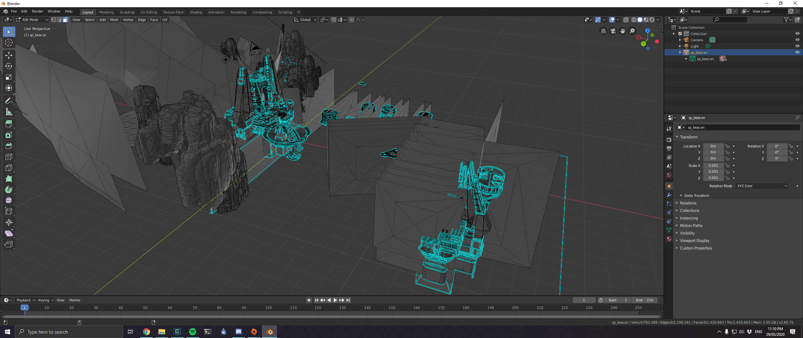
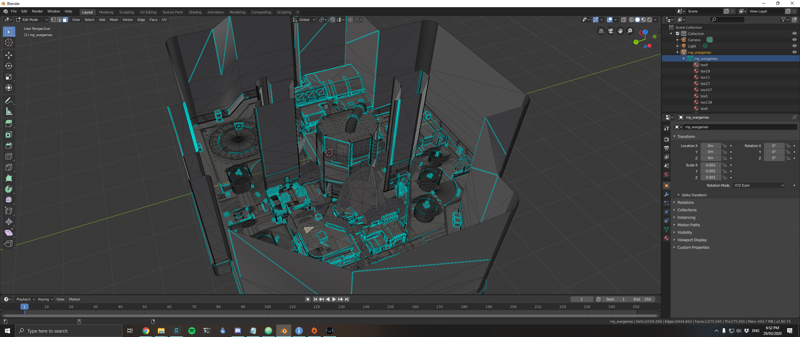

# 导出地图

### 工具

You will need the **Titanfall Map Exporter** python script and the **Titanfall VPK Tool** from the [Modding Tools](../how-to-start-modding/modding-introduction/modding-tools/) page. If you don't have python installed, you will also need that.

### 介绍

1\) Extract the VPK of the map you want to export with the **Titanfall VPK Tool**.

2\) You will need to edit the **Titanfall Map Exporter** script, so open it in your editor and change the `map_name` and `map_path` variables to the folder you extracted your VPK to. \(You can also change the `dump_base` too but since we don't have textures it doesn't matter too much.\)

```text
map_name = 'sp_beacon'
map_path = 'C:\\PATHNAME\\Beacon\\maps\\' + map_name + '.bsp'
dump_base = 'C:\\PATHNAME\\Exports\\textures\\'
```

3\) Open your console like `cmd` or `cmder` or `gitbash` and run the command:

```text
python /PATHT/TO/THE/SCRIPT/TitanfallMapExporter.py
```

4\) After the map has been exported, you should find it in the same directory that the python file is in. \(You will need to rename the exported file to have `.obj` at the end.\)

### 完工作品\*

\*In these screenshots I have scaled down and removed the boxes encasing the levels.






